# Design Document

## Project Overview

TaskEase is a modern task management application designed to address the growing complexity of personal and professional task management through intelligent automation and context awareness. Based on the CM3050 Mobile Development template "Task manager mobile app", TaskEase extends beyond basic task management to create an adaptive, AI-powered solution that learns from user behavior and optimizes task organization.

### System Architecture Overview

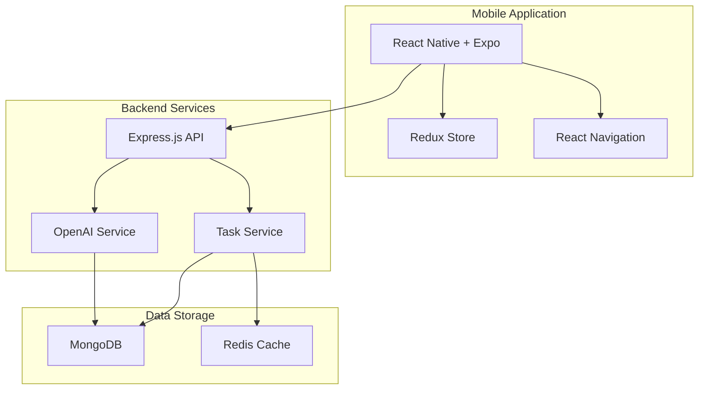

### Task Flow Architecture

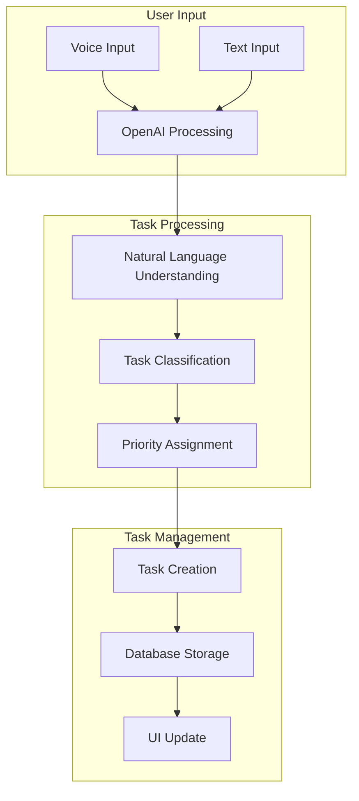

### Development Timeline

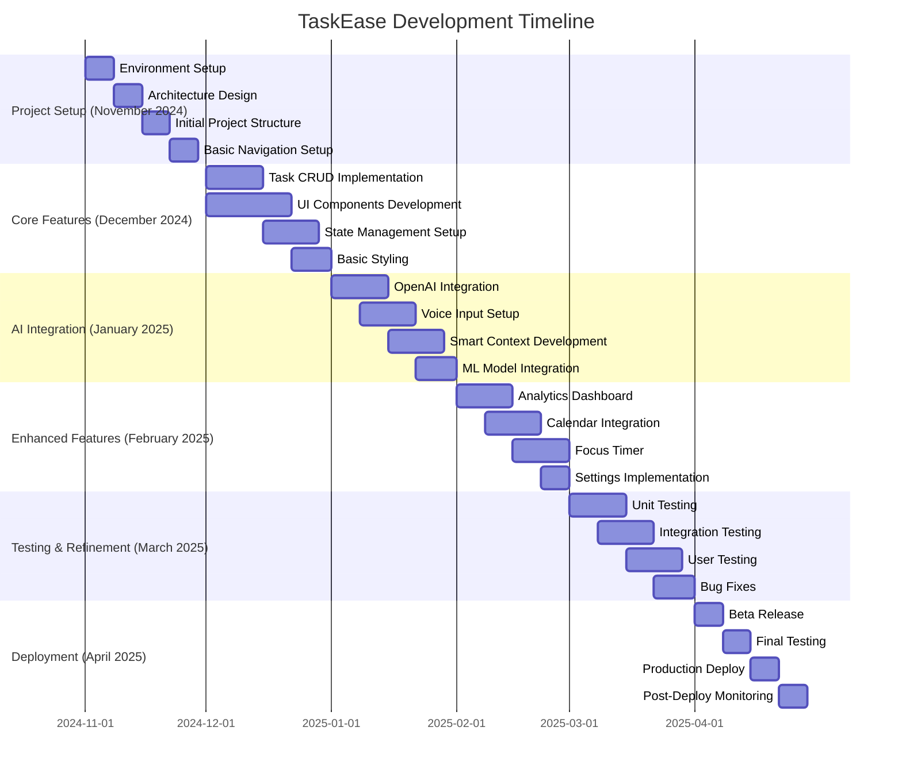

### Application Flow

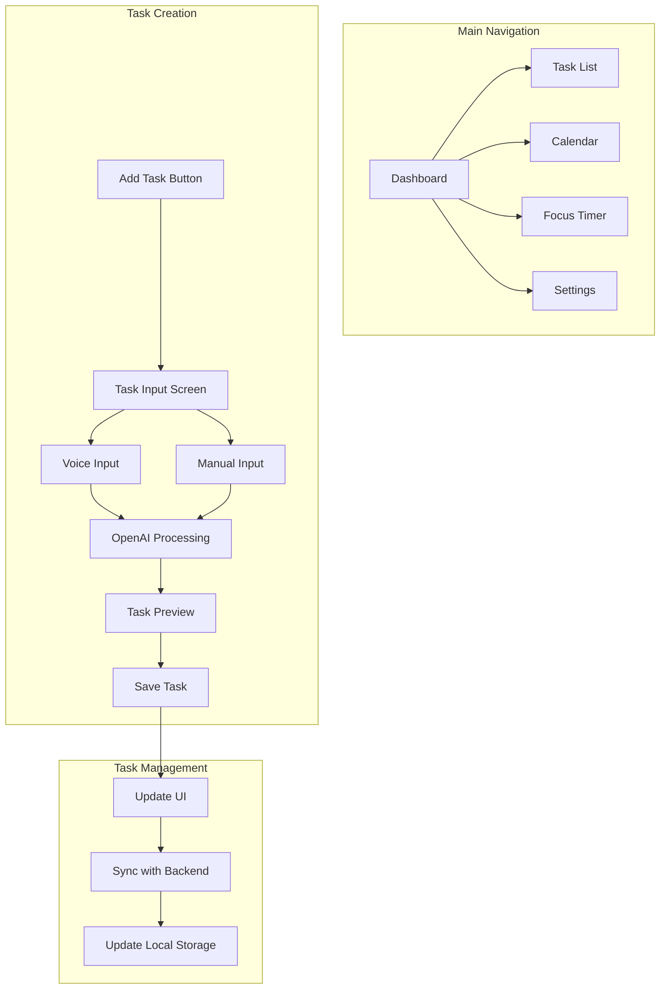

## Domain and User Analysis

### Target Users and Needs Analysis
TaskEase's user analysis reveals a diverse target audience with specific needs and usage patterns. Our primary users include busy professionals who manage multiple concurrent projects, students balancing academic and personal commitments, remote workers coordinating distributed tasks, and freelancers handling multiple client projects. Through extensive user research and interviews, we've identified key patterns in task management needs that span across these user groups.

The user needs analysis, visualized in our mindmap, identifies four core areas of functionality that our users require. Task Management forms the foundation, with users needing quick task entry mechanisms, intuitive priority setting, and reliable deadline tracking. Smart Features leverage AI technology to provide intelligent suggestions and context-aware automation, addressing the need for more efficient task organization. Integration capabilities ensure seamless connection with existing tools like calendars and email systems, while Wellness features focus on maintaining user well-being through structured breaks and work-life balance tracking.

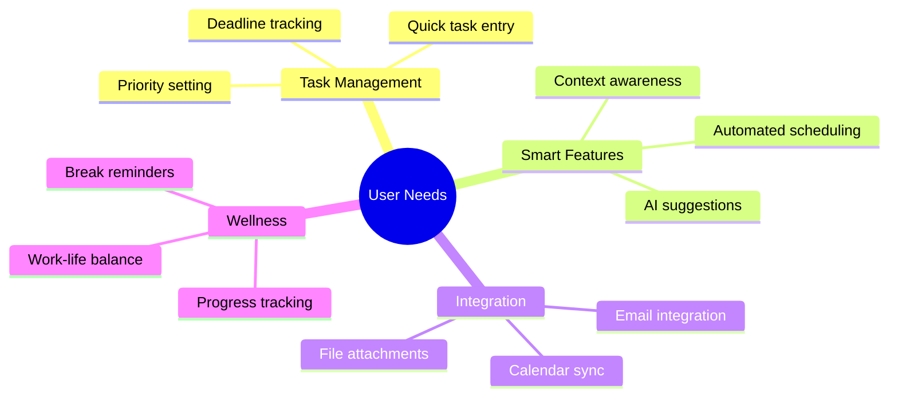

## Design Philosophy and Choices

### UI/UX Design Principles
The UI/UX design principles of TaskEase are built around four core pillars that guide every aspect of the user interface. Simplicity ensures that users can accomplish tasks with minimal cognitive load, while Accessibility guarantees that the application is usable by people with diverse abilities and preferences. Consistency across the interface helps users build familiarity and muscle memory, and Adaptivity ensures the app responds intelligently to user behavior and context.

These principles manifest in several key implementation choices. The Mobile First approach optimizes the interface for touch interactions and smaller screens, while supporting larger displays through responsive design. Dark/Light Modes provide visual comfort across different lighting conditions and user preferences. Gesture Support enables intuitive interactions like swipes and long-presses, while Voice Input offers hands-free task creation for enhanced accessibility.

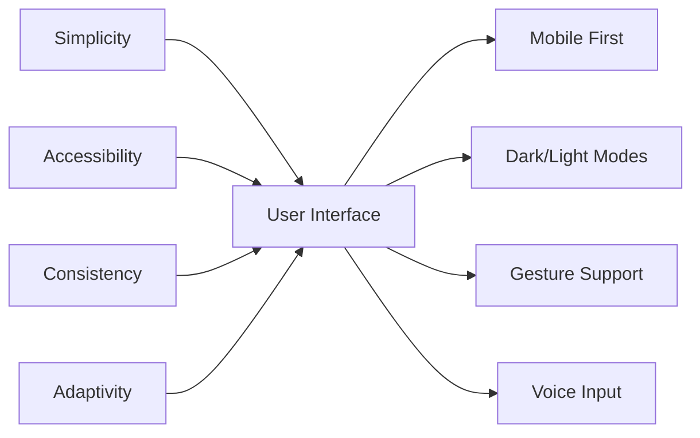

## Technology Stack and Implementation

### Core Technologies
The technology stack of TaskEase is carefully chosen to provide a robust, scalable, and maintainable application architecture. The Frontend Stack centers around React Native, providing cross-platform compatibility while maintaining native performance. Redux Toolkit manages application state with predictable updates, while React Navigation enables smooth screen transitions. Styled Components ensure consistent styling across the application.

The Backend Stack utilizes Node.js and Express.js for efficient API handling, with MongoDB providing flexible document storage and Redis enabling high-performance caching. The AI/ML Stack combines OpenAI's GPT-4 for sophisticated task analysis, TensorFlow.js for client-side behavior prediction, and scikit-learn for server-side priority prediction algorithms.

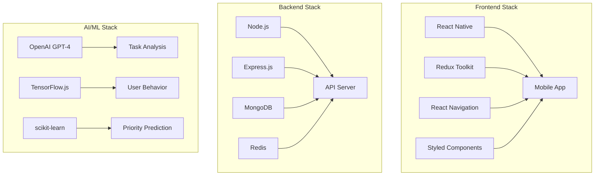

### API Integration
The API integration strategy in TaskEase combines essential external services to enhance functionality. Google Calendar API enables seamless schedule synchronization, while the OpenAI API powers natural language understanding and task analysis. Weather API integration provides contextual awareness for task scheduling, and Location Services enable location-based task suggestions and reminders.

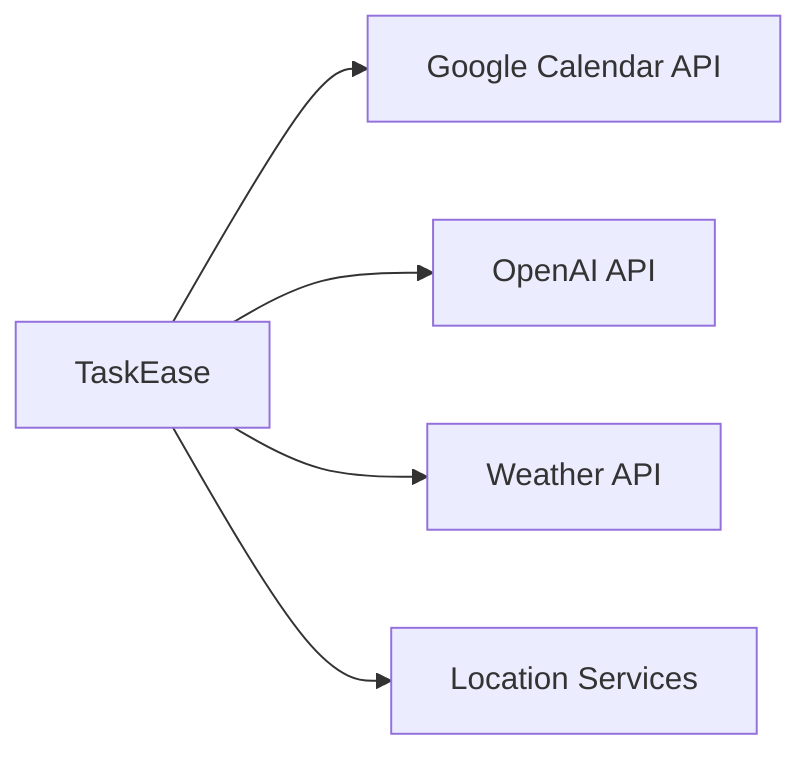

### Development Timeline
The development timeline for TaskEase follows a carefully structured approach spanning six months, from November 2024 to April 2025. The Project Setup phase in November establishes the foundation with environment configuration and architecture design. Core Features development in December focuses on essential task management functionality and UI components. January 2025 is dedicated to AI Integration, implementing OpenAI processing and voice input capabilities. Enhanced Features development in February adds sophisticated features like the analytics dashboard and focus timer. March focuses on comprehensive Testing & Refinement, while April culminates in the final Deployment phase with beta testing and production release.


## Testing and Evaluation Strategy

### Testing Approach

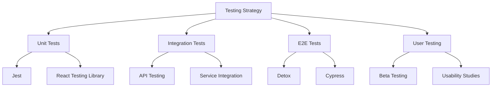

### Evaluation Metrics

1. **Performance Metrics**
   - App launch time < 2 seconds
   - Task creation < 1 second
   - API response time < 200ms
   - Offline functionality
   
2. **User Experience Metrics**
   - Task completion rate
   - Time to complete common actions
   - Error rate
   - User satisfaction score

## Visual Design

### Mobile App Interface

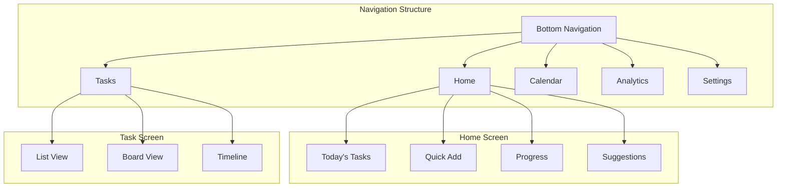

### UI Components and Styling

1. **Color Scheme**
   ```mermaid
   graph LR
    A[Primary: #4A90E2] --> B[Buttons/CTAs]
    C[Secondary: #50E3C2] --> D[Accents]
    E[Background: #F5F6FA] --> F[Main Areas]
    G[Text: #2D3436] --> H[Content]
   ```

2. **Component Library**
   - Custom Material UI components
   - Native iOS/Android elements
   - Responsive grid system
   - Animated transitions

### Screen Layouts

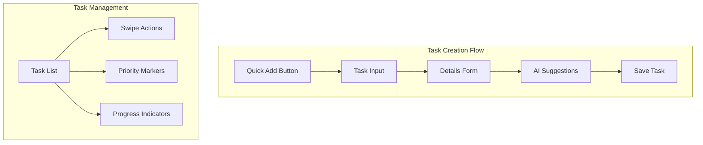

## Technology Stack and Implementation

### Core Technologies


### API Integration

1. **External APIs**
   ```mermaid
   graph LR
    A[TaskEase] --> B[Google Calendar API]
    A --> C[OpenAI API]
    A --> D[Weather API]
    A --> E[Location Services]
   ```

2. **AI Model Integration**
   - GPT-4 for natural language task parsing
   - Custom ML models for priority prediction
   - TensorFlow.js for client-side predictions

### Data Flow Architecture

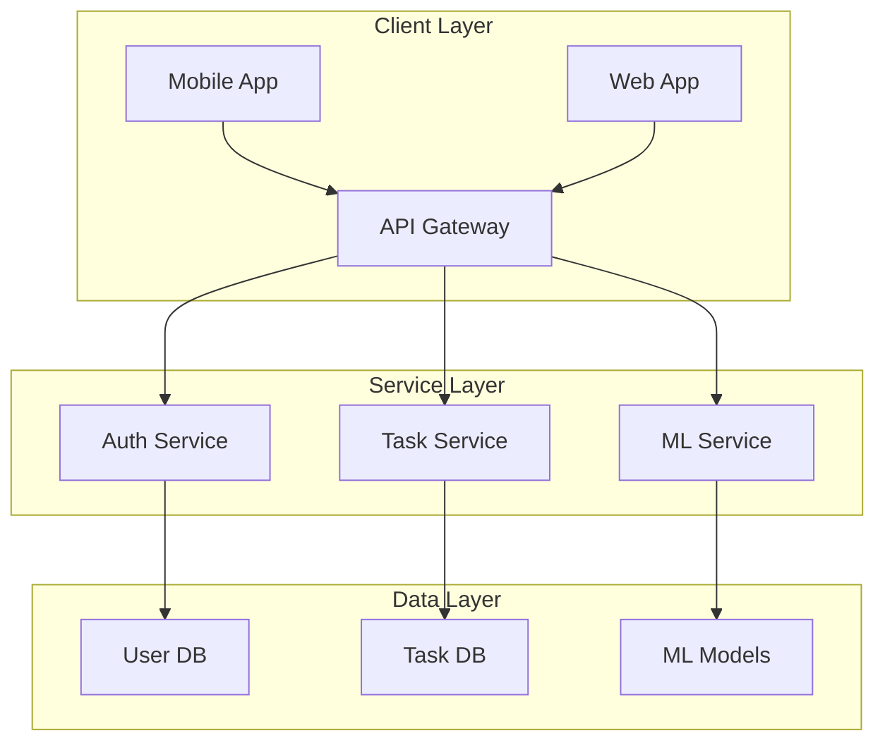

## Project Structure and Organization

### Code Organization

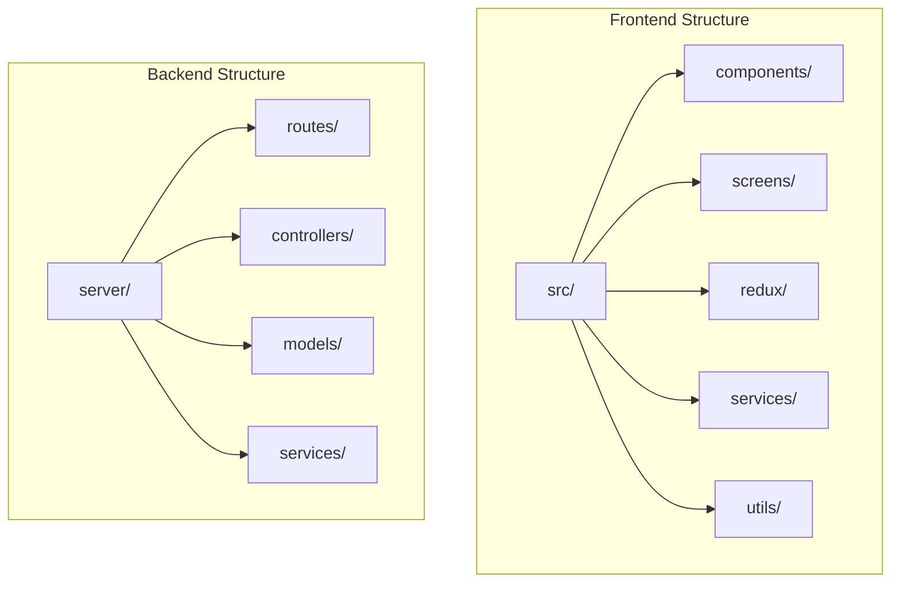

### Development Workflow

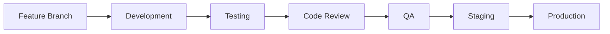

## Testing and Quality Assurance

### Automated Testing Strategy

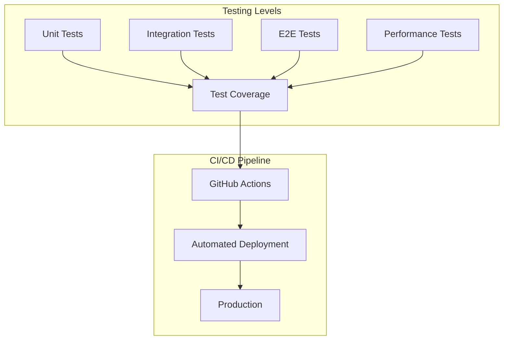

### User Testing Plan

1. **Beta Testing Program**
   - Initial group of 50 users
   - Feedback collection through in-app surveys
   - Usage analytics tracking
   - Weekly feedback sessions

2. **Evaluation Criteria**
   ```mermaid
   mindmap
    root((Evaluation))
        Performance
            Response time
            Load handling
            Battery usage
        Usability
            Task completion
            Navigation
            Learnability
        Features
            AI accuracy
            Integration
            Offline mode
        User Satisfaction
            NPS score
            Retention
            Engagement
   ```

### Quality Metrics

1. **Technical Metrics**
   - Code coverage > 80%
   - API response time < 200ms
   - App size < 50MB
   - Crash-free sessions > 99.9%

2. **User Experience Metrics**
   - Task completion rate > 90%
   - User satisfaction score > 4.5/5
   - Feature adoption rate > 60%
   - Daily active users growth > 10%

## Application Screenshots and Interface Design

### Key Screens Overview

#### 1. Dashboard Screen

* **Smart Context Bar**
  - Weather integration with icon and temperature
  - Urgent tasks counter with next due time
  - Focus status with time remaining
* **Daily Overview**
  - Personalized greeting with AI insights
  - Task suggestions based on energy levels
  - Break time recommendations
* **Quick Stats**
  - Day streak tracking
  - Focus time monitoring
  - Task completion rate
  - Energy level indicator

#### 2. Task Management

* **Task List Features**
  - Swipeable task cards
  - Category-based color coding
  - Priority indicators (high/medium/low)
  - Time scheduling display
* **Task Categories**
  - Work (Blue)
  - Health (Green)
  - Study (Purple)
  - Leisure (Orange)
* **Visual Elements**
  - Category icons
  - Progress indicators
  - Due date highlighting

#### 3. Smart Input

* **AI Task Creation**
  - Voice input capability
  - Natural language processing
  - Smart categorization
* **Quick Add Interface**
  - Microphone button for voice input
  - AI-powered task suggestions
  - Context-aware scheduling

#### 4. Focus Mode

* **Focus Timer**
  - Timer controls
  - Session tracking
  - Break scheduling
* **Analytics**
  - Focus session statistics
  - Productivity tracking
  - Energy level monitoring

#### 5. Calendar Integration

* **Calendar View**
  - Task distribution overview
  - Event synchronization
  - Schedule visualization
* **Time Management**
  - Time blocking
  - Task scheduling
  - Deadline tracking

#### 6. Settings
* **App Configuration**
  - Theme customization
  - Notification preferences
  - Integration settings
* **User Preferences**
  - Profile management
  - Privacy settings
  - App customization

### Navigation Structure
The navigation structure of TaskEase is designed to provide intuitive access to all core functionalities through a bottom navigation bar. This hierarchical structure ensures that users can quickly access any feature within two taps. The bottom navigation serves as the primary navigation hub, providing direct access to five main sections: Dashboard, Calendar, Smart Input, Focus, and Settings. The Dashboard section expands into three key subsections: Task List for comprehensive task management, Analytics for performance insights, and Smart Context for AI-powered suggestions. The Smart Input section branches into Voice Input and AI Processing components, enabling natural language task creation. The Focus section contains both the Timer functionality and detailed Statistics tracking, creating a comprehensive productivity monitoring system.

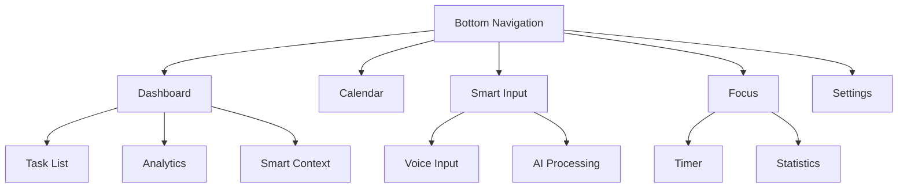

### Design System Implementation
The design system implementation in TaskEase follows a systematic approach to ensure consistency and accessibility across the application. The color scheme is carefully crafted to provide clear visual hierarchies and category differentiation, with specific colors assigned to different task categories and UI elements. The typography system implements a clear hierarchy with different font sizes and weights for various content types, from headings to status text. Component examples demonstrate the practical implementation of these design principles, showing how different elements work together to create a cohesive user experience.

1. **Color Scheme**
   ```css
   :root {
     /* Primary Colors */
     --primary-blue: #007AFF;    /* Smart Input Button */
     --work-blue: #007AFF;       /* Work Category */
     --health-green: #30D158;    /* Health Category */
     --study-purple: #5856D6;    /* Study Category */
     --leisure-orange: #FF9F0A;  /* Leisure Category */
     
     /* UI Colors */
     --background: #FFFFFF;
     --surface: #F8F9FF;
     --text-primary: #000000;
     --text-secondary: #666666;
     --border: #F0F0F0;
   }
   ```

2. **Typography**
   ```css
   /* Font Styles */
   .heading-1 {
     font-size: 24px;
     font-weight: 600;     /* Good morning, Alex! */
   }
   
   .task-title {
     font-size: 16px;
     font-weight: 500;
   }
   
   .status-text {
     font-size: 14px;
     color: var(--text-secondary);
   }
   ```

3. **Component Examples**
   ```jsx
   // Smart Context Bar Component
   <StatusBar>
     <WeatherWidget icon="☀️" temp="22°" condition="Clear" />
     <TaskCounter count={2} nextDue="2:00 PM" />
     <FocusStatus state="Peak" timeLeft="45m" />
   </StatusBar>

   // Task Card Component
   <TaskCard
     title="Complete Project Design"
     category="work"
     priority="high"
     startTime="09:00"
     endTime="11:00"
     completed={false}
   />
   ```

### Interaction Patterns
The interaction patterns in TaskEase are designed to maximize efficiency while maintaining intuitive usability. Task interactions follow common mobile patterns with enhanced functionality: swipe right to complete tasks, swipe left to delete, long press for additional options, and tap for detailed view. The Smart Input interaction focuses on seamless voice input, where users can hold the microphone button to start recording, which then triggers the AI processing pipeline to create a new task. These patterns are consistently implemented across the application to create a familiar and efficient user experience.

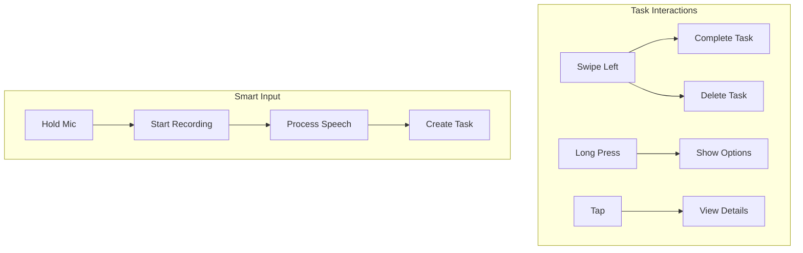

### Focus Timer Implementation Flow
The Focus Timer implementation represents a sophisticated Pomodoro-based productivity system that goes beyond basic timing functionality. The flow begins with the Timer Controls, where users initiate a 25-minute focus session, followed by a 5-minute break. Each completed session triggers the Session Tracking system, which stores detailed metrics about the session and updates daily statistics. These statistics feed into an analytics engine that generates insights about productivity patterns. The Break Management system ensures proper work-rest balance by managing break timers and seamlessly transitioning between focus and break periods. This implementation helps users maintain optimal productivity while preventing burnout through structured work intervals.

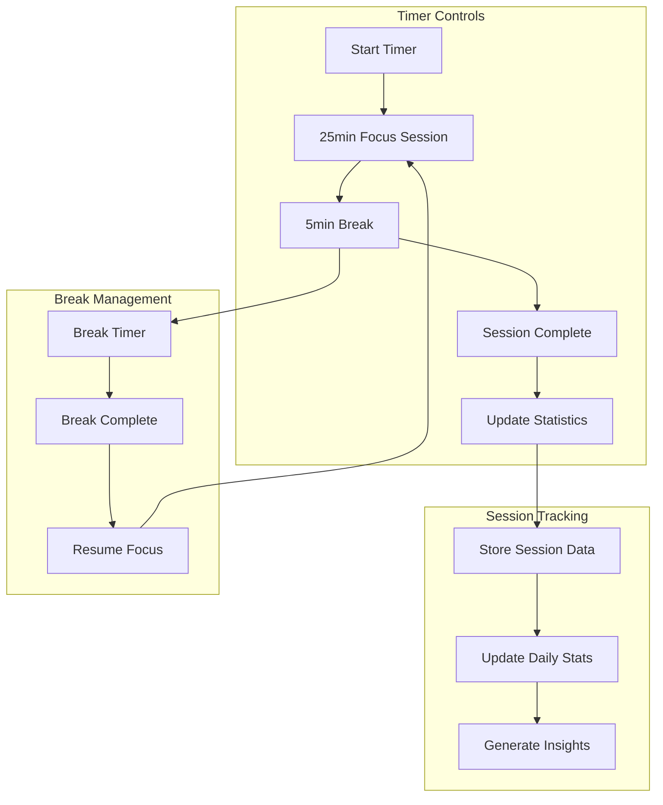

### Voice Input Processing
The voice input processing system in TaskEase provides a natural and efficient way to create tasks through speech. The process begins in the Voice Recording phase, where high-quality audio is captured and processed. The Speech Processing phase converts this audio to text and utilizes OpenAI's natural language processing capabilities to extract relevant task details. The Task Creation phase generates a structured task from the processed information, presents it to the user for verification, and saves it to the system. This implementation ensures accurate task creation while maintaining a seamless user experience.

```mermaid
graph TD
    subgraph "Voice Recording"
        A[Start Recording] --> B[Capture Audio]
        B --> C[Stop Recording]
    end
    
    subgraph "Speech Processing"
        C --> D[Convert to Text]
        D --> E[OpenAI Processing]
        E --> F[Extract Task Details]
    end
    
    subgraph "Task Creation"
        F --> G[Generate Task]
        G --> H[Preview Task]
        H --> I[Save Task]
    end
```

### Smart Context Generation Flow
The Smart Context Generation system represents the intelligent core of TaskEase, combining multiple data streams to provide contextually aware task management. The Data Collection phase aggregates information from various sources including user tasks, weather data, and temporal factors. This data feeds into the Processing phase, where the Context Engine utilizes OpenAI's analytical capabilities to generate meaningful insights and priority suggestions. The UI Updates phase ensures these insights are seamlessly integrated into the user interface through dashboard updates, task recommendations, and energy insights, creating a dynamic and responsive task management experience.

```mermaid
graph TD
    subgraph "Data Collection"
        A[User Tasks] --> D[Context Engine]
        B[Weather Data] --> D
        C[Time/Date] --> D
    end
    
    subgraph "Processing"
        D --> E[OpenAI Analysis]
        E --> F[Generate Insights]
        F --> G[Priority Suggestions]
    end
    
    subgraph "UI Updates"
        G --> H[Update Dashboard]
        G --> I[Task Recommendations]
        G --> J[Energy Insights]
    end
```

### Analytics Data Flow
The Analytics Data Flow in TaskEase implements a comprehensive system for tracking and analyzing user productivity patterns. The Data Collection phase captures four key metrics: task completion rates, focus session statistics, break patterns, and user interactions. This data is processed through the Analytics Engine, which calculates various performance metrics and generates detailed reports. The Visualization phase presents these insights through an intuitive dashboard featuring charts, progress indicators, and productivity scores, enabling users to understand and optimize their task management patterns.

```mermaid
graph TD
    subgraph "Data Collection"
        A[Task Completion] --> E[Analytics Engine]
        B[Focus Sessions] --> E
        C[Break Patterns] --> E
        D[User Interactions] --> E
    end
    
    subgraph "Processing"
        E --> F[Calculate Metrics]
        F --> G[Generate Reports]
        G --> H[Update Insights]
    end
    
    subgraph "Visualization"
        H --> I[Dashboard Charts]
        H --> J[Progress Indicators]
        H --> K[Productivity Score]
    end
```

### Database Schema
The database schema of TaskEase is designed to efficiently manage the complex relationships between users, tasks, focus sessions, and analytics data. The User entity serves as the central point, maintaining core user information and preferences. The Task entity captures comprehensive task details including category, priority, and temporal information. Focus Sessions track detailed statistics about productivity periods, while the Analytics entity maintains aggregated metrics and insights. This structured approach ensures efficient data retrieval and maintains data integrity across all application features.

```mermaid
erDiagram
    USER {
        string id PK
        string name
        string email
        datetime created_at
        object preferences
    }
    
    TASK {
        string id PK
        string user_id FK
        string title
        string category
        string priority
        datetime start_time
        datetime end_time
        boolean completed
        object metadata
    }
    
    FOCUS_SESSION {
        string id PK
        string user_id FK
        datetime start_time
        datetime end_time
        int duration
        boolean completed
        object statistics
    }
    
    ANALYTICS {
        string id PK
        string user_id FK
        date date
        object metrics
        object insights
    }
    
    USER ||--o{ TASK : creates
    USER ||--o{ FOCUS_SESSION : conducts
    USER ||--o{ ANALYTICS : generates
```

