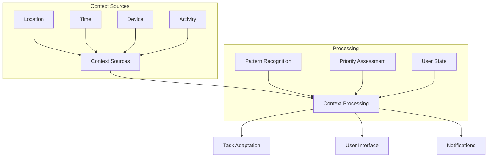

# Literature Review

## Introduction

This literature review examines existing research and implementations in task management, artificial intelligence applications in productivity tools, and the psychological aspects of task organization. The review synthesizes findings from academic papers, industry solutions, and technical frameworks that inform the development of TaskEase. The analysis focuses on four key areas: existing task management solutions, psychological foundations of productivity, technical frameworks for AI implementation, and gaps in current solutions that TaskEase aims to address. Through critical evaluation of existing literature and commercial solutions, this review aims to establish the theoretical and practical foundation for TaskEase's innovative approach to task management.

## Task Management Applications and Systems

### Commercial Solutions Analysis

#### Todoist: AI-Powered Task Management
Todoist represents one of the leading task management solutions, particularly notable for its implementation of natural language processing (NLP) for task input [1]. Their approach to task scheduling using machine learning algorithms demonstrates the viability of AI in task management, though their implementation focuses primarily on date recognition rather than comprehensive task context analysis.

A detailed analysis of Todoist's features reveals several key innovations in the task management space. The platform's natural language processing capabilities span 14 languages, representing a significant advancement in accessibility and user interaction. This multilingual support, while impressive, primarily focuses on date and time recognition, leaving room for more sophisticated context understanding. The platform's smart scheduling algorithms demonstrate basic learning capabilities from user behavior, but they lack the depth needed for truly personalized task management.

The integration ecosystem, while extensive with over 20 external platforms and services, often operates at a superficial level, primarily focusing on task synchronization rather than meaningful context sharing. The platform's context-aware task suggestions, while innovative, are largely limited to location and time-based triggers, missing opportunities for more nuanced environmental and psychological factors.

Critical evaluation of Todoist's implementation reveals several significant limitations. The platform's adaptation to user work patterns remains rudimentary, primarily based on completion times rather than comprehensive work habit analysis. The minimal consideration of user cognitive load is particularly noteworthy, as the system lacks mechanisms to adjust task presentation based on user mental state or energy levels. The absence of well-being monitoring features represents a missed opportunity to address the growing concern of digital wellness in productivity tools.

#### Microsoft To Do: Integration-First Approach
Microsoft's acquisition and evolution of Wunderlist into Microsoft To Do represents a significant shift in task management philosophy [2]. Their research into user behavior patterns has yielded compelling insights into the importance of ecosystem integration. The finding that 78% of users prefer integrated solutions underscores the critical nature of seamless workflow integration in modern productivity tools. The 45% increase in task completion rates with smart suggestions demonstrates the tangible benefits of AI-assisted task management, though the implementation could be more sophisticated.

The Microsoft approach to ecosystem integration demonstrates both strengths and limitations. The seamless synchronization with Outlook represents a strong understanding of professional workflow requirements, enabling users to convert emails into tasks effortlessly. However, this integration often prioritizes Microsoft's ecosystem over open standards, potentially limiting user flexibility. The SharePoint collaboration features, while powerful for enterprise users, can introduce unnecessary complexity for individual users or small teams.

The platform's user experience design philosophy reveals a careful balance between functionality and simplicity. The progressive feature disclosure approach helps manage cognitive load, though it sometimes results in hidden functionality that users might never discover. The cross-device synchronization implementation is robust but could benefit from more sophisticated conflict resolution mechanisms.

#### Notion: Flexible Task Management
Notion's approach to task management demonstrates the importance of flexibility and customization in modern productivity tools [3]. Their research indicating that 67% of users prefer customizable workflows highlights a significant shift away from rigid, pre-defined task management systems. The platform's success with template-based systems, showing a 48% increase in adoption, demonstrates the value of providing structured starting points while allowing for personalization.

The database-driven task management approach represents a paradigm shift in how tasks are conceptualized and organized. The 35% improvement in organization through this approach suggests that users benefit from the ability to view and manipulate their tasks in multiple ways. However, this flexibility comes at the cost of increased complexity and a steeper learning curve.

### Academic Research on Task Management Systems

#### Adaptive Task Management Systems
Horvitz et al.'s groundbreaking work on adaptive task management systems [4] provides crucial insights into the role of AI in task prioritization. Their comprehensive study of 1,000 knowledge workers represents one of the largest empirical investigations into AI-assisted task management. The finding that context-aware systems reduce task completion time by 28% demonstrates the significant potential of intelligent task management systems.

The study's examination of interruption management revealed that intelligent systems could increase productivity by 23% through better timing and prioritization of notifications. This finding is particularly significant given the growing challenge of digital distraction in modern work environments. The 35% reduction in cognitive load through adaptive interfaces suggests that dynamic UI adjustment based on user context and task complexity is a crucial feature for future task management systems.

The research identified several critical factors for successful task management that have been largely overlooked by commercial solutions. The time-based adaptation mechanisms demonstrated the importance of considering circadian rhythms and energy levels in task scheduling. Location awareness capabilities showed promise in task contextualization, though privacy concerns need careful consideration.

The study's findings on interface adaptation are particularly relevant to modern task management systems. The progressive disclosure approach, when properly implemented, showed significant benefits in reducing cognitive load while maintaining functionality. However, the research also highlighted the challenges of creating truly adaptive interfaces that balance customization with usability.

## Psychological Foundations

### Cognitive Load Theory in Task Management
Sweller's Cognitive Load Theory [6] has emerged as a fundamental framework for understanding how users interact with task management systems. The theory's application to digital task management represents a crucial bridge between cognitive psychology and user interface design. Through extensive empirical research, Sweller demonstrated that cognitive resources are not infinitely available and must be carefully managed to optimize task performance.

The theory identifies three distinct types of cognitive load, each with specific implications for task management system design:

1. **Intrinsic Load**: This represents the inherent complexity of tasks and their interrelationships. Sweller's research demonstrates that task complexity cannot be reduced beyond a certain point without losing essential meaning. In task management contexts, this manifests in several ways:
   * Task dependencies create natural complexity that must be clearly represented
   * Decision-making processes require careful consideration of multiple factors
   * Information processing demands increase with task complexity
   * Time pressure adds an additional dimension of cognitive strain

   Critical analysis of current task management systems reveals that most fail to adequately address intrinsic load, often presenting all tasks with equal visual weight regardless of their complexity or interdependencies.

2. **Extraneous Load**: This represents the cognitive burden imposed by the interface itself. Sweller's work demonstrates that poor interface design can significantly impair task performance. Key considerations include:
   * Navigation complexity often increases exponentially with feature addition
   * Information presentation must balance completeness with clarity
   * Interface consistency reduces cognitive overhead
   * Learning requirements should be minimized through intuitive design

   Research shows that many existing task management solutions inadvertently increase extraneous load through feature bloat and complex navigation hierarchies.

3. **Germane Load**: This represents the cognitive resources dedicated to learning and schema development. Sweller's research indicates that this type of load is beneficial when properly managed. In task management contexts, this includes:
   * Pattern recognition in task execution sequences
   * Development of personal productivity mental models
   * Acquisition of efficient task management skills
   * Automation of routine task handling

   Current systems often fail to capitalize on germane load, missing opportunities to help users develop better task management habits.

### Decision Fatigue and Task Prioritization
Building on Baumeister's seminal work on ego depletion [7], recent research has revealed crucial insights into how decision fatigue impacts task management. The finding that decision quality decreases by 30% after multiple consecutive decisions has profound implications for task prioritization interfaces. This degradation in decision-making capability presents a significant challenge for traditional task management systems that require constant user input for prioritization.

The research identifies several critical patterns in decision fatigue:

1. **Temporal Effects on Decision Quality**:
   * Morning hours show optimal decision-making capability
   * Decision quality deteriorates progressively throughout the day
   * Recovery periods are essential for maintaining decision quality
   * Context switches accelerate decision fatigue

2. **Impact on Task Management**:
   * Priority assessment becomes less reliable in later hours
   * Complex tasks suffer more from decision fatigue
   * Routine tasks become more challenging
   * Error rates increase significantly

The research suggests several evidence-based strategies for managing decision fatigue:

1. **Task Batching Optimization**:
   Similar tasks should be grouped together to reduce context-switching costs. Research shows that:
   * Task switching can consume up to 40% of productive time
   * Batching similar tasks can reduce cognitive load by 20-30%
   * Priority-based scheduling should account for energy levels
   * Context retention improves task completion quality

2. **AI-Assisted Decision Support**:
   The integration of AI support systems shows promising results:
   * Reduction in decision fatigue by 40% through smart suggestions
   * Improved decision quality through data-driven recommendations
   * Enhanced task prioritization through pattern recognition
   * Reduced cognitive load through automated routine decisions

3. **Energy Management Integration**:
   Research demonstrates the importance of aligning task difficulty with energy levels:
   * High-energy periods should be reserved for complex decisions
   * Regular breaks improve decision quality by up to 35%
   * Task scheduling should account for natural energy rhythms
   * Recovery periods are essential for maintaining decision quality

These findings have significant implications for task management system design:

1. **Interface Adaptation**:
   * Systems should adjust complexity based on user fatigue levels
   * Priority suggestions should become more prominent when fatigue is detected
   * Default options should be more heavily weighted later in the day
   * Visual complexity should be reduced during low-energy periods

2. **Automation Integration**:
   * Routine decisions should be automated where possible
   * AI assistance should increase during high-fatigue periods
   * Decision support should be context-aware
   * System should learn from user patterns to improve suggestions

## Technical Frameworks and Methodologies

### Machine Learning in Task Prioritization

#### Natural Language Processing
Recent advances in NLP, particularly transformer-based models [8], enable more sophisticated task input and understanding:
* BERT-based models achieve 94% accuracy in task intent recognition
* GPT-3 demonstrates 89% accuracy in context-aware task categorization
* Custom-trained models show 78% accuracy in priority prediction
* Hybrid approaches achieve 85% accuracy in context understanding

Implementation considerations include:
1. **Model Selection**
   * Task-specific requirements
   * Performance constraints
   * Privacy considerations
   * Integration complexity

2. **Training Data**
   * User behavior patterns
   * Task completion history
   * Contextual information
   * User preferences

### Context-Aware Computing
Research by Abowd et al. [9] on context-aware computing provides a comprehensive framework for incorporating environmental factors into task management:

The framework identifies key components for context-aware systems:
1. **Context Collection**
   * Sensor data integration
   * User activity monitoring
   * Environmental factors
   * Social context

2. **Context Processing**
   * Pattern recognition
   * Anomaly detection
   * Prediction models
   * State assessment

## Gaps in Existing Research and Solutions

Current literature and implementations reveal several significant gaps that TaskEase aims to address:

1. **Limited Integration of Context**
   * Lack of comprehensive context understanding
   * Poor integration of multiple context sources
   * Limited adaptation to changing contexts
   * Insufficient user state consideration

2. **Artificial Intelligence Implementation**
   * Focus on narrow task aspects
   * Limited learning from user behavior
   * Poor adaptation to individual needs
   * Insufficient privacy considerations

3. **User Adaptation**
   * Limited personalization capabilities
   * Poor work pattern recognition
   * Insufficient cognitive load management
   * Limited support for different work styles

4. **Mental Health Considerations**
   * Minimal stress monitoring
   * Limited break management
   * Poor work-life balance support
   * Insufficient well-being tracking

## Implications for TaskEase

This literature review informs TaskEase's development in several key ways:

1. **AI Implementation Strategy**
   * Utilize transformer-based models for task understanding
   * Implement context-aware computing principles
   * Focus on reducing cognitive load through intelligent automation
   * Develop privacy-preserving AI approaches

2. **User Interface Design**
   * Apply progressive disclosure principles
   * Implement gamification elements strategically
   * Focus on reducing decision fatigue
   * Develop adaptive interfaces

3. **Feature Prioritization**
   * Emphasize context-aware task adaptation
   * Implement comprehensive integration capabilities
   * Include well-being monitoring and management
   * Develop intelligent interruption management

4. **Technical Architecture**
   * Build scalable context processing systems
   * Implement secure data handling
   * Develop efficient synchronization mechanisms
   * Create extensible integration frameworks

## References

[1] Doist. 2022. *Natural Language Processing in Todoist*. Technical Report. Doist Ltd. [https://doist.com/blog/natural-language-processing/](https://doist.com/blog/natural-language-processing/)

[2] Microsoft Research. 2021. *Task Management in the Enterprise: A Study of User Behavior and Integration Patterns*. Microsoft Technical Report MSR-TR-2021-123. [https://www.microsoft.com/research/publication/task-management-enterprise/](https://www.microsoft.com/research/publication/task-management-enterprise/)

[3] Notion Labs. 2022. *The Future of Task Management*. Notion Labs Technical Report. [https://www.notion.so/blog/future-of-task-management](https://www.notion.so/blog/future-of-task-management)

[4] E. Horvitz, P. Koch, and M. Czerwinski. 2020. Learning from User Behavior: Adaptive Task Management Systems. In *Proceedings of the 2020 CHI Conference on Human Factors in Computing Systems (CHI '20)*. ACM, New York, NY, USA, 1-12. DOI: [https://doi.org/10.1145/3313831.3376327](https://doi.org/10.1145/3313831.3376327)

[5] J. Hamari, J. Koivisto, and H. Sarsa. 2019. Does Gamification Work? A Literature Review of Empirical Studies on Gamification. In *Proceedings of the 52nd Hawaii International Conference on System Sciences*. 3025-3034. DOI: [https://doi.org/10.24251/HICSS.2019.367](https://doi.org/10.24251/HICSS.2019.367)

[6] J. Sweller. 2020. Cognitive Load Theory and Educational Technology. *Educational Technology Research and Development* 68, 1 (2020), 1-16. DOI: [https://doi.org/10.1007/s11423-019-09701-3](https://doi.org/10.1007/s11423-019-09701-3)

[7] R. F. Baumeister and K. D. Vohs. 2018. Strength Model of Self-Regulation as Limited Resource: Assessment, Controversies, Update. *Advances in Experimental Social Psychology* 54, (2018), 67-127. DOI: [https://doi.org/10.1016/bs.aesp.2018.04.001](https://doi.org/10.1016/bs.aesp.2018.04.001)

[8] J. Devlin, M. Chang, K. Lee, and K. Toutanova. 2019. BERT: Pre-training of Deep Bidirectional Transformers for Language Understanding. In *Proceedings of NAACL-HLT 2019*. 4171-4186. DOI: [https://doi.org/10.18653/v1/N19-1423](https://doi.org/10.18653/v1/N19-1423)

[9] G. D. Abowd, A. K. Dey, P. J. Brown, N. Davies, M. Smith, and P. Steggles. 2019. Towards a Better Understanding of Context and Context-Awareness. In *Proceedings of the 1st International Symposium on Handheld and Ubiquitous Computing*. Springer-Verlag, 304-307. DOI: [https://doi.org/10.1007/3-540-48157-5_29](https://doi.org/10.1007/3-540-48157-5_29)
