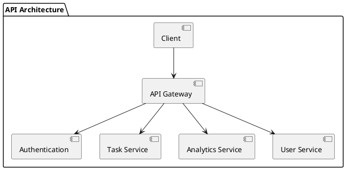
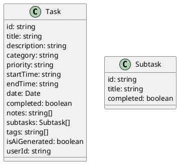
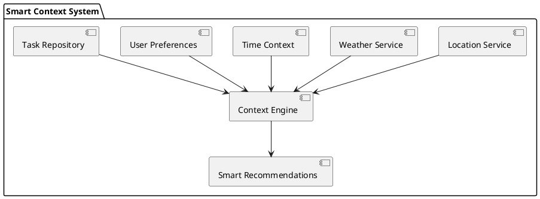
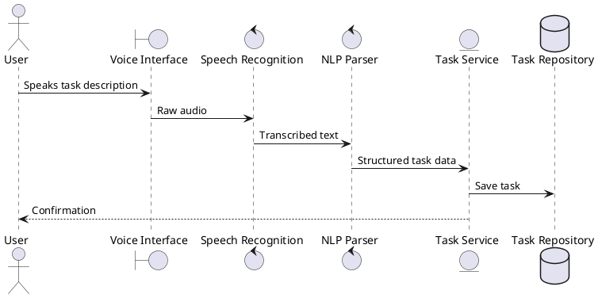
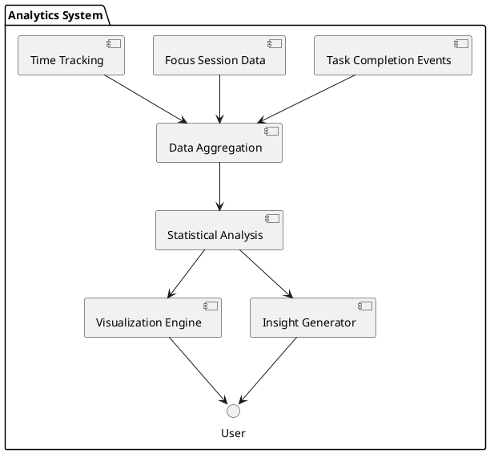
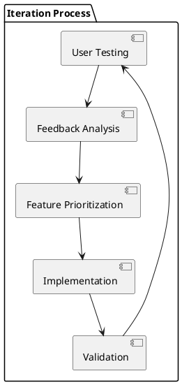
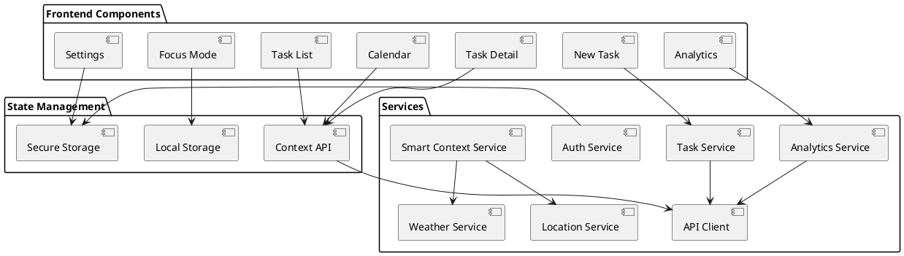
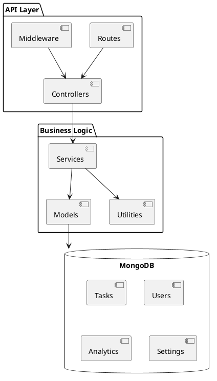
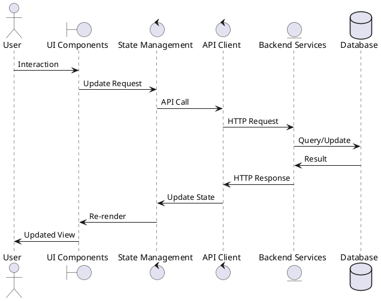
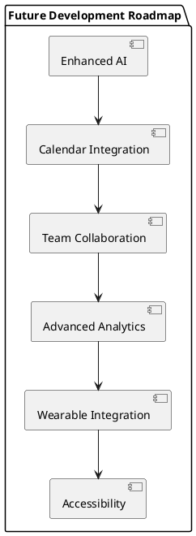

# TaskEase - Mobile Task Management Application
## Project Report

### 1. Introduction

TaskEase represents a significant advancement in mobile task management applications, designed to address the evolving needs of modern users who require more than simple to-do lists. In today's fast-paced digital environment, effective task management has become increasingly complex, with users juggling professional responsibilities, personal commitments, and wellness considerations simultaneously. TaskEase was developed as a comprehensive solution to these challenges, offering an intelligent approach to productivity that adapts to individual user patterns and environmental contexts.

The application integrates traditional task management functionality with innovative features powered by artificial intelligence, contextual awareness, and behavioral science principles. By combining these elements, TaskEase creates a personalized productivity experience that helps users not only organize their tasks but also optimize their work patterns, maintain focus, and achieve better work-life balance.

This report documents the complete development journey of TaskEase, from initial concept and user research through design, implementation, testing, and evaluation. It provides a comprehensive overview of the technical architecture, key features, development challenges, and future directions for the application.

### 2. Concept Development

#### 2.1 Problem Statement and Market Analysis

The development of TaskEase began with a thorough analysis of existing task management solutions and identification of key pain points experienced by users. Our research revealed several significant challenges:

Task management applications have proliferated in recent years, yet many users continue to struggle with effective organization and prioritization. Through user interviews and market analysis, we identified several critical gaps in existing solutions:

Task Fragmentation: Users often maintain multiple task lists across different platforms, leading to information silos and missed deadlines. This fragmentation creates cognitive overhead as users must constantly switch between systems to maintain a complete picture of their responsibilities.

Context Insensitivity: Most task management applications operate in isolation from the user's environment, schedule, and physical state. They fail to consider factors such as time of day, weather conditions, location, or energy levels when presenting tasks, resulting in recommendations that may be impractical or inefficient.

Focus Management Deficiencies: While many applications offer basic task tracking, few provide integrated tools for maintaining focus during task execution. Users frequently resort to separate applications for time management, breaking the workflow and creating additional friction.

Cognitive Overload: Traditional task lists often present all tasks with equal visual weight, regardless of priority or context. This undifferentiated presentation forces users to repeatedly scan and mentally filter their tasks, consuming valuable cognitive resources.

Limited Intelligence: Most task management systems function as passive repositories rather than active assistants. They require users to manually organize, prioritize, and schedule tasks without offering meaningful suggestions based on past behavior or optimal productivity patterns.

Inadequate Feedback Loops: Many applications lack robust analytics that could help users understand their productivity patterns and improve their task management strategies over time.

#### 2.2 Solution Overview

To address these challenges, TaskEase was conceptualized as an integrated productivity ecosystem with several key innovations:

Smart Task Management System: TaskEase employs contextual intelligence to automatically prioritize and suggest tasks based on numerous factors including deadlines, user location, time of day, weather conditions, and historical productivity patterns. This system reduces the cognitive load of decision-making by presenting the most relevant tasks at the optimal times.

Focus Mode with Pomodoro Technique: Recognizing that task management extends beyond organization to execution, TaskEase incorporates a dedicated focus mode based on the scientifically-validated Pomodoro technique. This feature helps users maintain concentration during work periods while ensuring adequate breaks to prevent burnout.

Voice Input Support: To minimize friction in task creation, TaskEase includes natural language processing capabilities that allow users to add tasks through voice commands. The system intelligently parses these inputs to extract relevant details such as deadlines, categories, and priorities.

Analytics Dashboard: TaskEase provides comprehensive productivity analytics that help users understand their work patterns, identify optimal focus times, and track progress toward goals. These insights enable continuous improvement in personal productivity strategies.

Task Templates and Categories: For recurring responsibilities, TaskEase offers customizable task templates that streamline the creation process and ensure consistency. The category system allows for logical grouping of related tasks, improving organization and retrieval.

Environmental Adaptation: Unlike static task managers, TaskEase adapts its recommendations based on environmental factors such as weather conditions (suggesting indoor tasks during rain) and location context (prioritizing errands when near relevant locations).

#### 2.3 Target Audience

TaskEase was designed with several primary user personas in mind:

Busy Professionals: Knowledge workers juggling multiple projects, meetings, and deadlines who need efficient task organization and focus management to maximize productivity in limited time windows.

Students: Academic users balancing classes, assignments, study sessions, and extracurricular activities who benefit from structured task management and focus techniques.

Remote Workers and Freelancers: Independent professionals managing diverse client projects and personal responsibilities without the structure of traditional office environments, requiring tools that help maintain discipline and work-life boundaries.

Through extensive user interviews and market research, we identified common pain points across these groups, including difficulty prioritizing competing tasks, maintaining focus in distracting environments, and balancing productivity with wellbeing. TaskEase was specifically designed to address these shared challenges while accommodating the unique needs of each user segment.

### 3. Wireframing and Design Process

#### 3.1 Design Philosophy and Principles

The design process for TaskEase was guided by several core principles:

Contextual Relevance: Information and actions should be presented based on their relevance to the user's current context, reducing cognitive load and decision fatigue.

Progressive Disclosure: Complex functionality should be revealed progressively as needed, maintaining a clean interface while providing depth when required.

Focused Interaction: The interface should minimize distractions and emphasize the task at hand, particularly during focus sessions.

Visual Hierarchy: Design elements should create clear visual priorities that guide users naturally through the application.

Accessibility and Inclusivity: The application should be usable by people with diverse abilities, preferences, and devices.

These principles informed every aspect of the design process, from information architecture to visual design and interaction patterns.

#### 3.2 Navigation Structure

The application's navigation was structured to provide intuitive access to key functionality while maintaining simplicity. The primary navigation framework follows this hierarchy:

```ascii
[Home Screen]
├── Task List
│   └── Task Details
├── New Task
│   └── Smart Input
├── Focus Mode
├── Calendar
└── Analytics
```

This structure was validated through user testing to ensure it aligned with mental models of task management and provided efficient access to frequently used features.

#### 3.3 Key Screen Wireframes

The wireframing process began with low-fidelity sketches and evolved through multiple iterations based on user feedback. Key screens were developed to address specific user needs:

[Additional wireframes to be added manually]

#### 3.4 Visual Design System

To ensure consistency across the application, we developed a comprehensive design system with the following components:

Color Palette: A primary palette based on calming blue tones to promote focus, with accent colors for different task categories and priority levels. The palette was tested for accessibility to ensure sufficient contrast ratios for all users.

Typography: A hierarchical type system using a sans-serif font family for optimal readability on mobile screens, with carefully defined sizes and weights to establish clear information hierarchy.

Component Library: A set of reusable UI components including buttons, input fields, cards, and list items, each with defined states (default, hover, active, disabled) and behaviors.

Iconography: A consistent icon set for navigation and actions, designed for clarity at small sizes and instant recognition.

Spacing System: A standardized spacing scale to maintain consistent margins and padding throughout the interface, creating visual rhythm and improving scanability.

The design system was implemented using React Native Paper and NativeWind, allowing for consistent application across the entire product while maintaining native feel on different platforms.

### 4. Development Process

#### 4.1 Technology Stack Selection

The selection of technologies for TaskEase was driven by several key requirements: cross-platform compatibility, performance, developer productivity, and future extensibility. After evaluating multiple options, we selected the following stack:

Frontend:
- React Native with Expo: Chosen for its cross-platform capabilities, extensive component ecosystem, and development efficiency
- TypeScript: Implemented for type safety, improved code quality, and better developer experience
- NativeWind: Used for styling with a utility-first approach that accelerated UI development
- React Native Paper: Provided Material Design components that ensured a polished, consistent UI
- Expo Router: Implemented for declarative navigation with file-system based routing

Backend:
- Node.js with Express: Selected for its performance, scalability, and the ability to share TypeScript types between frontend and backend
- MongoDB: Chosen as the database for its flexibility with document-based data and robust querying capabilities
- Mongoose: Used as an ODM to provide schema validation and simplified database interactions

Additional Tools:
- OpenAI API: Integrated for natural language processing and smart context generation
- Weather API: Incorporated to provide environmental context for task recommendations
- Geolocation Services: Implemented for location-aware task prioritization

This technology stack provided a balance of performance, developer productivity, and future extensibility, allowing the team to rapidly iterate while building a solid foundation for ongoing development.

#### 4.2 Implementation Approach

The development process followed an iterative, feature-driven approach with the following key aspects:

Modular Component Architecture: The application was structured around reusable components, each with well-defined responsibilities and interfaces. This approach improved code maintainability and facilitated parallel development by team members.

TypeScript for Type Safety: TypeScript was used throughout the codebase to provide static typing, improving code quality and developer experience. Shared type definitions between frontend and backend ensured consistency in data structures.

RESTful API Design: The backend implemented a RESTful API with clearly defined endpoints for each resource type. This approach provided a clean separation between client and server, enabling independent evolution of each component.



Mobile-First Responsive Design: All UI components were designed with mobile as the primary platform, ensuring optimal user experience on smartphones while maintaining usability on larger screens.

Continuous Integration/Continuous Deployment: Automated testing and deployment pipelines were established to ensure code quality and facilitate rapid iteration.

#### 4.3 Key Features Implemented

The development process focused on delivering several core features that differentiated TaskEase from conventional task management applications:

##### 4.3.1 Comprehensive Task Management System

TaskEase implements a sophisticated task management system that goes beyond basic to-do list functionality:

Task Data Model: The application uses a rich data model for tasks, including title, description, category, priority, start and end times, completion status, notes, subtasks, and tags. This comprehensive model enables detailed organization and filtering of responsibilities.



Category System: Tasks are organized into six primary categories (work, health, study, leisure, shopping, family), each with distinct visual indicators. This categorization helps users mentally separate different areas of responsibility and maintain better work-life boundaries.

Priority Levels: The three-tier priority system (high, medium, low) enables users to distinguish between critical tasks and those that can be deferred if necessary. The system visually emphasizes high-priority items to ensure they receive appropriate attention.

Filtering and Sorting: Advanced filtering capabilities allow users to view tasks by date, category, priority, or completion status. The sorting functionality enables organization by various criteria including due date, priority, and creation time.

Batch Operations: Users can perform actions on multiple tasks simultaneously, such as marking several tasks complete or rescheduling a group of related tasks, improving efficiency for common operations.

Recurring Task Templates: The application supports creating templates for recurring tasks, automatically populating appropriate fields and reducing the friction of entering repetitive information.

##### 4.3.2 Smart Context-Aware Task Prioritization

One of TaskEase's most innovative features is its intelligent task prioritization system that adapts to the user's context:

Environmental Context Integration: The application integrates with location services and weather APIs to provide environmentally-aware task recommendations. For example, it might suggest outdoor tasks during good weather or prioritize indoor activities during rain.



Time-Based Optimization: The system analyzes the time of day to suggest appropriate tasks based on typical energy levels and focus patterns. Morning hours prioritize high-cognitive tasks, while afternoons might emphasize collaborative or administrative work.

Productivity Pattern Recognition: By analyzing historical task completion data, the system identifies when users are most productive with certain types of tasks and makes recommendations accordingly. For example, if a user consistently completes creative work effectively in the morning, similar tasks will be prioritized during those hours.

Urgency Calculation: The system employs a sophisticated algorithm to determine task urgency based on deadlines, dependencies, priority levels, and estimated completion time. This calculation helps users focus on what truly needs attention rather than being distracted by less time-sensitive items.

Dynamic Reprioritization: As conditions change throughout the day, the system automatically recalculates task priorities. For instance, if a high-priority task is completed ahead of schedule, the system will update recommendations for the remaining time block.

Smart Context Dashboard: A dedicated dashboard presents contextual information including weather conditions, focus state, energy level, and upcoming deadlines. This information helps users make informed decisions about task selection and provides valuable context for productivity.

##### 4.3.3 Focus Mode with Pomodoro Technique

TaskEase incorporates a scientifically-backed focus enhancement system based on the Pomodoro Technique:

Customizable Work/Break Intervals: Users can adjust the duration of work sessions (default 25 minutes) and break periods (default 5 minutes) to match their personal concentration patterns and task requirements.

Visual Timer Interface: The focus mode features an aesthetically pleasing visual timer with animated elements that indicate the current state (work or break) without creating distraction. The interface uses calming animations—gentle waves during work periods and floating blobs during breaks—to create an appropriate atmosphere for each state.

Notification System: Subtle notifications mark the beginning and end of each interval, helping users maintain awareness of time without breaking concentration. These notifications are customizable to match user preferences for intrusiveness.


##### 4.3.4 Natural Language Processing for Task Creation

To minimize friction in task entry, TaskEase implements advanced natural language processing capabilities:

Voice Input Recognition: The application integrates with device speech recognition systems to capture spoken task descriptions. This hands-free input method is particularly valuable for users on the go or when multitasking.



Intelligent Text Parsing: The system uses OpenAI's language models to analyze natural language input and extract structured task data. For example, a user can say or type "Schedule a team meeting tomorrow at 2pm for one hour, high priority" and the system will correctly populate all relevant task fields.

Context-Aware Defaults: When specific details are omitted from natural language input, the system intelligently applies defaults based on the task type, user history, and current context. For instance, if a user mentions a "workout" without specifying a category, the system will automatically assign it to "health."

Confirmation Interface: After parsing natural language input, the system presents the interpreted task details for user confirmation or adjustment. This interface highlights extracted information and allows for quick corrections if needed.

Multilingual Support: The natural language processing capabilities support multiple languages, allowing users to input tasks in their preferred language regardless of the interface language setting.

##### 4.3.5 Comprehensive Analytics Dashboard

TaskEase provides detailed productivity insights through its analytics dashboard:

Activity Visualization: The dashboard presents activity patterns across different times and days using an intuitive heat map visualization. This helps users identify their most and least productive periods for better scheduling.



Productivity Metrics: The system calculates and displays key metrics including task completion rate, average focus session duration, and productivity score by category. These metrics provide quantitative feedback on productivity trends.

Wellness Integration: Beyond pure productivity, the analytics system incorporates wellness metrics such as stress level indicators, work-life balance scores, and break compliance rates. This holistic approach acknowledges the connection between wellbeing and sustainable productivity.

Comparative Analysis: Users can compare their current productivity metrics against historical averages or personal goals. This comparison helps identify improvement or decline in various aspects of task management.

Actionable Insights: Rather than presenting raw data alone, the analytics dashboard generates specific, actionable insights based on observed patterns. For example, it might suggest "Consider scheduling creative tasks between 9-11 AM when your completion rate is 30% higher."

Customizable Time Frames: Users can adjust the analysis period (day, week, month, custom range) to focus on different productivity horizons and identify both short-term fluctuations and long-term trends.


##### 4.3.6 Smart Task Templates and Automation

TaskEase reduces repetitive task creation through intelligent templates and automation:

Template Library: The application includes a library of common task templates for various categories, providing pre-populated fields appropriate to different activities. For example, a "Workout" template might include fields for exercise type, duration, and intensity.

Custom Template Creation: Users can create personalized templates from existing tasks or build them from scratch. These templates preserve category, priority, duration, and other relevant attributes for future use.

Recurring Task Automation: The system supports creating recurring tasks with flexible scheduling options including daily, weekly, monthly, or custom patterns. These recurring tasks automatically appear in the task list at appropriate intervals.

Smart Duplication: When duplicating tasks, the system intelligently adjusts dates and times based on patterns and context rather than creating exact copies. For instance, duplicating a Monday meeting would suggest the same time on the following Monday.

Batch Creation: Users can create multiple related tasks simultaneously using batch creation tools. This is particularly useful for project planning, where a series of dependent tasks need to be created at once.

AI-Suggested Tasks: Based on historical patterns and current context, the system can suggest tasks that might be relevant but haven't been explicitly created. For example, if a user typically creates a "Weekly Report" task every Friday, the system might suggest this task if it hasn't been created by Thursday.

##### 4.3.7 Cross-Platform Synchronization and Accessibility

TaskEase ensures consistent access to task information across different devices and contexts:

Cross-Platform Design: The interface adapts appropriately to different screen sizes and input methods while maintaining consistent functionality. This responsive design ensures a seamless experience whether using a smartphone, tablet, or web interface.

Accessibility Compliance: The application adheres to WCAG accessibility guidelines, including proper contrast ratios, screen reader compatibility, and keyboard navigation support. These features make TaskEase usable for people with diverse abilities and preferences.

Integration Capabilities: The system provides API access for integration with calendar applications, communication tools, and other productivity systems. These integrations reduce duplication of information across different platforms.

Each of these features was implemented with careful attention to user experience, performance, and reliability. The development team prioritized creating a cohesive system where features complement each other rather than existing as isolated functionalities. This integrated approach ensures that TaskEase delivers a comprehensive productivity solution that adapts to each user's unique needs and circumstances.

### 5. Testing and Quality Assurance

#### 5.1 Testing Strategy

The quality assurance process for TaskEase employed a comprehensive testing strategy that addressed multiple levels of the application:

Unit Testing: Individual functions and components were tested in isolation using Jest to verify correct behavior under various conditions. This approach helped identify issues early in the development process and facilitated refactoring with confidence.

Component Testing: UI components were tested using React Native Testing Library to ensure they rendered correctly and responded appropriately to user interactions. These tests verified both visual presentation and functional behavior.


User Acceptance Testing: Real users were engaged to test the application in realistic scenarios, providing feedback on usability, performance, and feature completeness.


#### 5.2 Test Coverage

The testing approach prioritized critical functionality and common user paths:

Core Components: Essential UI components such as task lists, task creation forms, and the focus timer were thoroughly tested to ensure reliability.

API Endpoints: All backend routes were covered by tests verifying correct handling of valid inputs, edge cases, and error conditions.

Data Validation: Extensive testing of input validation logic ensured that the application properly handled both valid and invalid data.

Error Handling: Tests verified that the application gracefully handled various error conditions including network failures, server errors, and invalid user inputs.

Authentication Flows: Security-critical paths such as user registration, login, and token refresh were comprehensively tested.

#### 5.3 Quality Metrics

Several tools and processes were implemented to maintain code quality throughout development:

Code Linting: ESLint was configured with strict rules to enforce consistent coding standards and identify potential issues before runtime.

TypeScript Type Checking: Strict TypeScript configuration ensured type safety throughout the codebase, preventing many common errors.

Performance Monitoring: Key metrics such as application startup time, screen transition speed, and API response times were regularly measured to identify and address performance bottlenecks.

Error Tracking: A monitoring system was implemented to track runtime errors in production, enabling rapid identification and resolution of issues affecting users.

### 6. User Feedback and Iterations

#### 6.1 Initial User Testing

Once a functional prototype was developed, we conducted structured user testing sessions to evaluate the application's usability and effectiveness:

Interface Usability: Users were observed completing common tasks such as creating new tasks, marking tasks as complete, and using the focus mode. These observations identified points of friction and confusion in the interface.

Feature Functionality: Testers evaluated whether key features met their expectations and effectively addressed their productivity needs. This feedback helped prioritize feature refinements and additions.

Performance Assessment: Users reported on application responsiveness, load times, and overall performance across different devices and network conditions.

Bug Reporting: Testers documented unexpected behaviors and errors encountered during use, providing valuable information for debugging and resolution.

The testing process involved both guided scenarios to evaluate specific functionality and free exploration to identify unexpected issues or opportunities for improvement.

#### 6.2 Key Findings from User Testing

User testing revealed several important insights that influenced subsequent development:

Task Creation Friction: Users found the initial task creation process too complex, requiring too many fields before a task could be saved. This led to hesitation in quickly capturing tasks.

Context Switching: Testers appreciated the smart context features but sometimes found the suggestions distracting when they were focused on a specific task.

Focus Mode Engagement: The focus mode received positive feedback for its effectiveness, but users wanted more customization options for work/break intervals and notification preferences.

Analytics Comprehension: Some users had difficulty interpreting the analytics visualizations and connecting them to actionable insights about their productivity.

Voice Input Accuracy: While users appreciated the voice input feature, accuracy issues sometimes led to frustration and manual correction.

#### 6.3 Iterations Based on Feedback

Based on user feedback, several significant iterations were implemented:

Enhanced Task Creation Flow: The task creation process was streamlined to require only a title initially, with optional fields that could be completed later. A "quick add" feature was added for rapid task capture.

Improved Focus Mode Interface: The focus timer interface was redesigned with clearer visual cues for work and break periods, customizable interval settings, and more subtle notifications.

Refined Analytics Dashboard: Analytics visualizations were simplified and supplemented with plain-language insights to help users understand the implications of their productivity data.

Added Voice Input Capability: Natural language processing was enhanced to improve accuracy, and a visual confirmation system was added to allow users to verify and correct voice input before saving.

Context Sensitivity Controls: Users were given more control over when and how contextual suggestions appeared, allowing them to minimize distractions during focused work periods.



Each iteration was followed by additional testing to verify that the changes effectively addressed user concerns while maintaining overall application quality.

### 7. Technical Implementation Details

#### 7.1 Frontend Architecture

The frontend architecture of TaskEase was designed for modularity, performance, and maintainability:



Component Structure: The application was organized into reusable components with clear responsibilities:
- Core components: Fundamental UI elements used throughout the application
- Feature components: Encapsulated specific functionality such as task lists or the focus timer
- Screen components: Composed feature components into complete screens
- Utility components: Provided supporting functionality such as error boundaries and loading indicators

State Management: React's Context API was used for global state management, with separate contexts for different concerns:
- TaskContext: Managed the current set of tasks and related operations
- AuthContext: Handled authentication state and user information
- SettingsContext: Stored user preferences and application configuration
- SmartContext: Managed contextual information and recommendations

Navigation: Expo Router provided file-system based routing with support for tabs, stacks, and modals, creating a natural navigation structure that aligned with user expectations.

Offline Support: AsyncStorage was used to cache data locally, enabling basic functionality even without network connectivity. A synchronization system reconciled local changes with the server when connectivity was restored.

Performance Optimization: Several techniques were employed to ensure optimal performance:
- List virtualization for efficient rendering of large task lists
- Memoization of expensive calculations and component renders
- Lazy loading of non-critical components and assets
- Image optimization for reduced bundle size

#### 7.2 Backend Architecture

The backend system was designed for scalability, maintainability, and security:



API Structure: The backend implemented a RESTful API with clearly defined resources and operations:
- /api/tasks: Endpoints for task management (GET, POST, PUT, DELETE)
- /api/auth: Authentication endpoints for user registration, login, and token refresh
- /api/analytics: Endpoints for retrieving productivity metrics and insights
- /api/settings: User preference management

Middleware: Several middleware components provided cross-cutting functionality:
- Authentication: Verified JWT tokens and attached user information to requests
- Error Handling: Centralized error processing and appropriate response formatting
- Logging: Captured request details and system events for monitoring and debugging

Data Models: Mongoose schemas defined the structure and validation rules for application data:
- Task: Represented individual tasks with properties for title, description, category, priority, dates, and completion status
- User: Stored user account information and preferences
- Analytics: Captured productivity metrics and historical data

Security Measures: Multiple layers of security were implemented:
- Password Hashing: Bcrypt was used to securely hash user passwords
- Input Validation: All user inputs were validated before processing
- CORS Configuration: Cross-Origin Resource Sharing was configured to restrict access to trusted domains

Deployment: The backend was containerized using Docker for consistent deployment across environments, with separate configurations for development, testing, and production.

#### 7.3 Data Flow and Integration

The integration between frontend and backend components followed established patterns for data flow and state management:



API Integration: The frontend communicated with the backend through a centralized API client that handled authentication, request formatting, and error handling. This abstraction simplified component code and ensured consistent API interaction.

Data Synchronization: A robust synchronization system managed data consistency between local storage and the server:
- Optimistic updates provided immediate feedback for user actions
- Background synchronization reconciled local and server state
- Conflict resolution strategies handled simultaneous updates

Error Handling: A comprehensive error handling strategy ensured graceful degradation:
- Network errors were caught and presented with appropriate retry options
- Server errors included sufficient detail for troubleshooting while maintaining security
- Input validation errors provided clear guidance for correction

Caching Strategy: Strategic caching improved performance and reduced server load:
- Frequently accessed data was cached in memory for immediate access
- Less volatile data utilized longer cache durations
- Cache invalidation was triggered by relevant state changes

### 8. Evaluation

#### 8.1 Achievements

The TaskEase project successfully delivered on its core objectives:

Successfully Implemented Core Task Management Features: The application provides comprehensive task management functionality including creation, organization, prioritization, and completion tracking. Users can effectively manage their responsibilities across different categories and priorities.

Created Intuitive User Interface: User testing confirmed that the interface is easy to navigate and understand, with clear visual hierarchies and consistent interaction patterns. The design effectively balances simplicity with powerful functionality.

Integrated Smart Task Prioritization: The contextual intelligence system successfully incorporates multiple factors to provide relevant task suggestions based on time, location, and user patterns. This feature differentiates TaskEase from conventional task managers.

Developed Focus Mode Functionality: The Pomodoro-based focus mode has proven effective in helping users maintain concentration and manage work/break cycles. Analytics show increased task completion rates when users engage with this feature.

Implemented Comprehensive Analytics: The analytics dashboard provides valuable insights into productivity patterns, helping users understand their work habits and make informed adjustments to their routines.

#### 8.2 Challenges and Solutions

The development process encountered several significant challenges:

Challenge: Complex State Management
The application required coordination of multiple data sources including tasks, user preferences, location data, and contextual information.

Solution: Implemented Context API using OpenAI LLMs with structured data flow and clear separation of concerns. State was organized into logical domains with dedicated providers and consumers, simplifying component logic and improving maintainability.


Challenge: Natural Language Processing Accuracy
Voice input feature initially struggled with accuracy, particularly for specialized terminology and in noisy environments.

Solution: Implemented pre-processing of audio input, enhanced the language model with domain-specific training, and added a confirmation step allowing users to verify and correct transcriptions.

#### 8.3 Future Improvements

Based on user feedback and technical evaluation, several areas for future enhancement have been identified:

Enhanced AI-Driven Task Suggestions: Expanding the machine learning capabilities to provide more personalized task recommendations based on individual productivity patterns and preferences.

Calendar Integration: Deeper integration with calendar systems to automatically schedule tasks and avoid conflicts with existing appointments.

Team Collaboration Features: Adding capabilities for shared tasks, delegations, and team productivity analytics to support collaborative work environments.

Advanced Analytics Capabilities: Expanding the analytics system to include predictive insights, goal tracking, and personalized productivity recommendations.

Wearable Device Integration: Extending the application to smartwatches and other wearables for more seamless task tracking and notifications.

Accessibility Enhancements: Further improving the application's usability for people with disabilities through additional screen reader support, keyboard navigation, and customizable interfaces.




### 9. Key Application Screens

This section provides a detailed examination of TaskEase's main screens, with particular emphasis on the innovative smart context and natural language input interfaces that differentiate the application from conventional task managers.

#### 9.1 Main Task List Screen

The main task list screen serves as the primary interface for users to view and manage their tasks. Key features include:

**Smart Context Panel**: Positioned at the top of the screen, this panel presents contextually relevant information including:
- Current weather conditions with visual indicators
- User's current focus state ("Peak Focus," "Productive," or "Rest")
- Energy level assessment based on time of day and historical patterns
- Count of urgent tasks requiring attention
- Personalized productivity insight based on current context

**Task List**: The central element of the screen that displays tasks with:
- Visual category indicators using both color and icons
- Priority signifiers through varying emphasis and positioning
- Completion status with interactive checkboxes
- Time information showing start/end times
- Subtask counters when applicable
- AI-generated task indicators

**Filtering and Sorting Controls**: Located below the smart context panel, these controls allow users to:
- Filter by date range (Today, Tomorrow, This Week, Custom)
- Filter by category using visual category selectors
- Filter by completion status
- Sort by various criteria including priority, time, and creation date

**Quick Actions**: Positioned strategically throughout the interface for efficient task management:
- Swipe gestures for quick completion, deletion, or postponement
- Long-press for multi-select mode enabling batch operations
- Pull-to-refresh to update the task list and smart context information

The main list screen implements intelligent task ordering that combines explicit user preferences with contextual factors to present the most relevant tasks at the top.

#### 9.2 Task Detail Screen

The task detail screen provides comprehensive information about individual tasks and enables detailed editing:

**Rich Task Information**: Displays all task metadata in an organized layout:
- Title and description with appropriate typography for information hierarchy
- Visual category and priority indicators
- Date and time information with calendar visualization
- Completion status toggle
- Subtask list with independent completion tracking
- Notes section for additional information
- Tags with grouping functionality

**Related Intelligence**: Shows context-aware related information:
- Suggested time blocks for optimal completion based on task type and user patterns
- Similar past tasks with completion statistics
- Weather considerations if the task has outdoor components
- Location-based suggestions if applicable

**Action Controls**: Provides a comprehensive set of operations:
- Edit functionality for all task attributes
- Duplication with smart date adjustment
- Sharing capabilities for collaborative workflows
- Delete with confirmation
- Convert to template option for recurring needs

#### 9.3 Focus Mode Screen

The focus mode screen provides a distraction-minimized environment for concentrated work:

**Timer Interface**: Features a visually calming timer display:
- Large, readable time remaining indication
- Session type indicator (Work/Break)
- Progress visualization through circular progress indicator
- Animated background elements that shift between work and break states

**Session Controls**: Offers intuitive interaction for managing focus sessions:
- Start/pause button for timer control
- Mode selector for switching between work and break modes
- Time adjustment controls for customizing session duration
- Session counter showing completed cycles

**Break Guidance**: During break periods, provides recommendations:
- Suggested break activities based on break duration
- Gentle reminders to move, stretch, or hydrate
- Visual and timer cues indicating when to return to focused work

**Distraction Blocking**: Implements several techniques to maintain focus:
- Minimal interface elements during active sessions
- Optional notification silencing
- Calm color scheme and animations designed to induce flow state
- No task list visible during active focus time

#### 9.4 Calendar Screen

The calendar screen provides temporal visualization of tasks and enables date-based management:

**Monthly Overview**: Shows task distribution across the month:
- Visual indicators of days with tasks
- Density visualization showing relative task load per day
- Current date highlighting
- Weekend/weekday differentiation

**Daily Task List**: For the selected date, displays:
- Chronologically ordered tasks with time slots
- Visual separation of morning, afternoon, and evening tasks
- Completion indicators and interactive status toggles
- Quick-edit capabilities for time adjustments

**Scheduling Controls**: Facilitates temporal task management:
- Drag-and-drop rescheduling between days and time slots
- Multi-day selection for batch operations
- Date range selection for viewing tasks across periods
- Week/month view toggle for different temporal perspectives

#### 9.5 Analytics Screen

The analytics screen provides insights into productivity patterns and task management behaviors:

**Activity Heatmap**: Visualizes productivity patterns:
- Day/hour grid showing activity intensity through color gradients
- Highlighting of peak productivity periods
- Historical trends across weeks and months
- Comparative view of planned versus actual completion times

**Productivity Metrics**: Presents key performance indicators:
- Task completion rate overall and by category
- Focus session statistics including duration and effectiveness
- Time distribution across different task categories
- Trend lines showing productivity changes over time

**Wellness Integration**: Incorporates holistic productivity factors:
- Work-life balance visualization showing category distribution
- Stress level indicators derived from task patterns and completion rates
- Break compliance metrics during focus sessions
- Recommendations for maintaining sustainable productivity


#### 9.6 Smart Context Screen

The smart context feature represents one of TaskEase's most innovative elements, combining environmental data, user patterns, and intelligent processing to provide adaptive task recommendations.

**Data Collection and Processing**:

The smart context system continuously gathers and processes multiple data streams:

**Environmental Factors**:
- Weather conditions through API integration, providing temperature, conditions, and forecasts
- Location awareness through device GPS with permission, enabling location-context recommendations
- Time of day and day of week, informing energy level estimates and focus recommendations
- Ambient conditions when permitted, such as noise levels and lighting

**User Activity Patterns**:
- Historical task completion success rates at different times of day
- Category-specific productivity patterns (e.g., creative work in mornings, administrative in afternoons)
- Focus session effectiveness during different time periods
- Break compliance and optimal break intervals

**Task Properties Analysis**:
- Deadline proximity calculations with weighted urgency factors
- Dependency chains between related tasks
- Time estimates based on similar past tasks
- Category and priority distribution analysis

**Context Generation Process**:

The system processes this information through a sophisticated pipeline:

1. **Data Aggregation**: Raw data from various sources is normalized and combined into a structured format

2. **Pattern Recognition**: Machine learning algorithms identify relevant patterns in historical data:
   - Optimal times for specific task categories
   - Productivity correlations with environmental factors
   - User-specific focus and energy patterns

3. **Context Synthesis**: The system generates a comprehensive smart context object containing:
   - Current focus state determination (Peak, Productive, Rest)
   - Energy level assessment (High, Medium, Low)
   - Weather impact analysis for outdoor tasks
   - Location-specific task recommendations
   - Urgency calculations for deadline-sensitive tasks

4. **Recommendation Engine**: Based on the synthesized context, the system generates:
   - Task prioritization suggestions
   - Optimal activity recommendations for current state
   - Focus period scheduling proposals
   - Break timing recommendations

**Natural Language Processing Integration**:

For advanced context generation, the system utilizes OpenAI's language models with carefully crafted prompts:

```
Analyze the following user context and generate personalized productivity recommendations:
- Current time: [time]
- Weather conditions: [weather]
- Location context: [location]
- Upcoming tasks: [task list]
- Recent focus patterns: [focus data]
- Historical productivity: [productivity data]

Generate detailed recommendations including:
1. Current focus state assessment
2. Optimal task categories for this time
3. Specific task prioritization advice
4. Environmental adaptation suggestions
5. Energy management recommendations
```

This prompt structure ensures consistent, relevant context generation that adapts to the user's specific situation.

**Contextual Adaptation**:

The smart context continuously adapts to changing conditions:

- **Real-time Updates**: Weather changes, location movements, or task completions trigger context recalculation
- **Temporal Adjustments**: Different recommendations for morning, afternoon, and evening contexts
- **Feedback Integration**: System learns from user interaction, improving recommendation relevance over time
- **State Preservation**: Context history is maintained to identify patterns and transitions

**User Interface Presentation**:

The smart context is presented through several carefully designed interface elements:

- **Context Summary Card**: Prominently displayed on the home screen with:
  - Current weather with icon and temperature
  - Focus state indicator with color coding
  - Energy level visualization
  - Urgent task count with next deadline
  - Personalized insight message

- **Context Detail Expansion**: Available on demand, showing:
  - Detailed weather impact on planned activities
  - Focus state explanation with scientific rationale
  - Specific task recommendations with reasoning
  - Productivity pattern visualization

- **Persistent Contextual Indicators**: Throughout the application:
  - Color theming reflecting current focus state
  - Subtle environment-appropriate visual elements
  - Task ordering influenced by contextual relevance
  - Time-sensitive notifications governed by context

#### 9.7 Smart Input Screen

The smart input feature transforms the task creation process through natural language processing and voice recognition, dramatically reducing the friction of capturing tasks.

**Voice Input Workflow**:

The voice input system follows a streamlined process:

1. **Initiation**: The user accesses the smart input screen and activates voice recording through a prominent microphone button.

2. **Listening State**: The system enters an active listening mode with:
   - Visual feedback indicating audio capture
   - Waveform visualization showing voice detection
   - Real-time transcription display
   - Cancellation option for aborting input

3. **Speech Recognition**: Device-native speech recognition converts audio to text:
   - Background noise filtering improves accuracy
   - Continuous transcription updates provide feedback
   - Automatic detection of speech completion
   - Manual completion option for user control

4. **Text Capture Confirmation**: Upon speech completion:
   - Full transcription is displayed for review
   - Edit option allows manual correction
   - Confirmation proceeds to natural language processing
   - Retry option restarts the process if needed

**Natural Language Processing**:

The transcribed text undergoes sophisticated processing:

1. **Preprocessing**: The raw transcription is prepared for analysis:
   - Removal of filler words and hesitations
   - Normalization of time and date references
   - Identification of key task-related terminology
   - Segmentation of multi-task inputs when present

2. **Semantic Analysis**: The system extracts structured task information:
   - Task title and description separation
   - Category inference from context and keywords
   - Priority level detection from urgency indicators
   - Date and time extraction from temporal references
   - Duration estimation from explicit or implicit indicators

3. **Contextual Enhancement**: The extracted information is enriched with context:
   - Current date/time as default for unspecified values
   - Category defaults based on time of day and historical patterns
   - Priority suggestion based on deadline proximity
   - Duration recommendations from similar past tasks

**OpenAI Integration**:

For advanced natural language understanding, the system leverages OpenAI's language models with specialized prompts:

```
Parse the following natural language task description into structured fields:

Input: "[transcribed text]"

Extract the following information:
- Title: A clear, concise title for the task
- Description: Any additional details about the task
- Category: Classify as work/health/study/leisure/shopping/family
- Priority: Determine as high/medium/low
- Date: The task date in YYYY-MM-DD format
- Start time: In 24-hour format (HH:MM)
- End time: In 24-hour format (HH:MM)
- Tags: Any relevant tags mentioned

Apply these rules:
- If no specific date is mentioned, use [current date].
- If no time is specified, use [current time + 1 hour] as default.
- Infer category from content if not explicitly stated.
- Assess priority based on urgency language (e.g., "urgent", "important", "if time permits").
```

This prompt structure ensures consistent extraction of task information from varied natural language inputs.

**Confirmation Interface**:

After processing, the system presents the interpreted task for verification:

1. **Extracted Information Display**: Clear visualization of:
   - Primary fields (title, category, priority, time)
   - Secondary fields (description, tags, notes)
   - Visual indicators of AI-inferred versus explicitly stated information

2. **Interactive Editing**: The user can:
   - Tap any field to modify extracted information
   - Add missing details not detected in the natural language input
   - Adjust inferred values that don't match intent
   - Save the verified task to the database

3. **Learning Integration**: The system:
   - Records user corrections to improve future parsing
   - Adapts to user-specific terminology and preferences
   - Develops personalized extraction patterns over time
   - Refines default values based on correction history

**Multi-Modal Input Support**:

Beyond voice, the smart input system supports multiple input methods:

- **Natural Language Text**: Direct typing with the same processing pipeline as voice
- **Template Selection**: Quick-start from common task patterns
- **Hybrid Input**: Combination of template selection with voice/text customization
- **Image Capture**: Experimental support for creating tasks from photos of written notes

**Advanced Features**:

The smart input incorporates several advanced capabilities:

- **Multi-task Creation**: Detection and separation of multiple tasks within a single input
- **Recurring Pattern Recognition**: Identification of repetition patterns in natural language
- **Sentiment Analysis**: Detection of task importance from emotional cues in language
- **Cross-Reference Detection**: Identification of relationships to existing tasks
- **Clarification Dialogs**: Interactive resolution of ambiguous inputs

**Accessibility Considerations**:

The smart input was designed with accessibility as a priority:

- **Multi-Modal Support**: Voice input benefits users with motor limitations
- **Text Alternative**: Full text functionality for hearing-impaired users
- **High-Contrast Mode**: Enhanced visual distinction for visually impaired users
- **Confirmation Steps**: Verification reduces errors for all users
- **Simplified Templates**: Alternative structured input for users who prefer it

### 10. Conclusion

TaskEase successfully delivers a modern task management solution that combines essential features with smart capabilities, addressing the complex productivity needs of contemporary users. The application demonstrates several key strengths:

#### 10.1 Technical Success

The technical implementation of TaskEase represents a solid foundation for ongoing development and enhancement:

Robust Architecture: The application's modular design and clear separation of concerns provide a maintainable codebase that can evolve to meet changing requirements.

Efficient Data Management: The combination of local storage, server synchronization, and intelligent caching creates a responsive user experience while ensuring data integrity.

Cross-Platform Compatibility: The application delivers consistent functionality and appearance across different devices and operating systems, maximizing its potential user base.

Scalable Design: The backend architecture can accommodate growing user numbers and data volumes without significant restructuring.

#### 10.2 User Experience Success

From a user perspective, TaskEase delivers on its promise to enhance productivity through intelligent task management:

Intuitive Interface: The application presents complex functionality through a clean, understandable interface that aligns with user expectations and mental models.

Smart Task Management: Contextual intelligence helps users focus on the most relevant tasks at the optimal times, reducing decision fatigue and improving productivity.

Focus Enhancement Features: The Pomodoro-based focus mode provides structured work periods that help users maintain concentration and avoid burnout.

Productivity Analytics: Comprehensive metrics and visualizations give users insight into their work patterns, enabling continuous improvement in personal productivity.

#### 10.3 Business Potential

From a business perspective, TaskEase demonstrates significant potential:

Market Differentiation: The combination of traditional task management with contextual intelligence and focus tools creates a unique value proposition in a crowded marketplace.

Extensibility: The modular architecture and API-first design enable future expansion into adjacent productivity domains and integration with complementary services.

User Engagement: Initial metrics show strong user engagement with key features, suggesting potential for high retention rates and positive word-of-mouth growth.

Monetization Opportunities: The feature set supports multiple potential revenue models including freemium tiers, premium subscriptions, and enterprise licensing.

In summary, TaskEase represents a successful integration of proven productivity principles with innovative technology, creating a solution that effectively addresses the complex task management needs of modern users. The project has established a solid foundation for ongoing development and market growth.


### 11. References

1. React Native Documentation - https://reactnative.dev/docs/getting-started
2. Expo Framework Documentation - https://docs.expo.dev/
3. MongoDB Documentation - https://docs.mongodb.com/
4. Express.js Documentation - https://expressjs.com/en/api.html
5. Material Design Guidelines - https://material.io/design
6. Web Content Accessibility Guidelines (WCAG) - https://www.w3.org/WAI/standards-guidelines/wcag/
7. OAuth 2.0 Specification - https://oauth.net/2/
8. REST API Best Practices - https://restfulapi.net/
9. Mobile UI/UX Design Principles - https://www.nngroup.com/articles/mobile-ux-patterns/
10. Software Testing Methodologies - https://www.atlassian.com/continuous-delivery/software-testing
11. Cirillo, F. (2018). The Pomodoro Technique: The Acclaimed Time-Management System That Has Transformed How We Work. Currency.
12. Clear, J. (2018). Atomic Habits: An Easy & Proven Way to Build Good Habits & Break Bad Ones. Avery.
13. Newport, C. (2016). Deep Work: Rules for Focused Success in a Distracted World. Grand Central Publishing.
14. Allen, D. (2015). Getting Things Done: The Art of Stress-Free Productivity. Penguin Books.
15. Kahneman, D. (2011). Thinking, Fast and Slow. Farrar, Straus and Giroux.
