# Design Document

## Project Overview

TaskEase is a modern task management application designed to address the growing complexity of personal and professional task management through intelligent automation and context awareness. Based on the CM3050 Mobile Development template "Task manager mobile app", TaskEase extends beyond basic task management to create an adaptive, AI-powered solution that learns from user behavior and optimizes task organization.

### System Architecture Overview

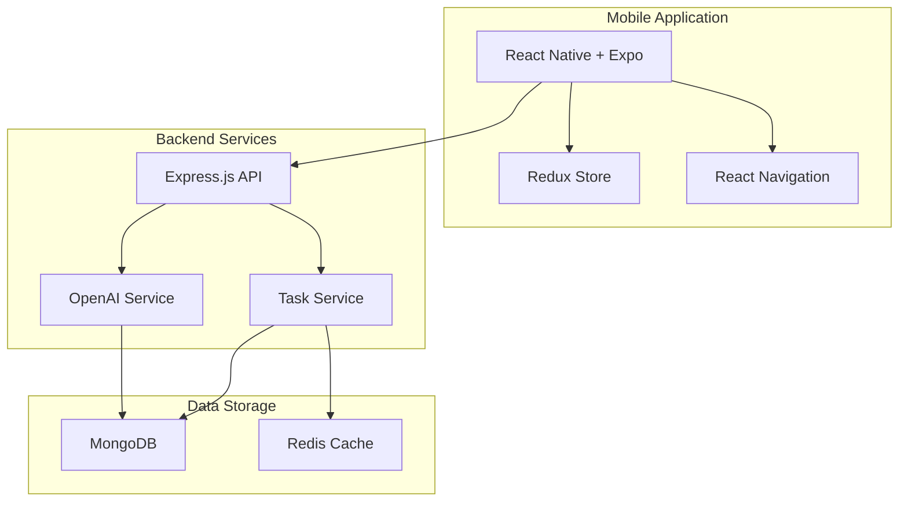

### Task Flow Architecture

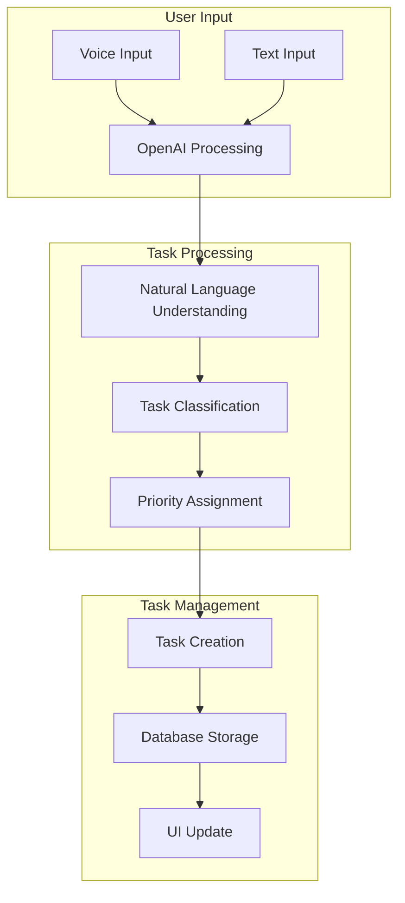

### Development Timeline

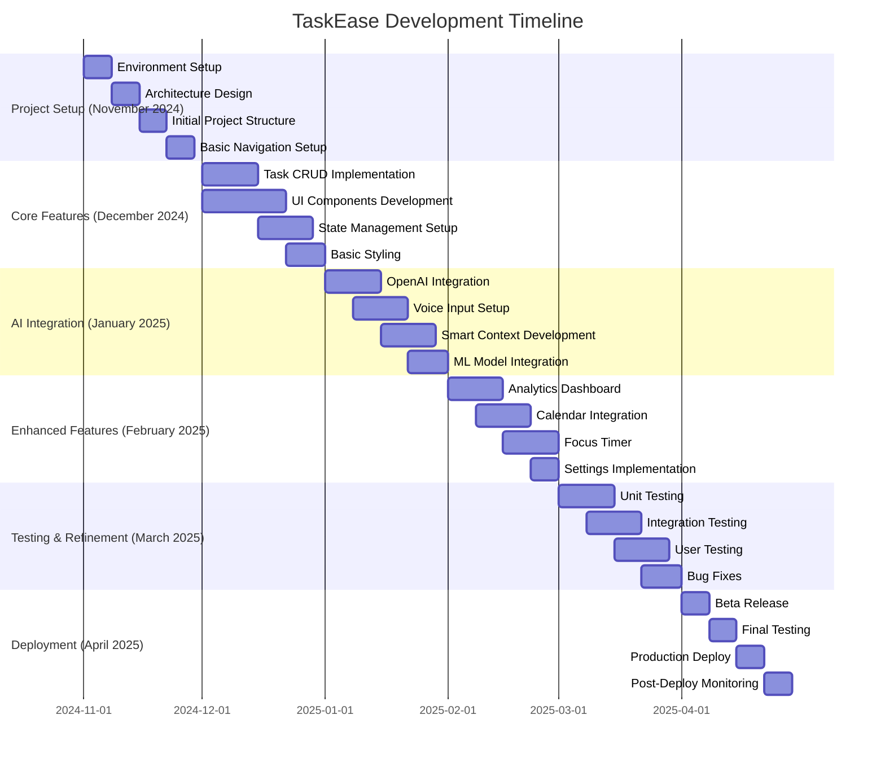

### Application Flow

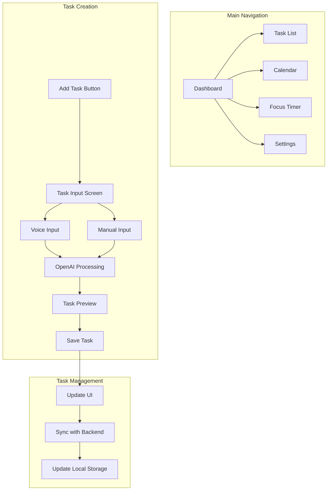

## Domain and User Analysis

### Target Users

1. **Primary Users**
   - Busy professionals managing multiple projects
   - Students balancing academic and personal tasks
   - Remote workers coordinating distributed work
   - Freelancers handling multiple clients

2. **User Needs Analysis**
   ```mermaid
   mindmap
    root((User Needs))
        Task Management
            Quick task entry
            Priority setting
            Deadline tracking
        Smart Features
            AI suggestions
            Context awareness
            Automated scheduling
        Integration
            Calendar sync
            Email integration
            File attachments
        Wellness
            Break reminders
            Work-life balance
            Progress tracking
   ```

## Design Philosophy and Choices

### Technical Architecture

1. **Frontend Implementation**
   - React Native for cross-platform mobile development
   - Redux for state management
   - Styled-components for theming
   - React Navigation for routing

### OpenAI Integration Architecture

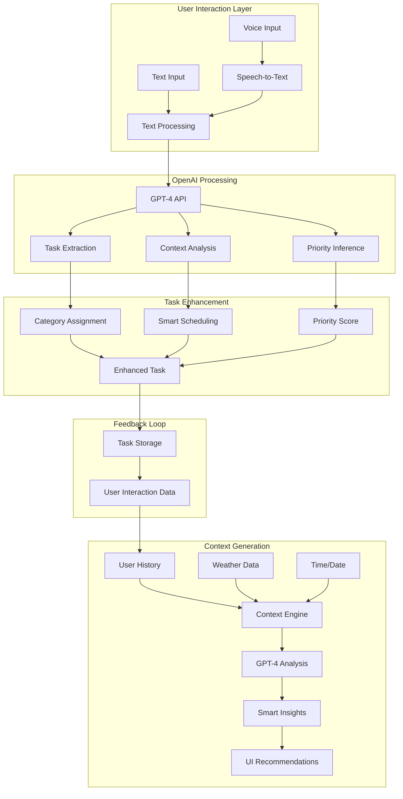

## Implementation Plan

### Development Timeline

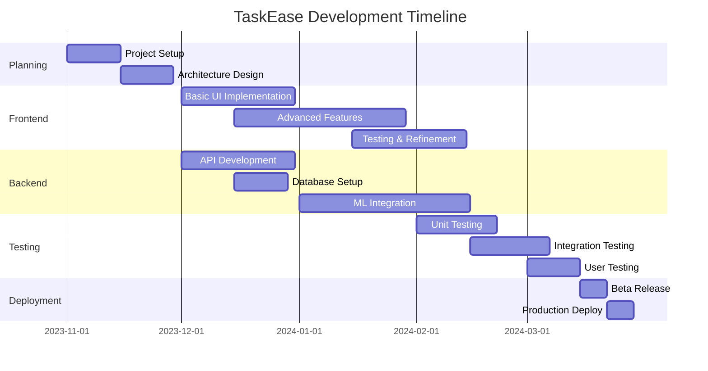

## Testing and Evaluation Strategy

### Testing Approach

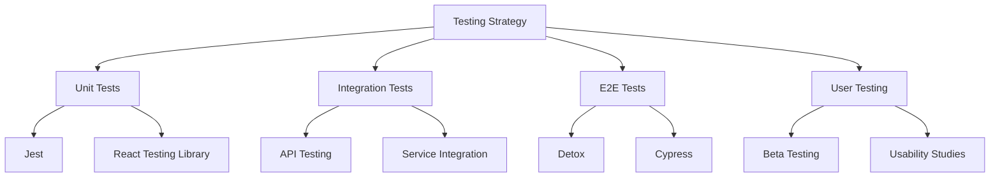

### Evaluation Metrics

1. **Performance Metrics**
   - App launch time < 2 seconds
   - Task creation < 1 second
   - API response time < 200ms
   - Offline functionality
   
2. **User Experience Metrics**
   - Task completion rate
   - Time to complete common actions
   - Error rate
   - User satisfaction score

## Visual Design

### Mobile App Interface

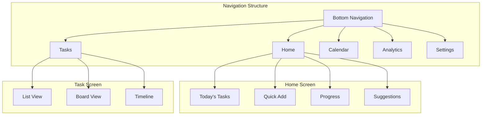

### UI Components and Styling

1. **Color Scheme**
   ```mermaid
   graph LR
    A[Primary: #4A90E2] --> B[Buttons/CTAs]
    C[Secondary: #50E3C2] --> D[Accents]
    E[Background: #F5F6FA] --> F[Main Areas]
    G[Text: #2D3436] --> H[Content]
   ```

2. **Component Library**
   - Custom Material UI components
   - Native iOS/Android elements
   - Responsive grid system
   - Animated transitions

### Screen Layouts

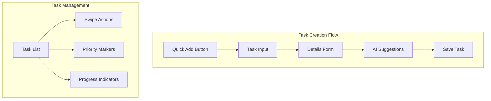

## Technology Stack and Implementation

### Core Technologies

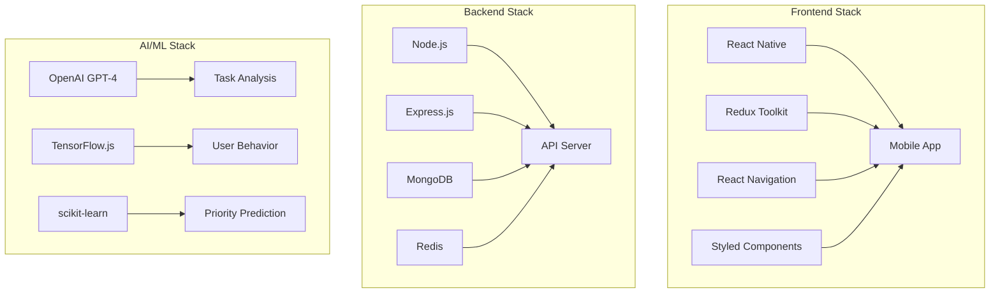

### API Integration

1. **External APIs**
   ```mermaid
   graph LR
    A[TaskEase] --> B[Google Calendar API]
    A --> C[OpenAI API]
    A --> D[Weather API]
    A --> E[Location Services]
   ```

2. **AI Model Integration**
   - GPT-4 for natural language task parsing
   - Custom ML models for priority prediction
   - TensorFlow.js for client-side predictions

### Data Flow Architecture

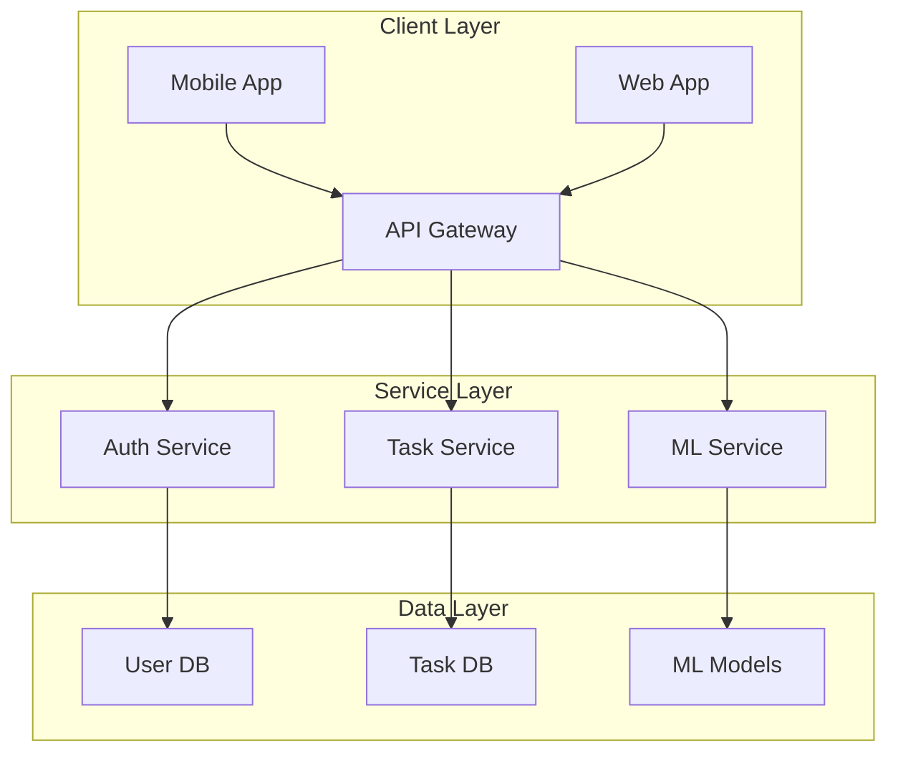

## Project Structure and Organization

### Code Organization

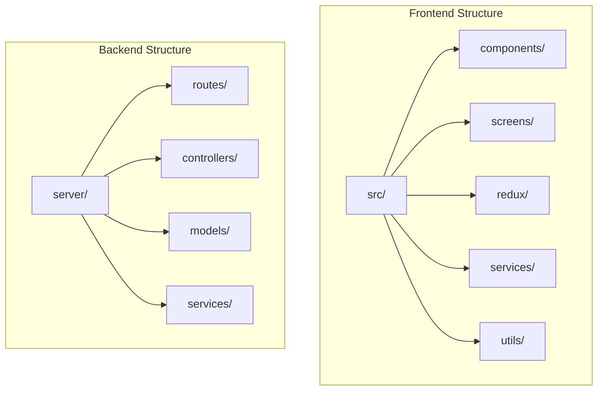

### Development Workflow

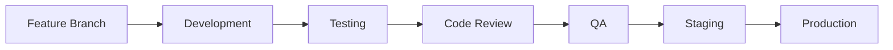

## Testing and Quality Assurance

### Automated Testing Strategy

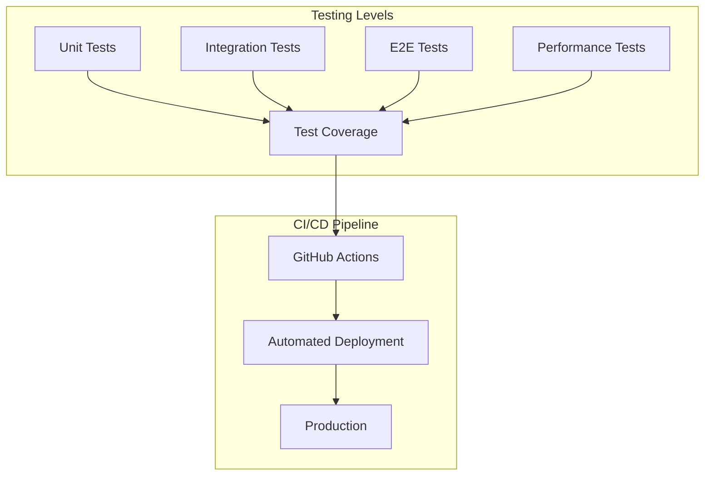

### User Testing Plan

1. **Beta Testing Program**
   - Initial group of 50 users
   - Feedback collection through in-app surveys
   - Usage analytics tracking
   - Weekly feedback sessions

2. **Evaluation Criteria**
   ```mermaid
   mindmap
    root((Evaluation))
        Performance
            Response time
            Load handling
            Battery usage
        Usability
            Task completion
            Navigation
            Learnability
        Features
            AI accuracy
            Integration
            Offline mode
        User Satisfaction
            NPS score
            Retention
            Engagement
   ```

### Quality Metrics

1. **Technical Metrics**
   - Code coverage > 80%
   - API response time < 200ms
   - App size < 50MB
   - Crash-free sessions > 99.9%

2. **User Experience Metrics**
   - Task completion rate > 90%
   - User satisfaction score > 4.5/5
   - Feature adoption rate > 60%
   - Daily active users growth > 10%

## Application Screenshots and Interface Design

### Key Screens Overview

#### 1. Dashboard Screen

* **Smart Context Bar**
  - Weather integration with icon and temperature
  - Urgent tasks counter with next due time
  - Focus status with time remaining
* **Daily Overview**
  - Personalized greeting with AI insights
  - Task suggestions based on energy levels
  - Break time recommendations
* **Quick Stats**
  - Day streak tracking
  - Focus time monitoring
  - Task completion rate
  - Energy level indicator

#### 2. Task Management

* **Task List Features**
  - Swipeable task cards
  - Category-based color coding
  - Priority indicators (high/medium/low)
  - Time scheduling display
* **Task Categories**
  - Work (Blue)
  - Health (Green)
  - Study (Purple)
  - Leisure (Orange)
* **Visual Elements**
  - Category icons
  - Progress indicators
  - Due date highlighting

#### 3. Smart Input

* **AI Task Creation**
  - Voice input capability
  - Natural language processing
  - Smart categorization
* **Quick Add Interface**
  - Microphone button for voice input
  - AI-powered task suggestions
  - Context-aware scheduling

#### 4. Focus Mode

* **Focus Timer**
  - Timer controls
  - Session tracking
  - Break scheduling
* **Analytics**
  - Focus session statistics
  - Productivity tracking
  - Energy level monitoring

#### 5. Calendar Integration

* **Calendar View**
  - Task distribution overview
  - Event synchronization
  - Schedule visualization
* **Time Management**
  - Time blocking
  - Task scheduling
  - Deadline tracking

#### 6. Settings

* **App Configuration**
  - Theme customization
  - Notification preferences
  - Integration settings
* **User Preferences**
  - Profile management
  - Privacy settings
  - App customization

### Navigation Structure

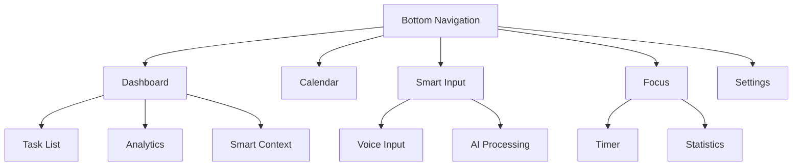

### Design System Implementation

1. **Color Scheme**
   ```css
   :root {
     /* Primary Colors */
     --primary-blue: #007AFF;    /* Smart Input Button */
     --work-blue: #007AFF;       /* Work Category */
     --health-green: #30D158;    /* Health Category */
     --study-purple: #5856D6;    /* Study Category */
     --leisure-orange: #FF9F0A;  /* Leisure Category */
     
     /* UI Colors */
     --background: #FFFFFF;
     --surface: #F8F9FF;
     --text-primary: #000000;
     --text-secondary: #666666;
     --border: #F0F0F0;
   }
   ```

2. **Typography**
   ```css
   /* Font Styles */
   .heading-1 {
     font-size: 24px;
     font-weight: 600;     /* Good morning, Alex! */
   }
   
   .task-title {
     font-size: 16px;
     font-weight: 500;
   }
   
   .status-text {
     font-size: 14px;
     color: var(--text-secondary);
   }
   ```

3. **Component Examples**
   ```jsx
   // Smart Context Bar Component
   <StatusBar>
     <WeatherWidget icon="☀️" temp="22°" condition="Clear" />
     <TaskCounter count={2} nextDue="2:00 PM" />
     <FocusStatus state="Peak" timeLeft="45m" />
   </StatusBar>

   // Task Card Component
   <TaskCard
     title="Complete Project Design"
     category="work"
     priority="high"
     startTime="09:00"
     endTime="11:00"
     completed={false}
   />
   ```

### Interaction Patterns

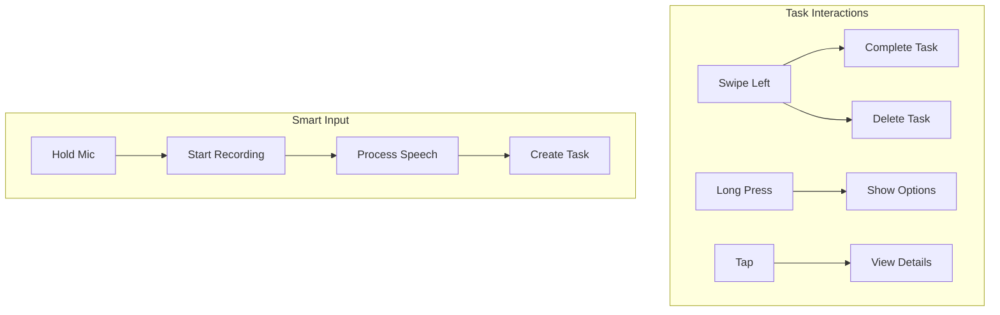

## Technical Implementation Details

### Frontend Architecture

The frontend of TaskEase is built using React Native with Expo, enabling cross-platform development while maintaining native performance. Key implementation aspects include:

1. **Component Structure**
   - Utilizes functional components with React Hooks
   - Implements custom hooks for business logic separation
   - Uses context providers for state management
   - Employs memo and useMemo for performance optimization

2. **State Management**
   - Redux Toolkit for global state management
   - Local state with useState for component-specific data
   - AsyncStorage for persistent data storage
   - Real-time updates using WebSocket connections

3. **Navigation System**
   - Expo Router for type-safe navigation
   - Bottom tab navigation for main screens
   - Stack navigation for detailed views
   - Modal presentations for quick actions

4. **UI Implementation**
   - React Native Paper for Material Design components
   - Custom styled-components for consistent theming
   - Responsive layouts using Flexbox
   - Native animations for smooth transitions

### Backend Services

The backend infrastructure is built on a microservices architecture using Node.js and Express:

1. **API Server**
   - RESTful endpoints for CRUD operations
   - JWT authentication for secure access
   - Rate limiting for API protection
   - Request validation using Joi
   - Error handling middleware
   - Logging with Winston

2. **Database Layer**
   - MongoDB for task and user data storage
   - Redis for caching and session management
   - Mongoose ODM for data modeling
   - Indexing for query optimization
   - Data validation at schema level

3. **Authentication Service**
   - JWT token generation and validation
   - Refresh token rotation
   - Password hashing with bcrypt
   - OAuth2 integration for social login
   - Session management

4. **Task Management Service**
   - Task CRUD operations
   - Priority calculation algorithms
   - Due date management
   - Category organization
   - Recurring task handling

### AI/ML Integration

TaskEase leverages advanced artificial intelligence and machine learning components to create a truly intelligent task management system. Our implementation focuses on three key areas: natural language processing, predictive analytics, and contextual awareness.

1. **OpenAI Integration**
   The core of our intelligent task processing relies on OpenAI's GPT-4 model, which we use in several sophisticated ways:

   a) **Natural Language Task Processing**
   - Converts user input into structured task data
   - Extracts key parameters like deadlines, priority, and category
   - Identifies task dependencies and relationships
   - Implementation example:
     ```javascript
     const generateSmartContext = async (tasks, analytics, weather) => {
       const completion = await openai.createCompletion({
         model: "gpt-4",
         prompt: generateContextPrompt(tasks, analytics, weather),
         max_tokens: 150,
         temperature: 0.7
       });
       return parseCompletionResponse(completion.data);
     };
     ```

   b) **Context-Aware Recommendations**
   - Analyzes user's working patterns
   - Considers environmental factors
   - Adapts to user's energy levels
   - Provides personalized scheduling suggestions

   c) **Smart Categorization**
   - Automatically categorizes tasks based on content
   - Learns from user corrections
   - Maintains consistency across similar tasks
   - Adapts to user's personal categorization style

2. **Machine Learning Models**
   Our application employs several custom-trained models for different aspects of task management:

   a) **Priority Prediction Model**
   - Uses TensorFlow.js for client-side inference
   - Features considered:
     * Task description semantics
     * User's historical patterns
     * Deadline proximity
     * Task dependencies
     * Project context
   - Continuous learning from user interactions
   - Accuracy improvement through feedback loops

   b) **User Behavior Analysis**
   - Tracks productivity patterns
   - Identifies optimal working hours
   - Monitors task completion patterns
   - Adapts to changing user habits
   - Implementation focuses:
     * Pattern recognition
     * Anomaly detection
     * Trend analysis
     * Behavioral prediction

   c) **Energy Level Estimation**
   - Combines multiple data sources:
     * Time of day
     * Previous task completion rates
     * Break patterns
     * Device usage patterns
     * External factors (weather, calendar)
   - Provides real-time energy level predictions
   - Suggests optimal task scheduling

3. **Context Engine**
   The context engine is a sophisticated system that processes multiple data streams to provide intelligent task management:

   a) **Data Integration**
   - Real-time weather data processing
   - Calendar event analysis
   - Location-based context awareness
   - Device status monitoring
   - External API integration

   b) **Context Processing Pipeline**
   ```plaintext
   Raw Data Collection → Data Normalization → Feature Extraction 
   → Context Analysis → Pattern Matching → Recommendation Generation
   ```

   c) **Adaptive Learning System**
   - Continuously updates user preferences
   - Refines recommendation accuracy
   - Adjusts to seasonal changes
   - Incorporates feedback loops

4. **Model Training and Optimization**
   Our AI models undergo continuous improvement through:

   a) **Training Process**
   - Initial training on anonymized user data
   - Fine-tuning with user-specific patterns
   - Regular retraining with new data
   - Performance monitoring and optimization

   b) **Model Evaluation Metrics**
   - Prediction accuracy
   - Response time
   - Resource utilization
   - User satisfaction scores

   c) **Optimization Techniques**
   - Model quantization for mobile devices
   - Batch prediction processing
   - Caching of frequent predictions
   - Efficient model architecture selection

5. **Privacy and Security Considerations**
   Our AI implementation prioritizes user privacy:

   a) **Data Protection**
   - Local processing when possible
   - Encrypted data transmission
   - Anonymous data aggregation
   - Secure model storage

   b) **User Control**
   - Opt-in for advanced features
   - Data usage transparency
   - Control over data sharing
   - Clear privacy settings

6. **Future AI Enhancements**
   Planned improvements to our AI system include:

   a) **Advanced Features**
   - Multi-modal input processing
   - Enhanced context understanding
   - Improved prediction accuracy
   - More sophisticated recommendations

   b) **Technical Improvements**
   - Reduced model size
   - Faster inference time
   - Better battery efficiency
   - Enhanced offline capabilities

### Cloud Infrastructure

The application is deployed using a containerized architecture:

1. **Docker Configuration**
   ```dockerfile
   # API Server
   FROM node:16-alpine
   WORKDIR /app
   COPY package*.json ./
   RUN npm install
   COPY . .
   EXPOSE 3000
   CMD ["npm", "start"]
   ```

2. **Kubernetes Deployment**
   - Horizontal pod autoscaling
   - Load balancing configuration
   - Health checks and monitoring
   - Rolling updates strategy

3. **CI/CD Pipeline**
   - GitHub Actions for automated testing
   - Docker image building and pushing
   - Automated deployment to staging
   - Production deployment approval gates

### Data Flow and Processing

1. **Task Creation Flow**
   ```plaintext
   User Input → NLP Processing → Category Assignment → Priority Calculation 
   → Schedule Optimization → Database Storage → Real-time Update
   ```

2. **Smart Context Generation**
   ```plaintext
   User Data + External Data → Context Engine → ML Processing 
   → Recommendation Generation → UI Update
   ```

3. **Analytics Processing**
   ```plaintext
   User Actions → Event Collection → Data Aggregation 
   → ML Analysis → Insight Generation
   ```

### Security Implementation

1. **Data Protection**
   - End-to-end encryption for sensitive data
   - Secure storage of API keys
   - Data sanitization
   - Input validation

2. **Authentication Flow**
   ```plaintext
   Login Request → JWT Generation → Token Storage → 
   Request Authorization → Token Refresh → Logout
   ```

3. **API Security**
   - CORS configuration
   - Rate limiting
   - Request validation
   - Error handling

### Performance Optimizations

1. **Frontend Optimizations**
   - Component memoization
   - Lazy loading of routes
   - Image optimization
   - Cache management

2. **Backend Optimizations**
   - Database indexing
   - Query optimization
   - Response caching
   - Connection pooling

3. **Network Optimizations**
   - API response compression
   - Batch requests
   - WebSocket for real-time updates
   - CDN integration

### Error Handling and Monitoring

1. **Error Management**
   - Global error boundary
   - Error logging service
   - User-friendly error messages
   - Automatic retry mechanisms

2. **Monitoring System**
   - Performance metrics collection
   - Error tracking
   - User behavior analytics
   - System health monitoring

This technical implementation ensures TaskEase delivers a robust, scalable, and maintainable solution for intelligent task management.

### Focus Timer Implementation Flow

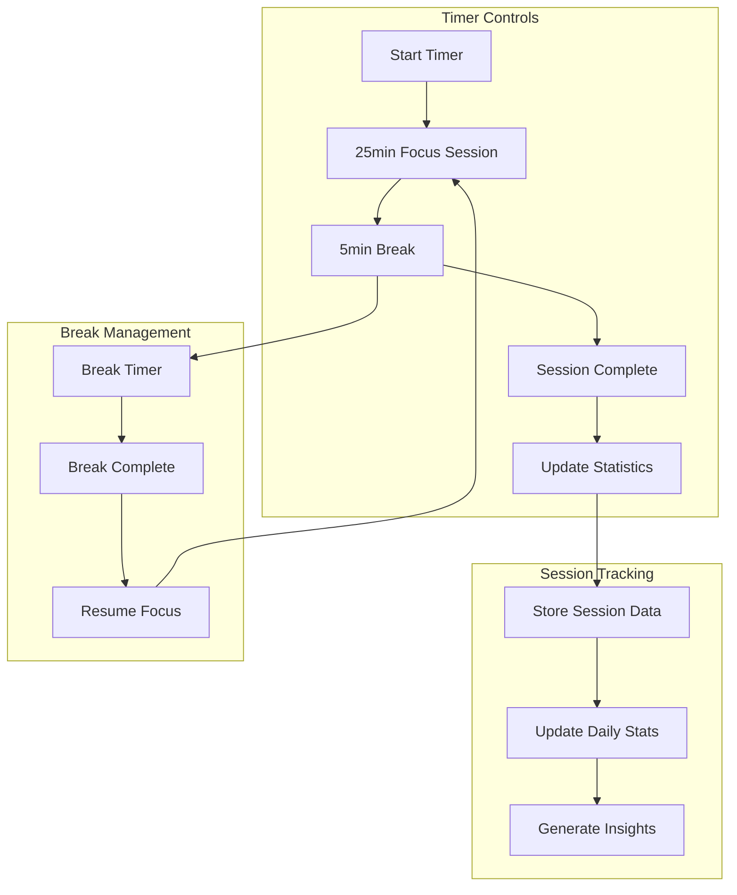

### Voice Input Processing

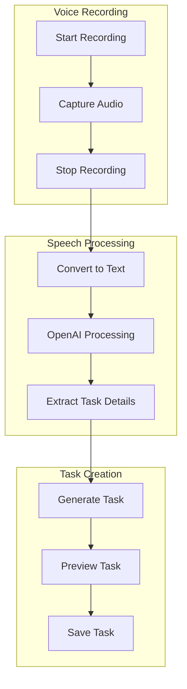

### Smart Context Generation Flow

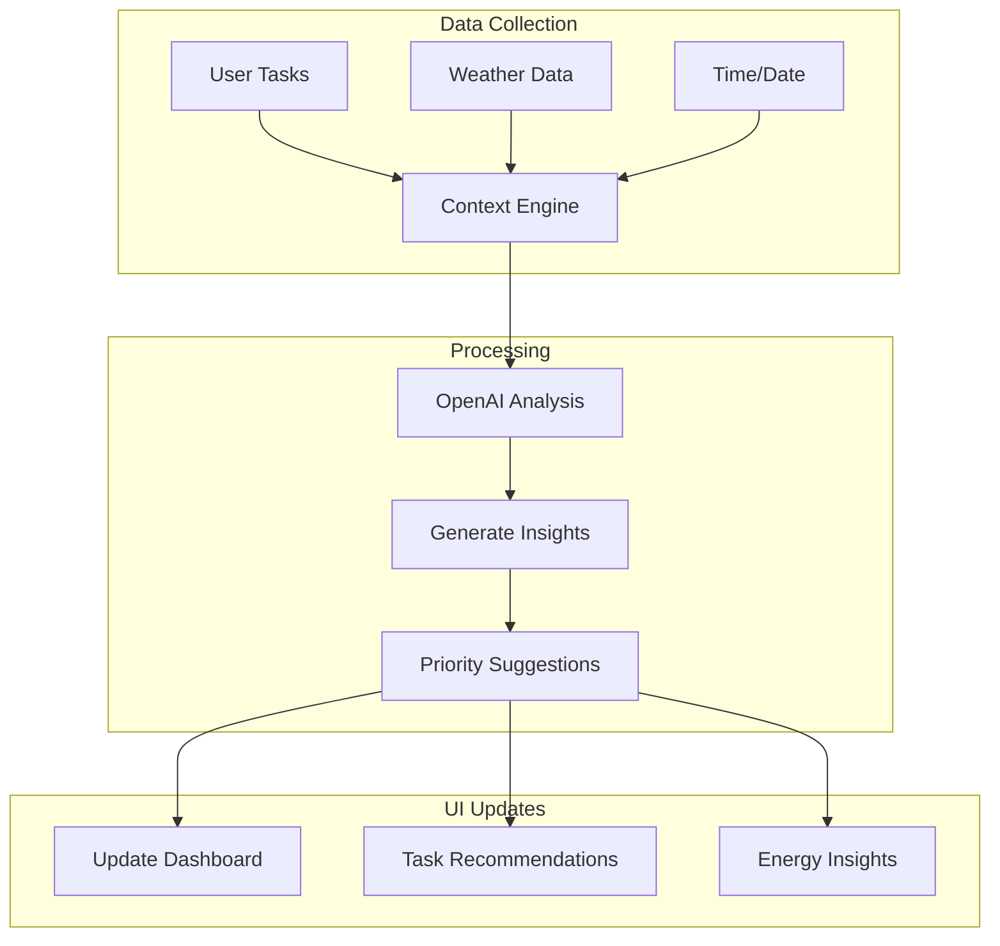

### Analytics Data Flow

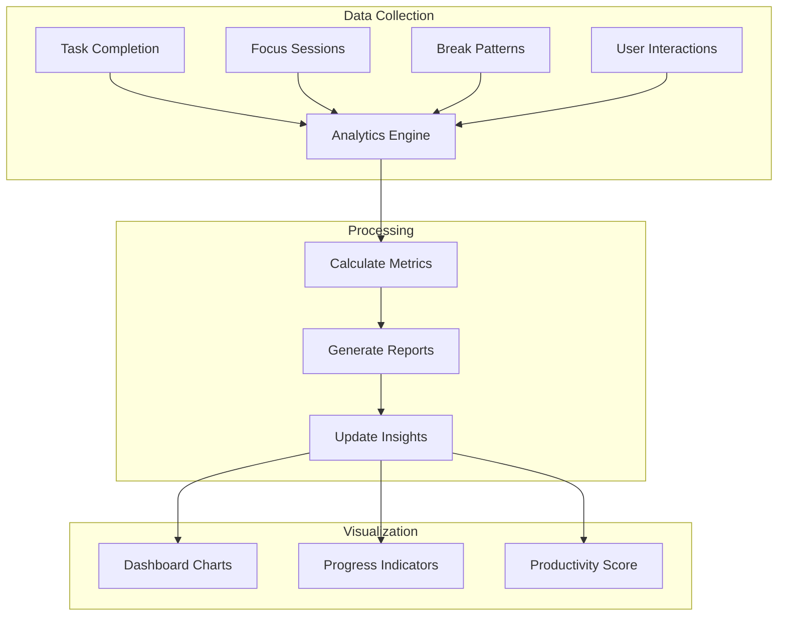

### Database Schema

```mermaid
erDiagram
    USER {
        string id PK
        string name
        string email
        datetime created_at
        object preferences
    }
    
    TASK {
        string id PK
        string user_id FK
        string title
        string category
        string priority
        datetime start_time
        datetime end_time
        boolean completed
        object metadata
    }
    
    FOCUS_SESSION {
        string id PK
        string user_id FK
        datetime start_time
        datetime end_time
        int duration
        boolean completed
        object statistics
    }
    
    ANALYTICS {
        string id PK
        string user_id FK
        date date
        object metrics
        object insights
    }
    
    USER ||--o{ TASK : creates
    USER ||--o{ FOCUS_SESSION : conducts
    USER ||--o{ ANALYTICS : generates
```

