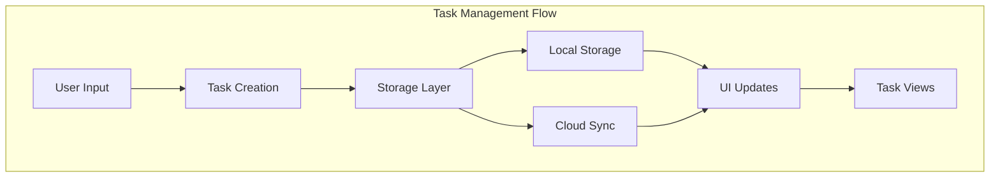
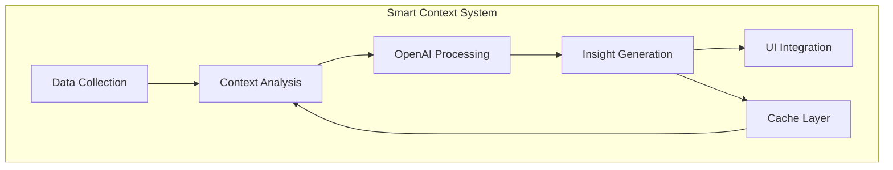
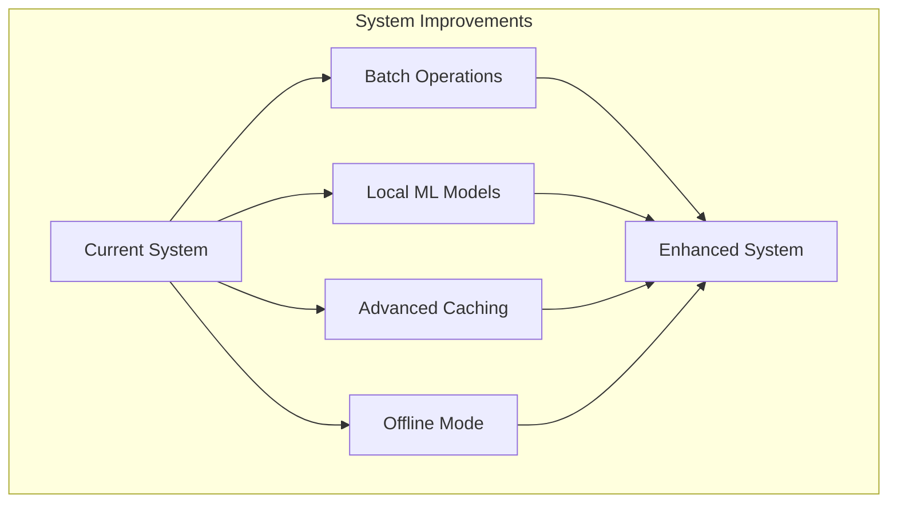

# Feature Prototype : Task Management System and Smart Context

## Overview

For our feature prototype, we implemented two core features of TaskEase: the Task Management System and the Smart Context System. These features represent the fundamental task handling capabilities and the AI-powered contextual awareness that sets TaskEase apart from traditional task management applications. The prototype demonstrates the feasibility of integrating sophisticated AI capabilities into a mobile task management application while maintaining performance and usability.

## Task Management System

### Implementation Details

The Task Management System implements a comprehensive task handling solution with the following key features:

1. **Task Categories**
   - Work (Blue): Professional and career-related tasks
   - Health (Green): Health and wellness activities
   - Study (Purple): Educational and learning tasks
   - Leisure (Orange): Personal and recreational activities

2. **Priority Levels**
   - High: Time-sensitive tasks requiring immediate attention
   - Medium: Important tasks with flexible timing
   - Low: Optional tasks with no urgent deadline

3. **Temporal Management**
   - Start and end time tracking
   - Deadline monitoring
   - Duration estimation

### Operational Flow

The Task Management System operates through a series of well-defined processes:

1. **Task Creation**
   - Users can create tasks through voice input or text entry
   - Each task requires a title, category, and priority level
   - Optional fields include start time, end time, and additional notes
   - The system automatically assigns a unique identifier and creation timestamp
   - Tasks are immediately synchronized with local storage and cloud backend

2. **Task Updates**
   - Users can modify any task attribute through the edit interface
   - Changes trigger immediate local updates and cloud synchronization
   - The system maintains a history of modifications for tracking
   - Real-time UI updates reflect changes across all views

3. **Task Organization**
   - Tasks are automatically sorted by priority and due date
   - Category-based filtering enables focused views
   - Calendar integration shows temporal distribution
   - Dashboard view provides quick access to urgent tasks

4. **Task Completion**
   - Users can mark tasks as complete through swipe gestures or checkboxes
   - Completed tasks are archived but remain searchable
   - Completion statistics feed into the analytics system
   - Task completion triggers Smart Context updates



## Smart Context System

### Implementation Overview

The Smart Context System represents the AI-powered intelligence layer of TaskEase. It integrates OpenAI's GPT-3.5 Turbo model to provide contextually aware task management suggestions and insights. The system processes multiple data streams including:

1. **User Tasks**: Current and historical task data
2. **Time Context**: Time of day, day of week, and seasonal factors
3. **Environmental Data**: Weather conditions and location information
4. **User Analytics**: Task completion patterns and productivity metrics

### Smart Context Processing

The Smart Context system operates through a sophisticated pipeline:

1. **Data Collection Phase**
   - Gathers current task list and completion history
   - Retrieves local weather data and time information
   - Collects user activity patterns and preferences
   - Checks device status and calendar events

   Example Input:
   ```json
   {
     "currentTime": "14:30",
     "currentDate": "2024-02-15",
     "dayOfWeek": "Thursday",
     "tasks": [
       {
         "title": "Complete Project Presentation",
         "priority": "high",
         "category": "work",
         "startTime": "13:00",
         "endTime": "16:00",
         "completed": false
       },
       {
         "title": "Gym Session",
         "priority": "medium",
         "category": "health",
         "startTime": "17:00",
         "endTime": "18:00",
         "completed": false
       }
     ],
     "weather": {
       "temperature": 22,
       "condition": "sunny",
       "humidity": 45
     },
     "userAnalytics": {
       "completionRate": 85,
       "peakProductivityHours": ["09:00", "14:00"],
       "lastBreak": "13:00"
     }
   }
   ```

2. **Context Analysis**
   - Aggregates collected data into a structured format
   - Analyzes task patterns and user behavior
   - Identifies urgent tasks and potential conflicts
   - Evaluates environmental factors

3. **OpenAI Integration**
   - Constructs a detailed prompt with contextual information
   - Sends data to GPT-3.5 Turbo for analysis
   - Receives structured recommendations and insights
   - Processes and validates AI responses

4. **Insight Generation**
   - Creates personalized task suggestions
   - Generates energy level predictions
   - Recommends optimal task scheduling
   - Provides contextual productivity tips

5. **User Interface Integration**
   - Updates dashboard with new insights
   - Displays weather-aware task suggestions
   - Shows energy level indicators
   - Provides smart break recommendations

   Example Output:
   ```json
   {
     "smartContext": {
       "weather": {
         "icon": "☀️",
         "temp": "22°C",
         "condition": "Perfect weather for focus"
       },
       "urgentTasks": {
         "count": 1,
         "nextDue": "Project Presentation (1.5 hours remaining)"
       },
       "focusStatus": {
         "state": "Peak Productivity",
         "timeLeft": "45 minutes until recommended break"
       },
       "energyLevel": "high",
       "suggestedActivity": "Continue with Project Presentation while energy levels are high",
       "nextBreak": "15:15 (10-minute break recommended)",
       "insight": "You're in your afternoon productivity peak. After completing the presentation, the weather is perfect for your planned gym session."
     },
     "taskSuggestions": [
       {
         "type": "schedule",
         "message": "Consider a short break at 15:15 before final presentation review"
       },
       {
         "type": "optimization",
         "message": "Weather and energy levels are optimal for gym session as planned"
       }
     ],
     "timestamp": "2024-02-15T14:30:00Z",
     "lastUpdated": "14:30"
   }
   ```

This example demonstrates how the Smart Context system processes various inputs to generate meaningful, context-aware insights and recommendations. The system considers multiple factors including:
- Current task priorities and deadlines
- User's productivity patterns
- Environmental conditions
- Energy level predictions
- Break timing optimization

The generated insights are then integrated into the user interface, providing real-time guidance for task management and productivity optimization.



## Prototype Evaluation and Improvements

### Current Implementation Strengths

1. **Task Management System**
   - Comprehensive task categorization with visual differentiation
   - Flexible priority management system
   - Efficient data synchronization
   - Intuitive user interaction patterns

2. **Smart Context System**
   - Sophisticated AI-powered task analysis
   - Multi-factor context generation
   - Efficient caching mechanism
   - Personalized task suggestions

### Proposed Improvements



## Conclusion

The prototype implementation demonstrates the feasibility of our core features while highlighting areas for improvement. The Task Management System provides a solid foundation for task organization, while the Smart Context System successfully implements AI-powered insights. The integration of these systems creates a unique task management experience that adapts to user needs and context.

Through the development and testing of this prototype, we've identified several key areas for enhancement that will be addressed in the full implementation. These improvements will focus on making the system more efficient, responsive, and personalized to user needs, while maintaining the core functionality that makes TaskEase unique in the task management space.
