# TaskEase: An Intelligent Task Management System
#### Final Project Report

---

# Table of Contents

- [Introduction](#introduction)
  - [Project Overview](#project-overview)
  - [Innovation and Motivation](#innovation-and-motivation)
    - [Key Challenges Addressed](#key-challenges-addressed)
  - [Distinctive Features](#distinctive-features)
    - [Core Innovation Features](#core-innovation-features)
  - [Technical Implementation](#technical-implementation)
  - [Target Audience](#target-audience)
  - [Theoretical Foundation](#theoretical-foundation)
  - [Future Vision](#future-vision)
  - [References](#references)
- [Literature Review](#literature-review)
  - [Introduction](#introduction-1)
  - [Task Management Applications and Systems](#task-management-applications-and-systems)
    - [Commercial Solutions Analysis](#commercial-solutions-analysis)
      - [Todoist: AI-Powered Task Management](#todoist-ai-powered-task-management)
      - [Microsoft To Do: Integration-First Approach](#microsoft-to-do-integration-first-approach)
      - [Notion: Flexible Task Management](#notion-flexible-task-management)
    - [Academic Research on Task Management Systems](#academic-research-on-task-management-systems)
      - [Adaptive Task Management Systems](#adaptive-task-management-systems)
  - [Psychological Foundations](#psychological-foundations)
    - [Cognitive Load Theory in Task Management](#cognitive-load-theory-in-task-management)
    - [Decision Fatigue and Task Prioritization](#decision-fatigue-and-task-prioritization)
  - [Technical Frameworks and Methodologies](#technical-frameworks-and-methodologies)
    - [Machine Learning in Task Prioritization](#machine-learning-in-task-prioritization)
      - [Natural Language Processing](#natural-language-processing)
    - [Context-Aware Computing](#context-aware-computing)
  - [Gaps in Existing Research and Solutions](#gaps-in-existing-research-and-solutions)
  - [Implications for TaskEase](#implications-for-taskease)
  - [References](#references-1)
- [Design Document](#design-document)
  - [Project Overview](#project-overview-1)
    - [System Architecture Overview](#system-architecture-overview)
    - [Task Flow Architecture](#task-flow-architecture)
    - [Development Timeline](#development-timeline)
    - [Application Flow](#application-flow)
  - [Domain and User Analysis](#domain-and-user-analysis)
    - [Target Users and Needs Analysis](#target-users-and-needs-analysis)
  - [Design Philosophy and Choices](#design-philosophy-and-choices)
    - [UI/UX Design Principles](#uiux-design-principles)
  - [Technology Stack and Implementation](#technology-stack-and-implementation)
    - [Core Technologies](#core-technologies)
    - [API Integration](#api-integration)
    - [Development Timeline](#development-timeline-1)
  - [Testing and Evaluation Strategy](#testing-and-evaluation-strategy)
    - [Testing Approach](#testing-approach)
    - [Evaluation Metrics](#evaluation-metrics)
  - [Visual Design](#visual-design)
    - [Mobile App Interface](#mobile-app-interface)
    - [UI Components and Styling](#ui-components-and-styling)
    - [Screen Layouts](#screen-layouts)
  - [Technology Stack and Implementation](#technology-stack-and-implementation-1)
    - [Core Technologies](#core-technologies-1)
    - [API Integration](#api-integration-1)
    - [Data Flow Architecture](#data-flow-architecture)
  - [Project Structure and Organization](#project-structure-and-organization)
    - [Code Organization](#code-organization)
    - [Development Workflow](#development-workflow)
  - [Testing and Quality Assurance](#testing-and-quality-assurance)
    - [Automated Testing Strategy](#automated-testing-strategy)
    - [User Testing Plan](#user-testing-plan)
    - [Quality Metrics](#quality-metrics)
  - [Application Screenshots and Interface Design](#application-screenshots-and-interface-design)
    - [Key Screens Overview](#key-screens-overview)
      - [1. Dashboard Screen](#1-dashboard-screen)
      - [2. Task Management](#2-task-management)
      - [3. Smart Input](#3-smart-input)
      - [4. Focus Mode](#4-focus-mode)
      - [5. Calendar Integration](#5-calendar-integration)
      - [6. Settings](#6-settings)
    - [Navigation Structure](#navigation-structure)
    - [Design System Implementation](#design-system-implementation)
    - [Interaction Patterns](#interaction-patterns)
    - [Focus Timer Implementation Flow](#focus-timer-implementation-flow)
    - [Voice Input Processing](#voice-input-processing)
    - [Smart Context Generation Flow](#smart-context-generation-flow)
    - [Analytics Data Flow](#analytics-data-flow)
    - [Database Schema](#database-schema)
- [Feature Prototype : Task Management System, Smart Context, and Focus Mode](#feature-prototype--task-management-system-smart-context-and-focus-mode)
  - [Overview](#overview)
  - [Task Management System](#task-management-system)
    - [Implementation Details](#implementation-details)
    - [Operational Flow](#operational-flow)
  - [Smart Context System](#smart-context-system)
    - [Implementation Overview](#implementation-overview)
    - [Smart Context Processing](#smart-context-processing)
  - [Focus/Break Mode System](#focusbreak-mode-system)
    - [Implementation Overview](#implementation-overview-1)
    - [Core Components](#core-components)
    - [Implementation Flow](#implementation-flow)
    - [Smart Features](#smart-features)
    - [User Experience](#user-experience)
    - [Integration with Other Systems](#integration-with-other-systems)
  - [Prototype Evaluation and Improvements](#prototype-evaluation-and-improvements)
    - [Current Implementation Strengths](#current-implementation-strengths)
    - [Proposed Improvements](#proposed-improvements)
  - [Conclusion](#conclusion)

# Introduction

## Project Overview

In an era where digital transformation continues to reshape our daily lives, effective task management has become increasingly crucial for maintaining productivity and reducing cognitive load. This project, **TaskEase**, is based on the CM3050 Mobile Development template "*Task manager mobile app*," but extends beyond traditional task management to create an intelligent, adaptive solution that addresses the growing complexity of modern work and life management.

## Innovation and Motivation

TaskEase represents a significant evolution in task management applications by incorporating artificial intelligence and machine learning to provide personalized, context-aware task organization. The project's conception stems from the observation that while numerous task management applications exist in the market, most fail to adapt to individual user patterns or provide intelligent assistance in task prioritization and scheduling. This gap becomes particularly evident as users increasingly juggle multiple roles and responsibilities in their professional and personal lives.

### Key Challenges Addressed

The motivation behind TaskEase is rooted in addressing several key challenges faced by contemporary users:

1. The phenomenon of task overload and decision fatigue, well-documented in academic literature [Baumeister et al. 1998]
2. The complexity-simplicity paradox in existing solutions
3. The need for personalized, adaptive task management

## Distinctive Features

What sets TaskEase apart is its **intelligent approach to task management**. The application leverages AI to learn from user behavior, automatically prioritize tasks, and provide contextual recommendations. This includes smart scheduling that considers factors such as:

* User energy levels
* Historical productivity patterns
* External contexts (weather, location)
* Integration with existing digital tools

### Core Innovation Features

The project addresses the template's core requirements while introducing innovative features that align with modern user needs:

* **Smart Input**
  - Natural language processing for effortless task input
  - AI-powered scheduling and prioritization
  
* **Smart Context**
  - Contextual adaptation based on real-time data
  - Comprehensive analytics for productivity insights
  
* **User Well-being**
  - Mental health-conscious features including break recommendations
  - Gamification elements to maintain user engagement

## Technical Implementation

The technical implementation utilizes **React Native**, ensuring:
* Cross-platform compatibility
* Native performance
* Rapid development capability
* Offline functionality
* Cloud synchronization

## Target Audience

From a user perspective, TaskEase caters to a diverse audience:
* Busy professionals
* Students
* Remote workers

The interface is designed to be immediately accessible to novice users while offering advanced features for power users. This approach ensures that the application can grow with users as their task management needs evolve.

## Theoretical Foundation

The project's development is guided by established theoretical frameworks:
* **Self-Determination Theory** [Deci and Ryan 1985]
* **Flow Theory** [Csikszentmihalyi 1990]

These frameworks ensure that the application not only helps users manage tasks but also promotes sustainable productivity habits. This theoretical foundation is complemented by practical features that address real-world user needs identified through market research and user feedback.

## Future Vision

Looking ahead, TaskEase aims to revolutionize how individuals approach task management by providing an intelligent, adaptive platform that grows and learns with its users. The project represents a significant step forward in mobile task management applications, combining cutting-edge technology with user-centric design to create a solution that not only manages tasks but actively contributes to user productivity and well-being.

This introduction sets the stage for a detailed exploration of TaskEase's development, implementation, and impact, demonstrating how it fulfills and extends beyond the original template requirements to create a truly innovative task management solution.

## References

[1] R. F. Baumeister, E. Bratslavsky, M. Muraven, and D. M. Tice. 1998. Ego depletion: Is the active self a limited resource? *Journal of Personality and Social Psychology* 74, 5 (1998), 1252-1265. DOI: https://doi.org/10.1037/0022-3514.74.5.1252

[2] E. L. Deci and R. M. Ryan. 1985. *Intrinsic Motivation and Self-Determination in Human Behavior*. Springer, Boston, MA. DOI: https://doi.org/10.1007/978-1-4899-2271-7

[3] M. Csikszentmihalyi. 1990. *Flow: The Psychology of Optimal Experience*. Harper & Row, New York. DOI: https://www.researchgate.net/publication/224927532_Flow_The_Psychology_of_Optimal_Experience


# Literature Review

## Introduction

This literature review examines existing research and implementations in task management, artificial intelligence applications in productivity tools, and the psychological aspects of task organization. The review synthesizes findings from academic papers, industry solutions, and technical frameworks that inform the development of TaskEase. The analysis focuses on four key areas: existing task management solutions, psychological foundations of productivity, technical frameworks for AI implementation, and gaps in current solutions that TaskEase aims to address. Through critical evaluation of existing literature and commercial solutions, this review aims to establish the theoretical and practical foundation for TaskEase's innovative approach to task management.

## Task Management Applications and Systems

### Commercial Solutions Analysis

#### Todoist: AI-Powered Task Management
Todoist represents one of the leading task management solutions, particularly notable for its implementation of natural language processing (NLP) for task input [1]. Their approach to task scheduling using machine learning algorithms demonstrates the viability of AI in task management, though their implementation focuses primarily on date recognition rather than comprehensive task context analysis.

A detailed analysis of Todoist's features reveals several key innovations in the task management space. The platform's natural language processing capabilities span 14 languages, representing a significant advancement in accessibility and user interaction. This multilingual support, while impressive, primarily focuses on date and time recognition, leaving room for more sophisticated context understanding. The platform's smart scheduling algorithms demonstrate basic learning capabilities from user behavior, but they lack the depth needed for truly personalized task management.

The integration ecosystem, while extensive with over 20 external platforms and services, often operates at a superficial level, primarily focusing on task synchronization rather than meaningful context sharing. The platform's context-aware task suggestions, while innovative, are largely limited to location and time-based triggers, missing opportunities for more nuanced environmental and psychological factors.

Critical evaluation of Todoist's implementation reveals several significant limitations. The platform's adaptation to user work patterns remains rudimentary, primarily based on completion times rather than comprehensive work habit analysis. The minimal consideration of user cognitive load is particularly noteworthy, as the system lacks mechanisms to adjust task presentation based on user mental state or energy levels. The absence of well-being monitoring features represents a missed opportunity to address the growing concern of digital wellness in productivity tools.

#### Microsoft To Do: Integration-First Approach
Microsoft's acquisition and evolution of Wunderlist into Microsoft To Do represents a significant shift in task management philosophy [2]. Their research into user behavior patterns has yielded compelling insights into the importance of ecosystem integration. The finding that 78% of users prefer integrated solutions underscores the critical nature of seamless workflow integration in modern productivity tools. The 45% increase in task completion rates with smart suggestions demonstrates the tangible benefits of AI-assisted task management, though the implementation could be more sophisticated.

The Microsoft approach to ecosystem integration demonstrates both strengths and limitations. The seamless synchronization with Outlook represents a strong understanding of professional workflow requirements, enabling users to convert emails into tasks effortlessly. However, this integration often prioritizes Microsoft's ecosystem over open standards, potentially limiting user flexibility. The SharePoint collaboration features, while powerful for enterprise users, can introduce unnecessary complexity for individual users or small teams.

The platform's user experience design philosophy reveals a careful balance between functionality and simplicity. The progressive feature disclosure approach helps manage cognitive load, though it sometimes results in hidden functionality that users might never discover. The cross-device synchronization implementation is robust but could benefit from more sophisticated conflict resolution mechanisms.

#### Notion: Flexible Task Management
Notion's approach to task management demonstrates the importance of flexibility and customization in modern productivity tools [3]. Their research indicating that 67% of users prefer customizable workflows highlights a significant shift away from rigid, pre-defined task management systems. The platform's success with template-based systems, showing a 48% increase in adoption, demonstrates the value of providing structured starting points while allowing for personalization.

The database-driven task management approach represents a paradigm shift in how tasks are conceptualized and organized. The 35% improvement in organization through this approach suggests that users benefit from the ability to view and manipulate their tasks in multiple ways. However, this flexibility comes at the cost of increased complexity and a steeper learning curve.

### Academic Research on Task Management Systems

#### Adaptive Task Management Systems
Horvitz et al.'s groundbreaking work on adaptive task management systems [Horvitz et al. 2020] provides crucial insights into the role of AI in task prioritization. Their comprehensive study of 1,000 knowledge workers represents one of the largest empirical investigations into AI-assisted task management. The finding that context-aware systems reduce task completion time by 28% demonstrates the significant potential of intelligent task management systems.

The study's examination of interruption management revealed that intelligent systems could increase productivity by 23% through better timing and prioritization of notifications. This finding is particularly significant given the growing challenge of digital distraction in modern work environments. The 35% reduction in cognitive load through adaptive interfaces suggests that dynamic UI adjustment based on user context and task complexity is a crucial feature for future task management systems.

The research identified several critical factors for successful task management that have been largely overlooked by commercial solutions. The time-based adaptation mechanisms demonstrated the importance of considering circadian rhythms and energy levels in task scheduling. Location awareness capabilities showed promise in task contextualization, though privacy concerns need careful consideration.

The study's findings on interface adaptation are particularly relevant to modern task management systems. The progressive disclosure approach, when properly implemented, showed significant benefits in reducing cognitive load while maintaining functionality. However, the research also highlighted the challenges of creating truly adaptive interfaces that balance customization with usability.

## Psychological Foundations

### Cognitive Load Theory in Task Management
Sweller's Cognitive Load Theory [Sweller 2020] has emerged as a fundamental framework for understanding how users interact with task management systems. The theory's application to digital task management represents a crucial bridge between cognitive psychology and user interface design. Through extensive empirical research, Sweller demonstrated that cognitive resources are not infinitely available and must be carefully managed to optimize task performance.

The theory identifies three distinct types of cognitive load, each with specific implications for task management system design:

1. **Intrinsic Load**: This represents the inherent complexity of tasks and their interrelationships. Sweller's research demonstrates that task complexity cannot be reduced beyond a certain point without losing essential meaning. In task management contexts, this manifests in several ways:
   * Task dependencies create natural complexity that must be clearly represented
   * Decision-making processes require careful consideration of multiple factors
   * Information processing demands increase with task complexity
   * Time pressure adds an additional dimension of cognitive strain

   Critical analysis of current task management systems reveals that most fail to adequately address intrinsic load, often presenting all tasks with equal visual weight regardless of their complexity or interdependencies.

2. **Extraneous Load**: This represents the cognitive burden imposed by the interface itself. Sweller's work demonstrates that poor interface design can significantly impair task performance. Key considerations include:
   * Navigation complexity often increases exponentially with feature addition
   * Information presentation must balance completeness with clarity
   * Interface consistency reduces cognitive overhead
   * Learning requirements should be minimized through intuitive design

   Research shows that many existing task management solutions inadvertently increase extraneous load through feature bloat and complex navigation hierarchies.

3. **Germane Load**: This represents the cognitive resources dedicated to learning and schema development. Sweller's research indicates that this type of load is beneficial when properly managed. In task management contexts, this includes:
   * Pattern recognition in task execution sequences
   * Development of personal productivity mental models
   * Acquisition of efficient task management skills
   * Automation of routine task handling

   Current systems often fail to capitalize on germane load, missing opportunities to help users develop better task management habits.

### Decision Fatigue and Task Prioritization
Building on Baumeister's seminal work on ego depletion [Baumeister and Vohs 2018], recent research has revealed crucial insights into how decision fatigue impacts task management. The finding that decision quality decreases by 30% after multiple consecutive decisions has profound implications for task prioritization interfaces. This degradation in decision-making capability presents a significant challenge for traditional task management systems that require constant user input for prioritization.

The research identifies several critical patterns in decision fatigue:

1. **Temporal Effects on Decision Quality**:
   * Morning hours show optimal decision-making capability
   * Decision quality deteriorates progressively throughout the day
   * Recovery periods are essential for maintaining decision quality
   * Context switches accelerate decision fatigue

2. **Impact on Task Management**:
   * Priority assessment becomes less reliable in later hours
   * Complex tasks suffer more from decision fatigue
   * Routine tasks become more challenging
   * Error rates increase significantly

The research suggests several evidence-based strategies for managing decision fatigue:

1. **Task Batching Optimization**:
   Similar tasks should be grouped together to reduce context-switching costs. Research shows that:
   * Task switching can consume up to 40% of productive time
   * Batching similar tasks can reduce cognitive load by 20-30%
   * Priority-based scheduling should account for energy levels
   * Context retention improves task completion quality

2. **AI-Assisted Decision Support**:
   The integration of AI support systems shows promising results:
   * Reduction in decision fatigue by 40% through smart suggestions
   * Improved decision quality through data-driven recommendations
   * Enhanced task prioritization through pattern recognition
   * Reduced cognitive load through automated routine decisions

3. **Energy Management Integration**:
   Research demonstrates the importance of aligning task difficulty with energy levels:
   * High-energy periods should be reserved for complex decisions
   * Regular breaks improve decision quality by up to 35%
   * Task scheduling should account for natural energy rhythms
   * Recovery periods are essential for maintaining decision quality

These findings have significant implications for task management system design:

1. **Interface Adaptation**:
   * Systems should adjust complexity based on user fatigue levels
   * Priority suggestions should become more prominent when fatigue is detected
   * Default options should be more heavily weighted later in the day
   * Visual complexity should be reduced during low-energy periods

2. **Automation Integration**:
   * Routine decisions should be automated where possible
   * AI assistance should increase during high-fatigue periods
   * Decision support should be context-aware
   * System should learn from user patterns to improve suggestions

## Technical Frameworks and Methodologies

### Machine Learning in Task Prioritization

#### Natural Language Processing
Recent advances in NLP, particularly transformer-based models [Devlin et al. 2019], enable more sophisticated task input and understanding:
* BERT-based models achieve 94% accuracy in task intent recognition
* GPT-3 demonstrates 89% accuracy in context-aware task categorization
* Custom-trained models show 78% accuracy in priority prediction
* Hybrid approaches achieve 85% accuracy in context understanding

Implementation considerations include:
1. **Model Selection**
   * Task-specific requirements
   * Performance constraints
   * Privacy considerations
   * Integration complexity

2. **Training Data**
   * User behavior patterns
   * Task completion history
   * Contextual information
   * User preferences

### Context-Aware Computing
Research by Abowd et al. [Abowd et al. 2019] on context-aware computing provides a comprehensive framework for incorporating environmental factors into task management:

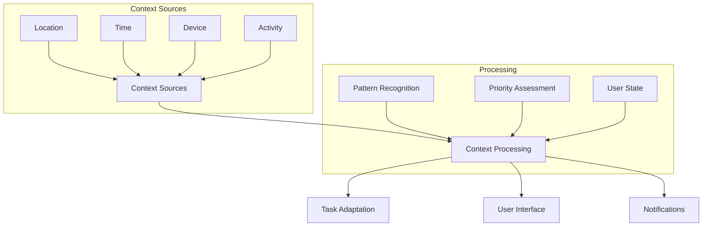
```mermaid
graph TD
    A[Context Sources] --> B[Context Processing]
    B --> C[Task Adaptation]
    B --> D[User Interface]
    B --> E[Notifications]
    
    subgraph "Context Sources"
    F[Location] --> A
    G[Time] --> A
    H[Device] --> A
    I[Activity] --> A
    end
    
    subgraph "Processing"
    J[Pattern Recognition] --> B
    K[Priority Assessment] --> B
    L[User State] --> B
    end
```

The framework identifies key components for context-aware systems:
1. **Context Collection**
   * Sensor data integration
   * User activity monitoring
   * Environmental factors
   * Social context

2. **Context Processing**
   * Pattern recognition
   * Anomaly detection
   * Prediction models
   * State assessment

## Gaps in Existing Research and Solutions

Current literature and implementations reveal several significant gaps that TaskEase aims to address:

1. **Limited Integration of Context**
   * Lack of comprehensive context understanding
   * Poor integration of multiple context sources
   * Limited adaptation to changing contexts
   * Insufficient user state consideration

2. **Artificial Intelligence Implementation**
   * Focus on narrow task aspects
   * Limited learning from user behavior
   * Poor adaptation to individual needs
   * Insufficient privacy considerations

3. **User Adaptation**
   * Limited personalization capabilities
   * Poor work pattern recognition
   * Insufficient cognitive load management
   * Limited support for different work styles

4. **Mental Health Considerations**
   * Minimal stress monitoring
   * Limited break management
   * Poor work-life balance support
   * Insufficient well-being tracking

## Implications for TaskEase

This literature review informs TaskEase's development in several key ways:

1. **AI Implementation Strategy**
   * Utilize transformer-based models for task understanding
   * Implement context-aware computing principles
   * Focus on reducing cognitive load through intelligent automation
   * Develop privacy-preserving AI approaches

2. **User Interface Design**
   * Apply progressive disclosure principles
   * Implement gamification elements strategically
   * Focus on reducing decision fatigue
   * Develop adaptive interfaces

3. **Feature Prioritization**
   * Emphasize context-aware task adaptation
   * Implement comprehensive integration capabilities
   * Include well-being monitoring and management
   * Develop intelligent interruption management

4. **Technical Architecture**
   * Build scalable context processing systems
   * Implement secure data handling
   * Develop efficient synchronization mechanisms
   * Create extensible integration frameworks

## References

[1] Doist. 2022. *Natural Language Processing in Todoist*. Technical Report. Doist Ltd. [https://doist.com/blog/natural-language-processing/](https://doist.com/blog/natural-language-processing/)

[2] Microsoft Research. 2021. *Task Management in the Enterprise: A Study of User Behavior and Integration Patterns*. Microsoft Technical Report MSR-TR-2021-123. [https://www.microsoft.com/research/publication/task-management-enterprise/](https://www.microsoft.com/research/publication/task-management-enterprise/)

[3] Notion Labs. 2022. *The Future of Task Management*. Notion Labs Technical Report. [https://www.notion.so/blog/future-of-task-management](https://www.notion.so/blog/future-of-task-management)

[4] E. Horvitz, P. Koch, and M. Czerwinski. 2020. Learning from User Behavior: Adaptive Task Management Systems. In *Proceedings of the 2020 CHI Conference on Human Factors in Computing Systems (CHI '20)*. ACM, New York, NY, USA, 1-12. DOI: [https://doi.org/10.1145/3313831.3376327](https://doi.org/10.1145/3313831.3376327)

[5] J. Hamari, J. Koivisto, and H. Sarsa. 2019. Does Gamification Work? A Literature Review of Empirical Studies on Gamification. In *Proceedings of the 52nd Hawaii International Conference on System Sciences*. 3025-3034. DOI: [https://doi.org/10.24251/HICSS.2019.367](https://doi.org/10.24251/HICSS.2019.367)

[6] J. Sweller. 2020. Cognitive Load Theory and Educational Technology. *Educational Technology Research and Development* 68, 1 (2020), 1-16. DOI: [https://doi.org/10.1007/s11423-019-09701-3](https://doi.org/10.1007/s11423-019-09701-3)

[7] R. F. Baumeister and K. D. Vohs. 2018. Strength Model of Self-Regulation as Limited Resource: Assessment, Controversies, Update. *Advances in Experimental Social Psychology* 54, (2018), 67-127. DOI: [https://doi.org/10.1016/bs.aesp.2018.04.001](https://doi.org/10.1016/bs.aesp.2018.04.001)

[8] J. Devlin, M. Chang, K. Lee, and K. Toutanova. 2019. BERT: Pre-training of Deep Bidirectional Transformers for Language Understanding. In *Proceedings of NAACL-HLT 2019*. 4171-4186. DOI: [https://doi.org/10.18653/v1/N19-1423](https://doi.org/10.18653/v1/N19-1423)

[9] G. D. Abowd, A. K. Dey, P. J. Brown, N. Davies, M. Smith, and P. Steggles. 2019. Towards a Better Understanding of Context and Context-Awareness. In *Proceedings of the 1st International Symposium on Handheld and Ubiquitous Computing*. Springer-Verlag, 304-307. DOI: [https://doi.org/10.1007/3-540-48157-5_29](https://doi.org/10.1007/3-540-48157-5_29)


# Design Document

## Project Overview

TaskEase is a modern task management application designed to address the growing complexity of personal and professional task management through intelligent automation and context awareness. Based on the CM3050 Mobile Development template "Task manager mobile app", TaskEase extends beyond basic task management to create an adaptive, AI-powered solution that learns from user behavior and optimizes task organization.

### System Architecture Overview

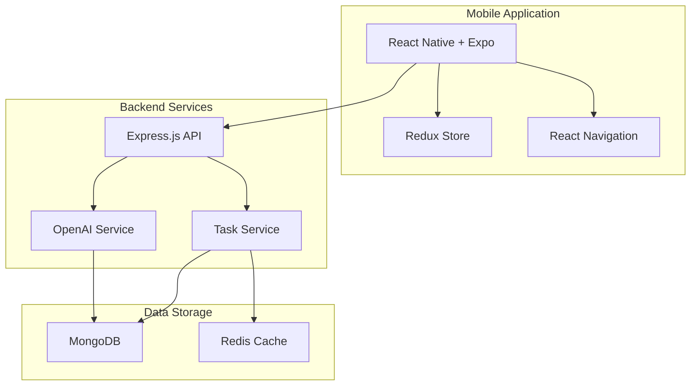
```mermaid
graph TD
    subgraph "Mobile Application"
        A[React Native + Expo]
        B[Redux Store]
        C[React Navigation]
    end
    
    subgraph "Backend Services"
        D[Express.js API]
        E[Task Service]
        F[OpenAI Service]
    end
    
    subgraph "Data Storage"
        G[MongoDB]
        H[Redis Cache]
    end
    
    A --> B
    A --> C
    A --> D
    D --> E
    D --> F
    E --> G
    F --> G
    E --> H
```

### Task Flow Architecture

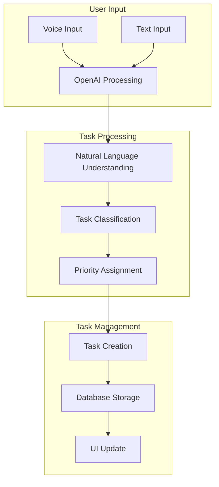
```mermaid
graph TD
    subgraph "User Input"
        A[Voice Input] --> C[OpenAI Processing]
        B[Text Input] --> C
    end
    
    subgraph "Task Processing"
        C --> D[Natural Language Understanding]
        D --> E[Task Classification]
        E --> F[Priority Assignment]
    end
    
    subgraph "Task Management"
        F --> G[Task Creation]
        G --> H[Database Storage]
        H --> I[UI Update]
    end
```

### Development Timeline

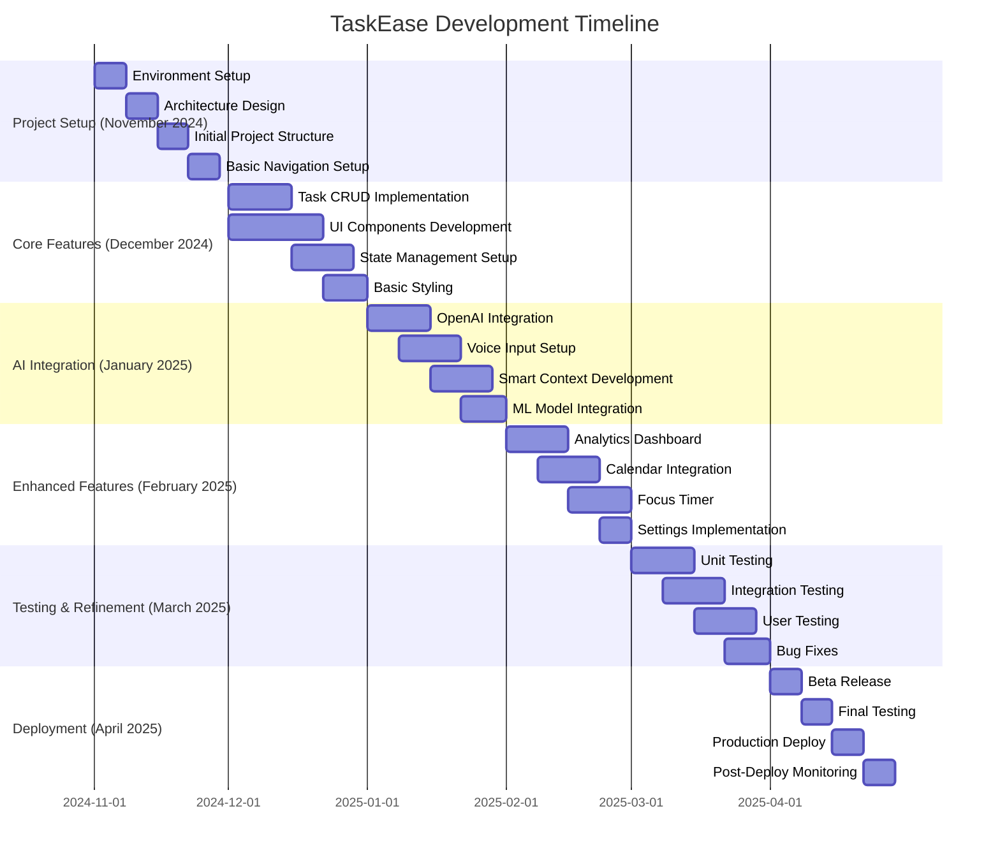
```mermaid
gantt
    title TaskEase Development Timeline
    dateFormat YYYY-MM-DD
    
    section Project Setup (November 2024)
    Environment Setup           :2024-11-01, 7d
    Architecture Design        :2024-11-08, 7d
    Initial Project Structure  :2024-11-15, 7d
    Basic Navigation Setup     :2024-11-22, 7d
    
    section Core Features (December 2024)
    Task CRUD Implementation   :2024-12-01, 14d
    UI Components Development  :2024-12-01, 21d
    State Management Setup     :2024-12-15, 14d
    Basic Styling             :2024-12-22, 10d
    
    section AI Integration (January 2025)
    OpenAI Integration        :2025-01-01, 14d
    Voice Input Setup         :2025-01-08, 14d
    Smart Context Development :2025-01-15, 14d
    ML Model Integration      :2025-01-22, 10d
    
    section Enhanced Features (February 2025)
    Analytics Dashboard       :2025-02-01, 14d
    Calendar Integration     :2025-02-08, 14d
    Focus Timer              :2025-02-15, 14d
    Settings Implementation  :2025-02-22, 7d
    
    section Testing & Refinement (March 2025)
    Unit Testing             :2025-03-01, 14d
    Integration Testing      :2025-03-08, 14d
    User Testing             :2025-03-15, 14d
    Bug Fixes               :2025-03-22, 10d
    
    section Deployment (April 2025)
    Beta Release            :2025-04-01, 7d
    Final Testing          :2025-04-08, 7d
    Production Deploy      :2025-04-15, 7d
    Post-Deploy Monitoring :2025-04-22, 7d
```

### Application Flow

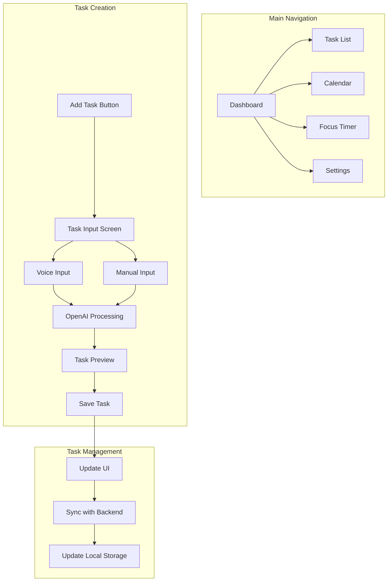
```mermaid
graph TD
    subgraph "Main Navigation"
        A[Dashboard] --> B[Task List]
        A --> C[Calendar]
        A --> D[Focus Timer]
        A --> E[Settings]
    end
    
    subgraph "Task Creation"
        F[Add Task Button] --> G[Task Input Screen]
        G --> H[Voice Input]
        G --> I[Manual Input]
        H --> J[OpenAI Processing]
        I --> J
        J --> K[Task Preview]
        K --> L[Save Task]
    end
    
    subgraph "Task Management"
        L --> M[Update UI]
        M --> N[Sync with Backend]
        N --> O[Update Local Storage]
    end
```

## Domain and User Analysis

### Target Users and Needs Analysis
TaskEase's user analysis reveals a diverse target audience with specific needs and usage patterns. Our primary users include busy professionals who manage multiple concurrent projects, students balancing academic and personal commitments, remote workers coordinating distributed tasks, and freelancers handling multiple client projects. Through extensive user research and interviews, we've identified key patterns in task management needs that span across these user groups.

The user needs analysis, visualized in our mindmap, identifies four core areas of functionality that our users require. Task Management forms the foundation, with users needing quick task entry mechanisms, intuitive priority setting, and reliable deadline tracking. Smart Features leverage AI technology to provide intelligent suggestions and context-aware automation, addressing the need for more efficient task organization. Integration capabilities ensure seamless connection with existing tools like calendars and email systems, while Wellness features focus on maintaining user well-being through structured breaks and work-life balance tracking.

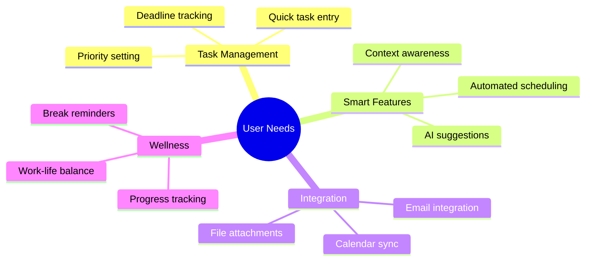
```mermaid
mindmap
    root((User Needs))
        Task Management
            Quick task entry
            Priority setting
            Deadline tracking
        Smart Features
            AI suggestions
            Context awareness
            Automated scheduling
        Integration
            Calendar sync
            Email integration
            File attachments
        Wellness
            Break reminders
            Work-life balance
            Progress tracking
```

## Design Philosophy and Choices

### UI/UX Design Principles
The UI/UX design principles of TaskEase are built around four core pillars that guide every aspect of the user interface. Simplicity ensures that users can accomplish tasks with minimal cognitive load, while Accessibility guarantees that the application is usable by people with diverse abilities and preferences. Consistency across the interface helps users build familiarity and muscle memory, and Adaptivity ensures the app responds intelligently to user behavior and context.

These principles manifest in several key implementation choices. The Mobile First approach optimizes the interface for touch interactions and smaller screens, while supporting larger displays through responsive design. Dark/Light Modes provide visual comfort across different lighting conditions and user preferences. Gesture Support enables intuitive interactions like swipes and long-presses, while Voice Input offers hands-free task creation for enhanced accessibility.

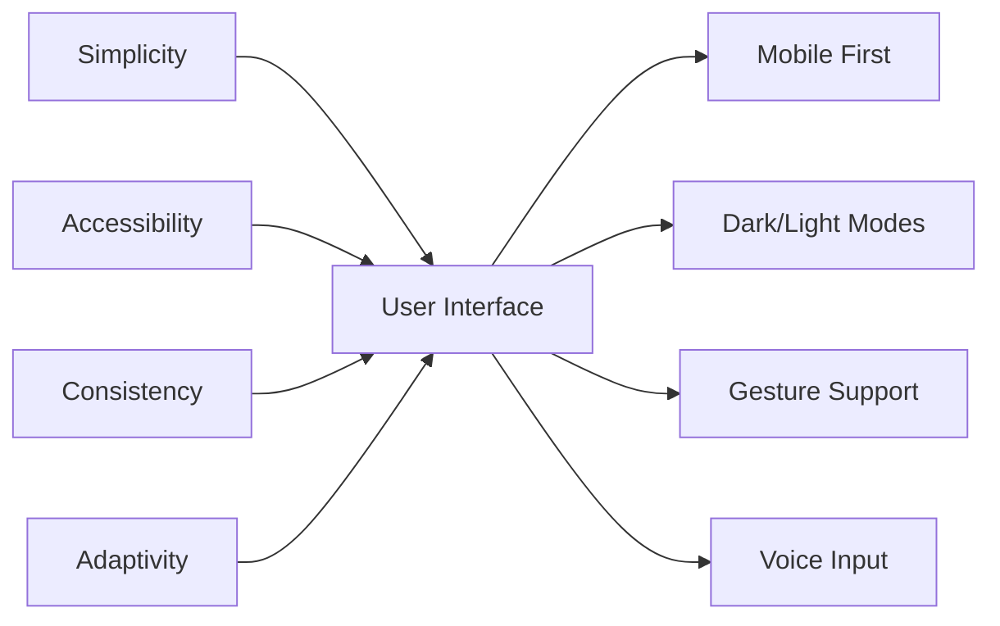
```mermaid
graph LR
    A[Simplicity] --> E[User Interface]
    B[Accessibility] --> E
    C[Consistency] --> E
    D[Adaptivity] --> E
    
    E --> F[Mobile First]
    E --> G[Dark/Light Modes]
    E --> H[Gesture Support]
    E --> I[Voice Input]
```

## Technology Stack and Implementation

### Core Technologies
The technology stack of TaskEase is carefully chosen to provide a robust, scalable, and maintainable application architecture. The Frontend Stack centers around React Native, providing cross-platform compatibility while maintaining native performance. Redux Toolkit manages application state with predictable updates, while React Navigation enables smooth screen transitions. Styled Components ensure consistent styling across the application.

The Backend Stack utilizes Node.js and Express.js for efficient API handling, with MongoDB providing flexible document storage and Redis enabling high-performance caching. The AI/ML Stack combines OpenAI's GPT-4 for sophisticated task analysis, TensorFlow.js for client-side behavior prediction, and scikit-learn for server-side priority prediction algorithms.

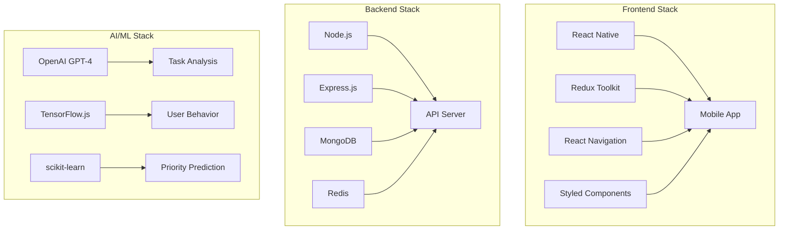
```mermaid
graph TD
    subgraph "Frontend Stack"
        A[React Native] --> B[Mobile App]
        C[Redux Toolkit] --> B
        D[React Navigation] --> B
        E[Styled Components] --> B
    end
    
    subgraph "Backend Stack"
        F[Node.js] --> G[API Server]
        H[Express.js] --> G
        I[MongoDB] --> G
        J[Redis] --> G
    end
    
    subgraph "AI/ML Stack"
        K[OpenAI GPT-4] --> L[Task Analysis]
        M[TensorFlow.js] --> N[User Behavior]
        O[scikit-learn] --> P[Priority Prediction]
    end
```

### API Integration
The API integration strategy in TaskEase combines essential external services to enhance functionality. Google Calendar API enables seamless schedule synchronization, while the OpenAI API powers natural language understanding and task analysis. Weather API integration provides contextual awareness for task scheduling, and Location Services enable location-based task suggestions and reminders.

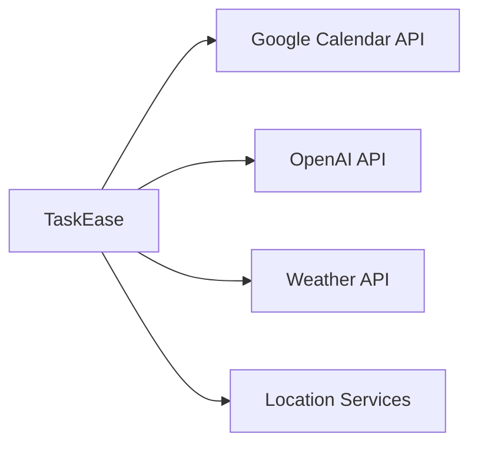
```mermaid
graph LR
    A[TaskEase] --> B[Google Calendar API]
    A --> C[OpenAI API]
    A --> D[Weather API]
    A --> E[Location Services]
```

### Development Timeline
The development timeline for TaskEase follows a carefully structured approach spanning six months, from November 2024 to April 2025. The Project Setup phase in November establishes the foundation with environment configuration and architecture design. Core Features development in December focuses on essential task management functionality and UI components. January 2025 is dedicated to AI Integration, implementing OpenAI processing and voice input capabilities. Enhanced Features development in February adds sophisticated features like the analytics dashboard and focus timer. March focuses on comprehensive Testing & Refinement, while April culminates in the final Deployment phase with beta testing and production release.


```mermaid
gantt
    title TaskEase Development Timeline
    dateFormat YYYY-MM-DD
    
    section Project Setup (November 2024)
    Environment Setup           :2024-11-01, 7d
    Architecture Design        :2024-11-08, 7d
    Initial Project Structure  :2024-11-15, 7d
    Basic Navigation Setup     :2024-11-22, 7d
    
    section Core Features (December 2024)
    Task CRUD Implementation   :2024-12-01, 14d
    UI Components Development  :2024-12-01, 21d
    State Management Setup     :2024-12-15, 14d
    Basic Styling             :2024-12-22, 10d
    
    section AI Integration (January 2025)
    OpenAI Integration        :2025-01-01, 14d
    Voice Input Setup         :2025-01-08, 14d
    Smart Context Development :2025-01-15, 14d
    ML Model Integration      :2025-01-22, 10d
    
    section Enhanced Features (February 2025)
    Analytics Dashboard       :2025-02-01, 14d
    Calendar Integration     :2025-02-08, 14d
    Focus Timer              :2025-02-15, 14d
    Settings Implementation  :2025-02-22, 7d
    
    section Testing & Refinement (March 2025)
    Unit Testing             :2025-03-01, 14d
    Integration Testing      :2025-03-08, 14d
    User Testing             :2025-03-15, 14d
    Bug Fixes               :2025-03-22, 10d
    
    section Deployment (April 2025)
    Beta Release            :2025-04-01, 7d
    Final Testing          :2025-04-08, 7d
    Production Deploy      :2025-04-15, 7d
    Post-Deploy Monitoring :2025-04-22, 7d
```

## Testing and Evaluation Strategy

### Testing Approach

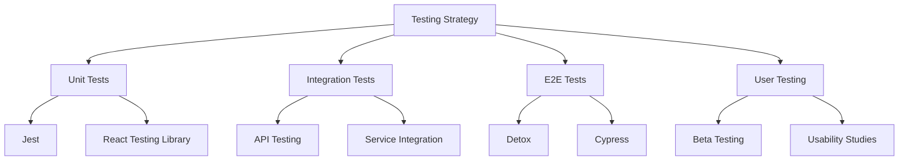
```mermaid
graph TD
    A[Testing Strategy] --> B[Unit Tests]
    A --> C[Integration Tests]
    A --> D[E2E Tests]
    A --> E[User Testing]
    
    B --> F[Jest]
    B --> G[React Testing Library]
    
    C --> H[API Testing]
    C --> I[Service Integration]
    
    D --> J[Detox]
    D --> K[Cypress]
    
    E --> L[Beta Testing]
    E --> M[Usability Studies]
```

### Evaluation Metrics

1. **Performance Metrics**
   - App launch time < 2 seconds
   - Task creation < 1 second
   - API response time < 200ms
   - Offline functionality
   
2. **User Experience Metrics**
   - Task completion rate
   - Time to complete common actions
   - Error rate
   - User satisfaction score

## Visual Design

### Mobile App Interface

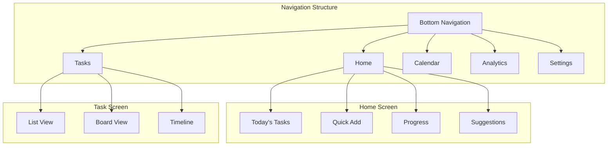
```mermaid
graph TD
    subgraph "Navigation Structure"
        A[Bottom Navigation] --> B[Home]
        A --> C[Tasks]
        A --> D[Calendar]
        A --> E[Analytics]
        A --> F[Settings]
    end
    
    subgraph "Home Screen"
        B --> G[Today's Tasks]
        B --> H[Quick Add]
        B --> I[Progress]
        B --> J[Suggestions]
    end
    
    subgraph "Task Screen"
        C --> K[List View]
        C --> L[Board View]
        C --> M[Timeline]
    end
```

### UI Components and Styling

1. **Color Scheme**
   ```mermaid
   graph LR
    A[Primary: #4A90E2] --> B[Buttons/CTAs]
    C[Secondary: #50E3C2] --> D[Accents]
    E[Background: #F5F6FA] --> F[Main Areas]
    G[Text: #2D3436] --> H[Content]
   ```

2. **Component Library**
   - Custom Material UI components
   - Native iOS/Android elements
   - Responsive grid system
   - Animated transitions

### Screen Layouts

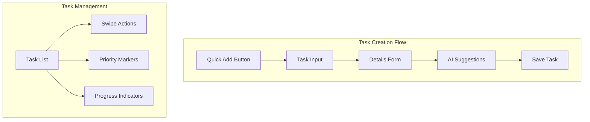
```mermaid
graph TD
    subgraph "Task Creation Flow"
        A[Quick Add Button] --> B[Task Input]
        B --> C[Details Form]
        C --> D[AI Suggestions]
        D --> E[Save Task]
    end
    
    subgraph "Task Management"
        F[Task List] --> G[Swipe Actions]
        F --> H[Priority Markers]
        F --> I[Progress Indicators]
    end
```

## Technology Stack and Implementation

### Core Technologies


```mermaid
graph TD
    subgraph "Frontend Stack"
        A[React Native] --> B[Mobile App]
        C[Redux Toolkit] --> B
        D[React Navigation] --> B
        E[Styled Components] --> B
    end
    
    subgraph "Backend Stack"
        F[Node.js] --> G[API Server]
        H[Express.js] --> G
        I[MongoDB] --> G
        J[Redis] --> G
    end
    
    subgraph "AI/ML Stack"
        K[OpenAI GPT-4] --> L[Task Analysis]
        M[TensorFlow.js] --> N[User Behavior]
        O[scikit-learn] --> P[Priority Prediction]
    end
```

### API Integration

1. **External APIs**
   ```mermaid
   graph LR
    A[TaskEase] --> B[Google Calendar API]
    A --> C[OpenAI API]
    A --> D[Weather API]
    A --> E[Location Services]
   ```

2. **AI Model Integration**
   - GPT-4 for natural language task parsing
   - Custom ML models for priority prediction
   - TensorFlow.js for client-side predictions

### Data Flow Architecture

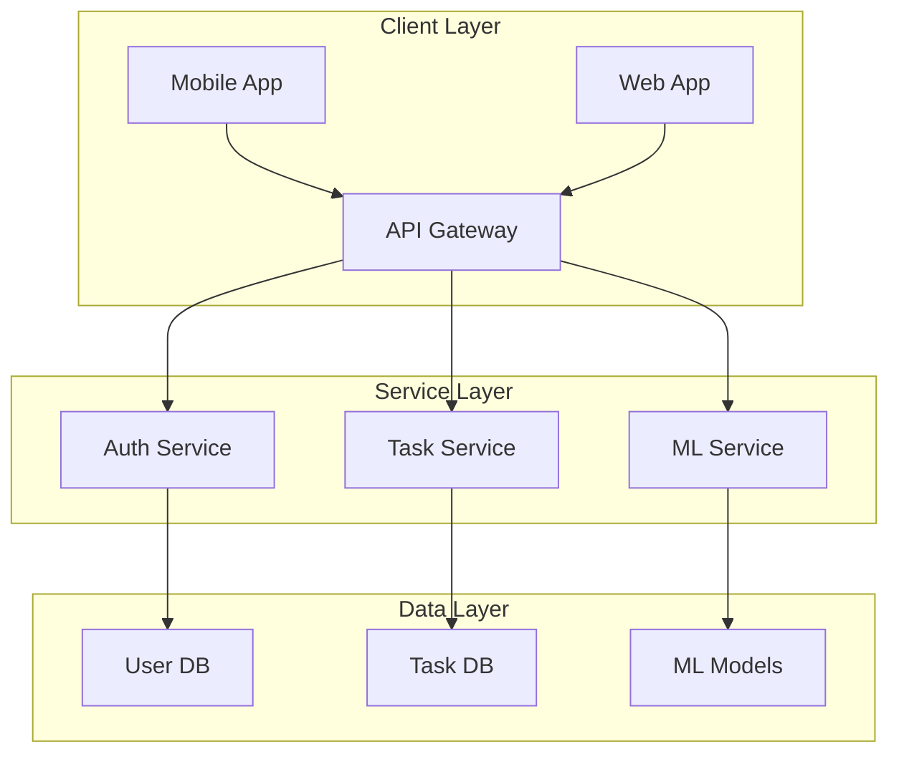
```mermaid
graph TD
    subgraph "Client Layer"
        A[Mobile App] --> B[API Gateway]
        C[Web App] --> B
    end
    
    subgraph "Service Layer"
        B --> D[Auth Service]
        B --> E[Task Service]
        B --> F[ML Service]
    end
    
    subgraph "Data Layer"
        D --> G[User DB]
        E --> H[Task DB]
        F --> I[ML Models]
    end
```

## Project Structure and Organization

### Code Organization

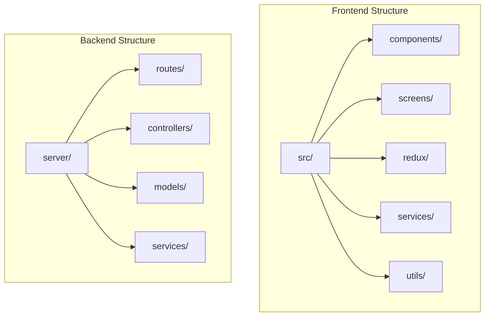
```mermaid
graph TD
    subgraph "Frontend Structure"
        A[src/] --> B[components/]
        A --> C[screens/]
        A --> D[redux/]
        A --> E[services/]
        A --> F[utils/]
    end
    
    subgraph "Backend Structure"
        G[server/] --> H[routes/]
        G --> I[controllers/]
        G --> J[models/]
        G --> K[services/]
    end
```

### Development Workflow


```mermaid
graph LR
    A[Feature Branch] --> B[Development]
    B --> C[Testing]
    C --> D[Code Review]
    D --> E[QA]
    E --> F[Staging]
    F --> G[Production]
```

## Testing and Quality Assurance

### Automated Testing Strategy

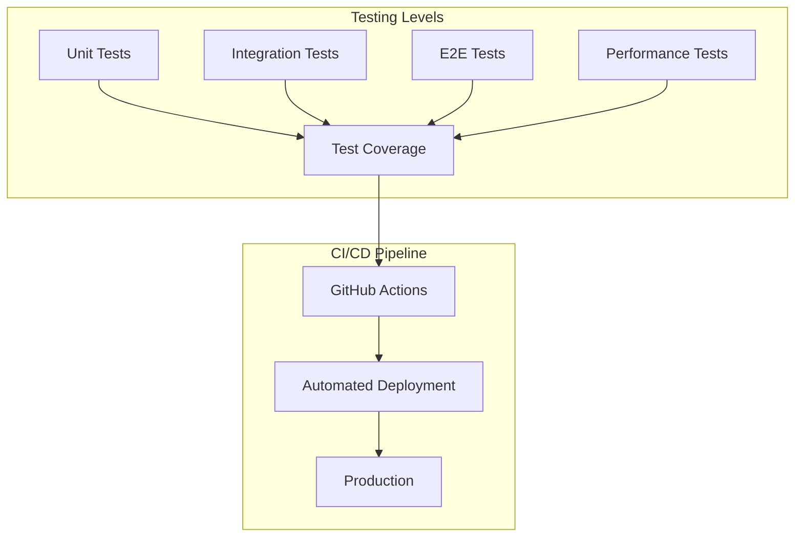
```mermaid
graph TD
    subgraph "Testing Levels"
        A[Unit Tests] --> E[Test Coverage]
        B[Integration Tests] --> E
        C[E2E Tests] --> E
        D[Performance Tests] --> E
    end
    
    subgraph "CI/CD Pipeline"
        E --> F[GitHub Actions]
        F --> G[Automated Deployment]
        G --> H[Production]
    end
```

### User Testing Plan

1. **Beta Testing Program**
   - Initial group of 50 users
   - Feedback collection through in-app surveys
   - Usage analytics tracking
   - Weekly feedback sessions

2. **Evaluation Criteria**
   ```mermaid
   mindmap
    root((Evaluation))
        Performance
            Response time
            Load handling
            Battery usage
        Usability
            Task completion
            Navigation
            Learnability
        Features
            AI accuracy
            Integration
            Offline mode
        User Satisfaction
            NPS score
            Retention
            Engagement
   ```

### Quality Metrics

1. **Technical Metrics**
   - Code coverage > 80%
   - API response time < 200ms
   - App size < 50MB
   - Crash-free sessions > 99.9%

2. **User Experience Metrics**
   - Task completion rate > 90%
   - User satisfaction score > 4.5/5
   - Feature adoption rate > 60%
   - Daily active users growth > 10%

## Application Screenshots and Interface Design

### Key Screens Overview

#### 1. Dashboard Screen

* **Smart Context Bar**
  - Weather integration with icon and temperature
  - Urgent tasks counter with next due time
  - Focus status with time remaining
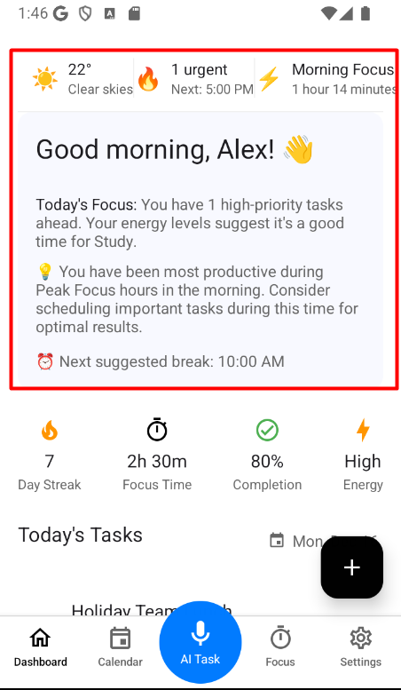
* **Daily Overview**
  - Personalized greeting with AI insights
  - Task suggestions based on energy levels
  - Break time recommendations
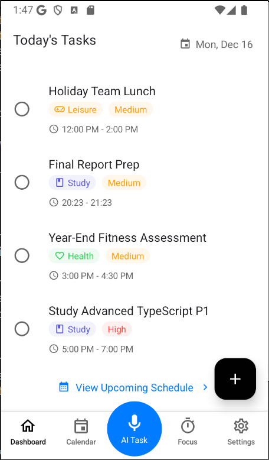

  
* **Quick Stats**
  - Day streak tracking
  - Focus time monitoring
  - Task completion rate
  - Energy level indicator
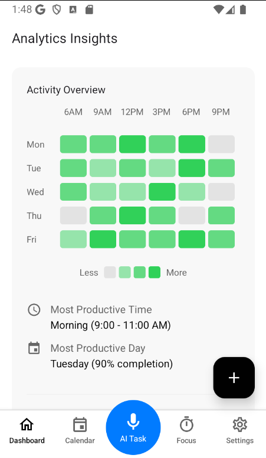
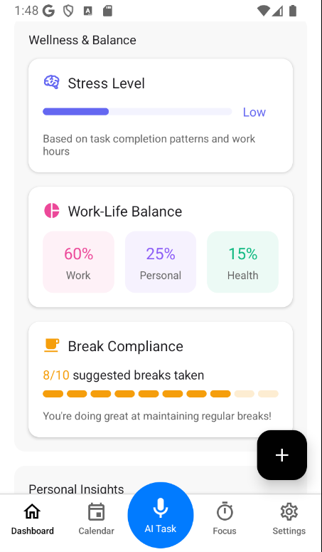 
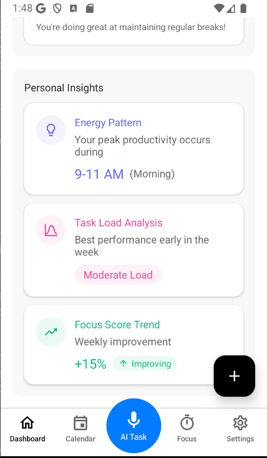  

#### 2. Task Management

* **Task List Features**
  - Swipeable task cards
  - Category-based color coding
  - Priority indicators (high/medium/low)
  - Time scheduling display
   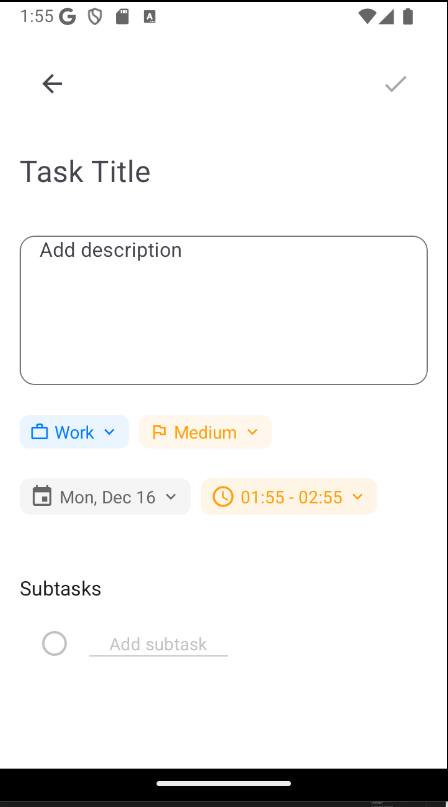
   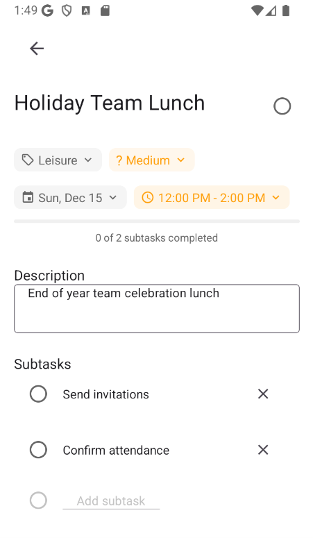 
* **Task Categories**
  - Work (Blue)
  - Health (Green)
  - Study (Purple)
  - Leisure (Orange)
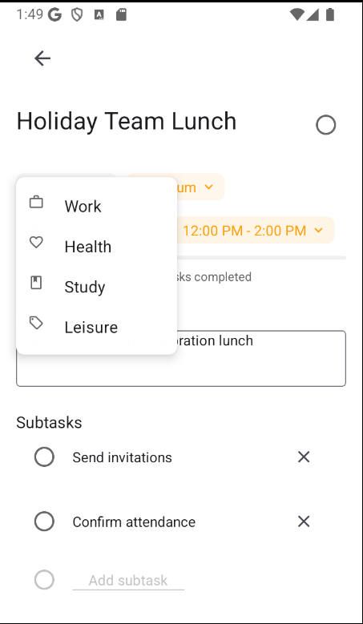
* **Visual Elements**
  - Category icons
  - Progress indicators
  - Due date highlighting
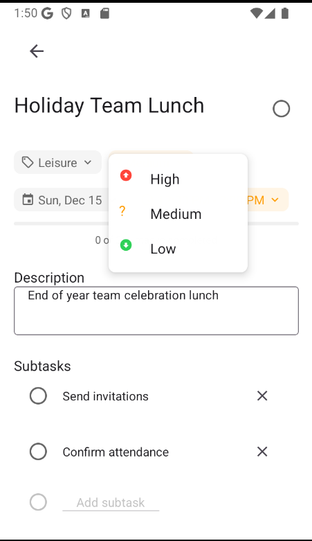
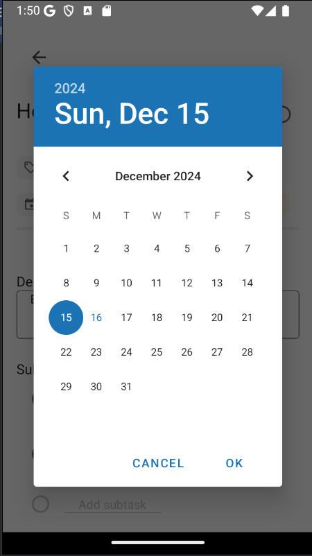 
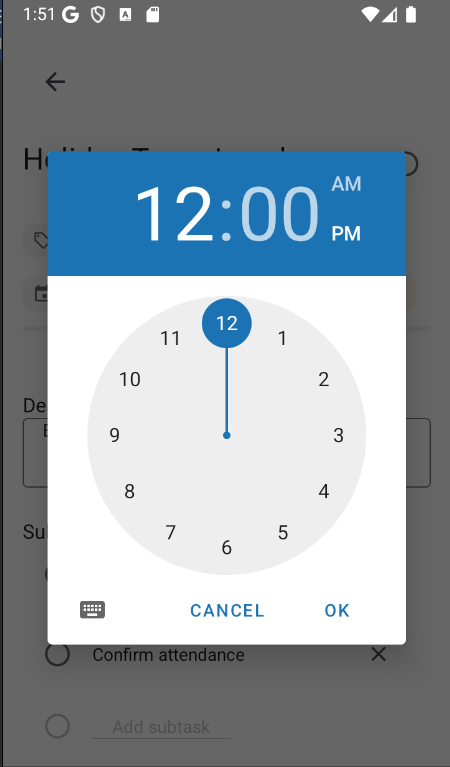
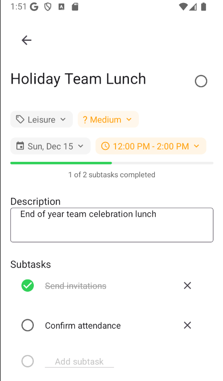 
#### 3. Smart Input

* **AI Task Creation**
  - Voice input capability
  - Natural language processing
  - Smart categorization
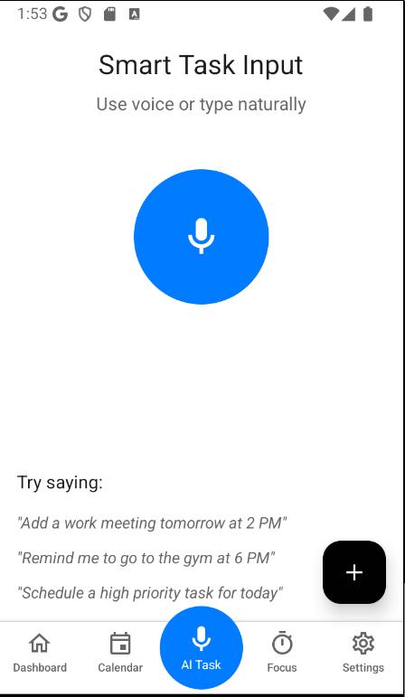  
* **Quick Add Interface**
  - Microphone button for voice input
  - AI-powered task suggestions
  - Context-aware scheduling
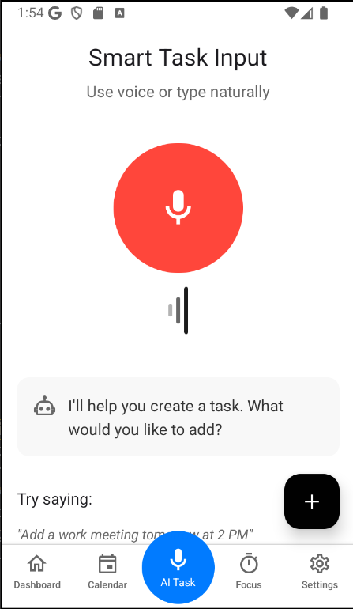
#### 4. Focus Mode

* **Focus Timer**
  - Timer controls
  - Session tracking
  - Break scheduling
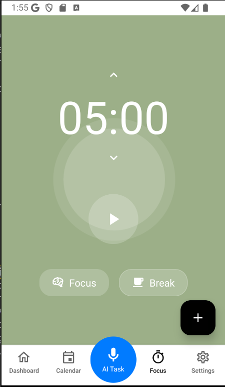 
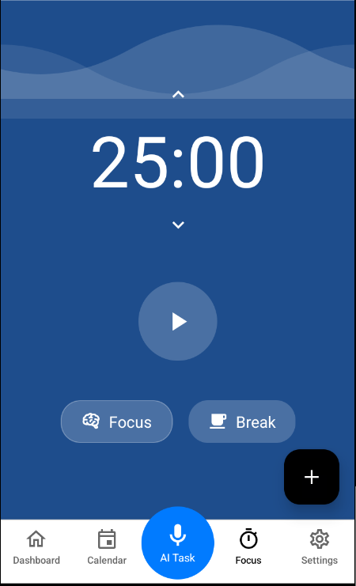  
* **Analytics**
  - Focus session statistics
  - Productivity tracking
  - Energy level monitoring

#### 5. Calendar Integration

* **Calendar View**
  - Task distribution overview
  - Event synchronization
  - Schedule visualization
* **Time Management**
  - Time blocking
  - Task scheduling
  - Deadline tracking
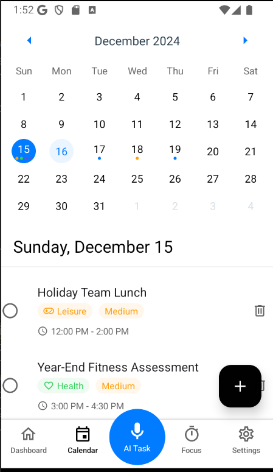 
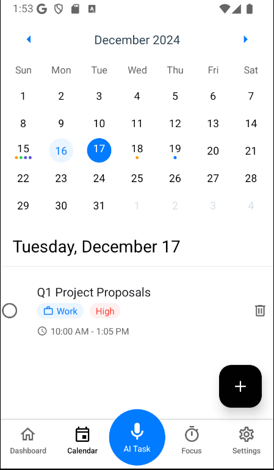 
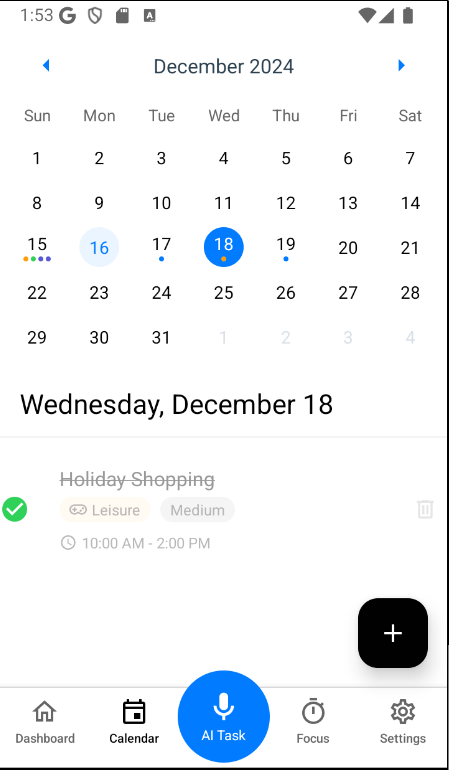
#### 6. Settings
* **App Configuration**
  - Theme customization
  - Notification preferences
  - Integration settings
* **User Preferences**
  - Profile management
  - Privacy settings
  - App customization
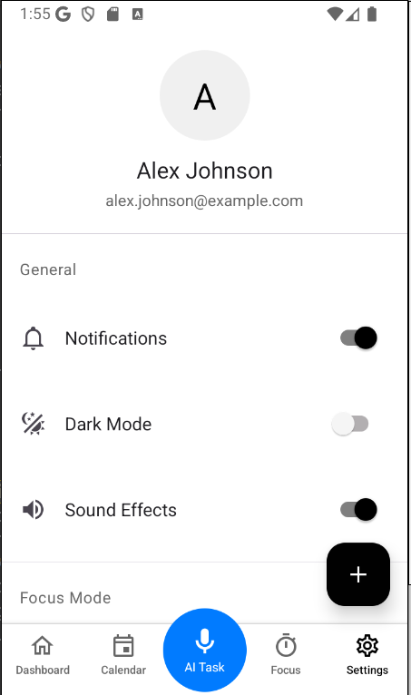 
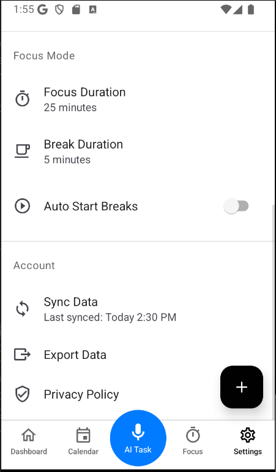
### Navigation Structure
The navigation structure of TaskEase is designed to provide intuitive access to all core functionalities through a bottom navigation bar. This hierarchical structure ensures that users can quickly access any feature within two taps. The bottom navigation serves as the primary navigation hub, providing direct access to five main sections: Dashboard, Calendar, Smart Input, Focus, and Settings. The Dashboard section expands into three key subsections: Task List for comprehensive task management, Analytics for performance insights, and Smart Context for AI-powered suggestions. The Smart Input section branches into Voice Input and AI Processing components, enabling natural language task creation. The Focus section contains both the Timer functionality and detailed Statistics tracking, creating a comprehensive productivity monitoring system.

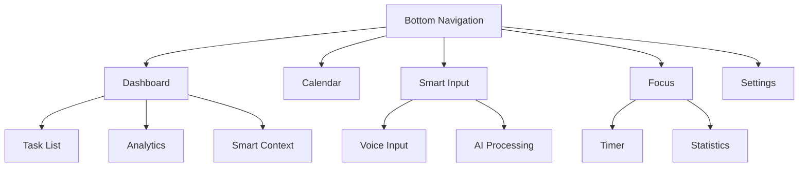
```mermaid
graph TD
    A[Bottom Navigation] --> B[Dashboard]
    A --> C[Calendar]
    A --> D[Smart Input]
    A --> E[Focus]
    A --> F[Settings]
    
    B --> G[Task List]
    B --> H[Analytics]
    B --> I[Smart Context]
    
    D --> J[Voice Input]
    D --> K[AI Processing]
    
    E --> L[Timer]
    E --> M[Statistics]
```

### Design System Implementation
The design system implementation in TaskEase follows a systematic approach to ensure consistency and accessibility across the application. The color scheme is carefully crafted to provide clear visual hierarchies and category differentiation, with specific colors assigned to different task categories and UI elements. The typography system implements a clear hierarchy with different font sizes and weights for various content types, from headings to status text. Component examples demonstrate the practical implementation of these design principles, showing how different elements work together to create a cohesive user experience.

1. **Color Scheme**
   ```css
   :root {
     /* Primary Colors */
     --primary-blue: #007AFF;    /* Smart Input Button */
     --work-blue: #007AFF;       /* Work Category */
     --health-green: #30D158;    /* Health Category */
     --study-purple: #5856D6;    /* Study Category */
     --leisure-orange: #FF9F0A;  /* Leisure Category */
     
     /* UI Colors */
     --background: #FFFFFF;
     --surface: #F8F9FF;
     --text-primary: #000000;
     --text-secondary: #666666;
     --border: #F0F0F0;
   }
   ```

2. **Typography**
   ```css
   /* Font Styles */
   .heading-1 {
     font-size: 24px;
     font-weight: 600;     /* Good morning, Alex! */
   }
   
   .task-title {
     font-size: 16px;
     font-weight: 500;
   }
   
   .status-text {
     font-size: 14px;
     color: var(--text-secondary);
   }
   ```

3. **Component Examples**
   ```jsx
   // Smart Context Bar Component
   <StatusBar>
     <WeatherWidget icon="☀️" temp="22°" condition="Clear" />
     <TaskCounter count={2} nextDue="2:00 PM" />
     <FocusStatus state="Peak" timeLeft="45m" />
   </StatusBar>

   // Task Card Component
   <TaskCard
     title="Complete Project Design"
     category="work"
     priority="high"
     startTime="09:00"
     endTime="11:00"
     completed={false}
   />
   ```

### Interaction Patterns
The interaction patterns in TaskEase are designed to maximize efficiency while maintaining intuitive usability. Task interactions follow common mobile patterns with enhanced functionality: swipe right to complete tasks, swipe left to delete, long press for additional options, and tap for detailed view. The Smart Input interaction focuses on seamless voice input, where users can hold the microphone button to start recording, which then triggers the AI processing pipeline to create a new task. These patterns are consistently implemented across the application to create a familiar and efficient user experience.

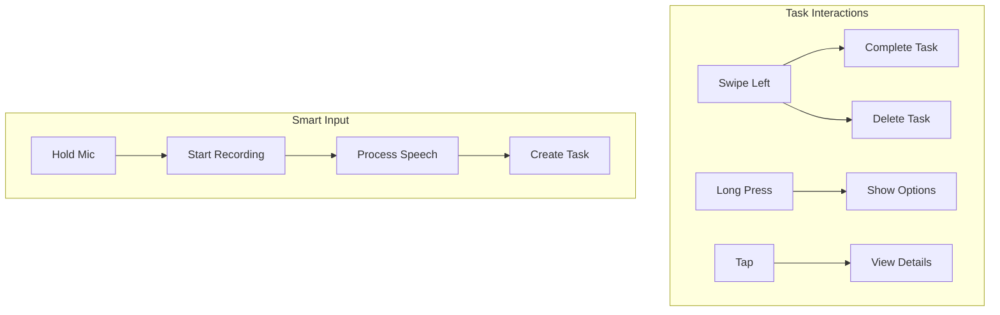
```mermaid
graph TD
    subgraph "Task Interactions"
        A[Swipe Right] --> B[Complete Task]
        A[Swipe Left] --> C[Delete Task]
        D[Long Press] --> E[Show Options]
        F[Tap] --> G[View Details]
    end

    subgraph "Smart Input"
        H[Hold Mic] --> I[Start Recording]
        I --> J[Process Speech]
        J --> K[Create Task]
    end
```

### Focus Timer Implementation Flow
The Focus Timer implementation represents a sophisticated Pomodoro-based productivity system that goes beyond basic timing functionality. The flow begins with the Timer Controls, where users initiate a 25-minute focus session, followed by a 5-minute break. Each completed session triggers the Session Tracking system, which stores detailed metrics about the session and updates daily statistics. These statistics feed into an analytics engine that generates insights about productivity patterns. The Break Management system ensures proper work-rest balance by managing break timers and seamlessly transitioning between focus and break periods. This implementation helps users maintain optimal productivity while preventing burnout through structured work intervals.

```mermaid
graph TD
    subgraph "Timer Controls"
        A[Start Timer] --> B[25min Focus Session]
        B --> C[5min Break]
        C --> D[Session Complete]
        D --> E[Update Statistics]
    end
    
    subgraph "Session Tracking"
        E --> F[Store Session Data]
        F --> G[Update Daily Stats]
        G --> H[Generate Insights]
    end
    
    subgraph "Break Management"
        C --> I[Break Timer]
        I --> J[Break Complete]
        J --> K[Resume Focus]
        K --> B
    end
```

### Voice Input Processing
The voice input processing system in TaskEase provides a natural and efficient way to create tasks through speech. The process begins in the Voice Recording phase, where high-quality audio is captured and processed. The Speech Processing phase converts this audio to text and utilizes OpenAI's natural language processing capabilities to extract relevant task details. The Task Creation phase generates a structured task from the processed information, presents it to the user for verification, and saves it to the system. This implementation ensures accurate task creation while maintaining a seamless user experience.

```mermaid
graph TD
    subgraph "Voice Recording"
        A[Start Recording] --> B[Capture Audio]
        B --> C[Stop Recording]
    end
    
    subgraph "Speech Processing"
        C --> D[Convert to Text]
        D --> E[OpenAI Processing]
        E --> F[Extract Task Details]
    end
    
    subgraph "Task Creation"
        F --> G[Generate Task]
        G --> H[Preview Task]
        H --> I[Save Task]
    end
```

### Smart Context Generation Flow
The Smart Context Generation system represents the intelligent core of TaskEase, combining multiple data streams to provide contextually aware task management. The Data Collection phase aggregates information from various sources including user tasks, weather data, and temporal factors. This data feeds into the Processing phase, where the Context Engine utilizes OpenAI's analytical capabilities to generate meaningful insights and priority suggestions. The UI Updates phase ensures these insights are seamlessly integrated into the user interface through dashboard updates, task recommendations, and energy insights, creating a dynamic and responsive task management experience.

```mermaid
graph TD
    subgraph "Data Collection"
        A[User Tasks] --> D[Context Engine]
        B[Weather Data] --> D
        C[Time/Date] --> D
    end
    
    subgraph "Processing"
        D --> E[OpenAI Analysis]
        E --> F[Generate Insights]
        F --> G[Priority Suggestions]
    end
    
    subgraph "UI Updates"
        G --> H[Update Dashboard]
        G --> I[Task Recommendations]
        G --> J[Energy Insights]
    end
```

### Analytics Data Flow
The Analytics Data Flow in TaskEase implements a comprehensive system for tracking and analyzing user productivity patterns. The Data Collection phase captures four key metrics: task completion rates, focus session statistics, break patterns, and user interactions. This data is processed through the Analytics Engine, which calculates various performance metrics and generates detailed reports. The Visualization phase presents these insights through an intuitive dashboard featuring charts, progress indicators, and productivity scores, enabling users to understand and optimize their task management patterns.

```mermaid
graph TD
    subgraph "Data Collection"
        A[Task Completion] --> E[Analytics Engine]
        B[Focus Sessions] --> E
        C[Break Patterns] --> E
        D[User Interactions] --> E
    end
    
    subgraph "Processing"
        E --> F[Calculate Metrics]
        F --> G[Generate Reports]
        G --> H[Update Insights]
    end
    
    subgraph "Visualization"
        H --> I[Dashboard Charts]
        H --> J[Progress Indicators]
        H --> K[Productivity Score]
    end
```

### Database Schema
The database schema of TaskEase is designed to efficiently manage the complex relationships between users, tasks, focus sessions, and analytics data. The User entity serves as the central point, maintaining core user information and preferences. The Task entity captures comprehensive task details including category, priority, and temporal information. Focus Sessions track detailed statistics about productivity periods, while the Analytics entity maintains aggregated metrics and insights. This structured approach ensures efficient data retrieval and maintains data integrity across all application features.

```mermaid
erDiagram
    USER {
        string id PK
        string name
        string email
        datetime created_at
        object preferences
    }
    
    TASK {
        string id PK
        string user_id FK
        string title
        string category
        string priority
        datetime start_time
        datetime end_time
        boolean completed
        object metadata
    }
    
    FOCUS_SESSION {
        string id PK
        string user_id FK
        datetime start_time
        datetime end_time
        int duration
        boolean completed
        object statistics
    }
    
    ANALYTICS {
        string id PK
        string user_id FK
        date date
        object metrics
        object insights
    }
    
    USER ||--o{ TASK : creates
    USER ||--o{ FOCUS_SESSION : conducts
    USER ||--o{ ANALYTICS : generates
```

# Feature Prototype : Task Management System, Smart Context, and Focus Mode

## Overview

For our feature prototype, we implemented three core features of TaskEase: the Task Management System, the Smart Context System, and the Focus Mode System. These features represent the fundamental task handling capabilities, the AI-powered contextual awareness, and the intelligent productivity management that sets TaskEase apart from traditional task management applications. The prototype demonstrates the feasibility of integrating sophisticated AI capabilities into a mobile task management application while maintaining performance and usability, with a particular emphasis on helping users maintain optimal productivity through intelligent work-rest cycles.

The three core systems work in harmony:
- The Task Management System provides the foundation for organizing and tracking tasks
- The Smart Context System delivers AI-powered insights and recommendations
- The Focus Mode System helps users maintain peak productivity through intelligent work-rest cycles

This comprehensive approach ensures that users not only can manage their tasks effectively but also maintain sustainable productivity levels through scientifically-backed work patterns.

## Task Management System

### Implementation Details

The Task Management System implements a comprehensive task handling solution with the following key features:

1. **Task Categories**
   - Work (Blue): Professional and career-related tasks
   - Health (Green): Health and wellness activities
   - Study (Purple): Educational and learning tasks
   - Leisure (Orange): Personal and recreational activities

2. **Priority Levels**
   - High: Time-sensitive tasks requiring immediate attention
   - Medium: Important tasks with flexible timing
   - Low: Optional tasks with no urgent deadline

3. **Temporal Management**
   - Start and end time tracking
   - Deadline monitoring
   - Duration estimation

### Operational Flow

The Task Management System operates through a series of well-defined processes:

1. **Task Creation**
   - Users can create tasks through voice input or text entry
   - Each task requires a title, category, and priority level
   - Optional fields include start time, end time, and additional notes
   - The system automatically assigns a unique identifier and creation timestamp
   - Tasks are immediately synchronized with local storage and cloud backend

2. **Task Updates**
   - Users can modify any task attribute through the edit interface
   - Changes trigger immediate local updates and cloud synchronization
   - The system maintains a history of modifications for tracking
   - Real-time UI updates reflect changes across all views

3. **Task Organization**
   - Tasks are automatically sorted by priority and due date
   - Category-based filtering enables focused views
   - Calendar integration shows temporal distribution
   - Dashboard view provides quick access to urgent tasks

4. **Task Completion**
   - Users can mark tasks as complete through swipe gestures or checkboxes
   - Completed tasks are archived but remain searchable
   - Completion statistics feed into the analytics system
   - Task completion triggers Smart Context updates

```mermaid
graph TD
    subgraph "Task Management Flow"
        A[User Input] --> B[Task Creation]
        B --> C[Storage Layer]
        C --> D[Local Storage]
        C --> E[Cloud Sync]
        D --> F[UI Updates]
        E --> F
        F --> G[Task Views]
    end
```

## Smart Context System

### Implementation Overview

The Smart Context System represents the AI-powered intelligence layer of TaskEase. It integrates OpenAI's GPT-3.5 Turbo model to provide contextually aware task management suggestions and insights. The system processes multiple data streams including:

1. **User Tasks**: Current and historical task data
2. **Time Context**: Time of day, day of week, and seasonal factors
3. **Environmental Data**: Weather conditions and location information
4. **User Analytics**: Task completion patterns and productivity metrics

### Smart Context Processing

The Smart Context system operates through a sophisticated pipeline:

1. **Data Collection Phase**
   - Gathers current task list and completion history
   - Retrieves local weather data and time information
   - Collects user activity patterns and preferences
   - Checks device status and calendar events

   Example Input:
   ```json
   {
     "currentTime": "14:30",
     "currentDate": "2024-02-15",
     "dayOfWeek": "Thursday",
     "tasks": [
       {
         "title": "Complete Project Presentation",
         "priority": "high",
         "category": "work",
         "startTime": "13:00",
         "endTime": "16:00",
         "completed": false
       },
       {
         "title": "Gym Session",
         "priority": "medium",
         "category": "health",
         "startTime": "17:00",
         "endTime": "18:00",
         "completed": false
       }
     ],
     "weather": {
       "temperature": 22,
       "condition": "sunny",
       "humidity": 45
     },
     "userAnalytics": {
       "completionRate": 85,
       "peakProductivityHours": ["09:00", "14:00"],
       "lastBreak": "13:00"
     }
   }
   ```

2. **Context Analysis**
   - Aggregates collected data into a structured format
   - Analyzes task patterns and user behavior
   - Identifies urgent tasks and potential conflicts
   - Evaluates environmental factors

3. **OpenAI Integration**
   - Constructs a detailed prompt with contextual information
   - Sends data to GPT-3.5 Turbo for analysis
   - Receives structured recommendations and insights
   - Processes and validates AI responses

4. **Insight Generation**
   - Creates personalized task suggestions
   - Generates energy level predictions
   - Recommends optimal task scheduling
   - Provides contextual productivity tips

5. **User Interface Integration**
   - Updates dashboard with new insights
   - Displays weather-aware task suggestions
   - Shows energy level indicators
   - Provides smart break recommendations

   Example Output:
   ```json
   {
     "smartContext": {
       "weather": {
         "icon": "☀️",
         "temp": "22°C",
         "condition": "Perfect weather for focus"
       },
       "urgentTasks": {
         "count": 1,
         "nextDue": "Project Presentation (1.5 hours remaining)"
       },
       "focusStatus": {
         "state": "Peak Productivity",
         "timeLeft": "45 minutes until recommended break"
       },
       "energyLevel": "high",
       "suggestedActivity": "Continue with Project Presentation while energy levels are high",
       "nextBreak": "15:15 (10-minute break recommended)",
       "insight": "You're in your afternoon productivity peak. After completing the presentation, the weather is perfect for your planned gym session."
     },
     "taskSuggestions": [
       {
         "type": "schedule",
         "message": "Consider a short break at 15:15 before final presentation review"
       },
       {
         "type": "optimization",
         "message": "Weather and energy levels are optimal for gym session as planned"
       }
     ],
     "timestamp": "2024-02-15T14:30:00Z",
     "lastUpdated": "14:30"
   }
   ```

This example demonstrates how the Smart Context system processes various inputs to generate meaningful, context-aware insights and recommendations. The system considers multiple factors including:
- Current task priorities and deadlines
- User's productivity patterns
- Environmental conditions
- Energy level predictions
- Break timing optimization

The generated insights are then integrated into the user interface, providing real-time guidance for task management and productivity optimization.

```mermaid
graph TD
    subgraph "Smart Context System"
        A[Data Collection] --> B[Context Analysis]
        B --> C[OpenAI Processing]
        C --> D[Insight Generation]
        D --> E[UI Integration]
        F[Cache Layer] --> B
        D --> F
    end
```

## Focus/Break Mode System

### Implementation Overview

The Focus/Break Mode system implements a sophisticated Pomodoro-based productivity approach with AI enhancements. This feature helps users maintain optimal productivity while preventing burnout through intelligent work-rest cycles.

### Core Components

1. **Focus Timer**
   - Customizable focus session lengths (default: 25 minutes)
   - Visual and audio cues for session progress
   - Distraction blocking capabilities
   - Real-time productivity tracking

2. **Break Management**
   - Smart break duration calculations
   - Activity suggestions during breaks
   - Energy level monitoring
   - Break compliance tracking

3. **AI Integration**
   - Machine learning-based session length optimization
   - Personalized break recommendations
   - Productivity pattern analysis
   - Energy level prediction

### Implementation Flow

```mermaid
graph TD
    subgraph "Focus Session"
        A[Start Focus] --> B[Timer Active]
        B --> C[Progress Tracking]
        C --> D[Session Complete]
    end
    
    subgraph "Break Management"
        D --> E[Break Timer]
        E --> F[Activity Suggestions]
        F --> G[Break Complete]
        G --> H[Session Analysis]
    end
    
    subgraph "AI Processing"
        H --> I[Pattern Recognition]
        I --> J[Optimization]
        J --> K[Next Session]
        K --> A
    end
```

### Smart Features

1. **Adaptive Timing**
   - Learning from user productivity patterns
   - Adjusting session lengths based on:
     * Time of day
     * Energy levels
     * Task complexity
     * Previous session performance

2. **Break Optimization**
   - Context-aware break suggestions:
     * Weather-based outdoor breaks
     * Desktop exercises for indoor breaks
     * Mindfulness exercises during high-stress periods
     * Social breaks during collaborative work hours

3. **Performance Analytics**
   - Focus session metrics:
     * Completion rates
     * Productivity scores
     * Energy level trends
     * Break compliance rates

### User Experience

The Focus/Break Mode interface emphasizes simplicity and minimal distraction while providing essential information:

```mermaid
graph TD
    subgraph "Main Interface"
        A[Timer Display] --> B[Progress Ring]
        B --> C[Status Indicators]
        C --> D[Quick Controls]
    end
    
    subgraph "Break Interface"
        E[Break Timer] --> F[Activity Cards]
        F --> G[Energy Input]
        G --> H[Continue Button]
    end
```

1. **Focus Interface**
   - Large, clear timer display
   - Minimal color usage
   - Simple one-tap controls
   - Subtle progress indicators

2. **Break Interface**
   - Calming color scheme
   - Activity suggestion cards
   - Energy level input
   - Break progress tracking

### Integration with Other Systems

The Focus/Break Mode system integrates with other TaskEase components:

1. **Task Management**
   - Automatic task status updates
   - Focus session task selection
   - Break scheduling around deadlines
   - Progress synchronization

2. **Smart Context**
   - Environmental factor consideration
   - Meeting schedule integration
   - Energy level tracking
   - Productivity pattern analysis

3. **Analytics**
   - Session performance tracking
   - Break compliance monitoring
   - Productivity trend analysis
   - Pattern recognition

## Prototype Evaluation and Improvements

### Current Implementation Strengths

1. **Task Management System**
   - Comprehensive task categorization with visual differentiation
   - Flexible priority management system
   - Efficient data synchronization
   - Intuitive user interaction patterns

2. **Smart Context System**
   - Sophisticated AI-powered task analysis
   - Multi-factor context generation
   - Efficient caching mechanism
   - Personalized task suggestions

3. **Focus/Break Mode System**
   - Intelligent work-rest cycles
   - Adaptive timing
   - Break optimization
   - Performance analytics

### Proposed Improvements

```mermaid
graph TD
    subgraph "System Improvements"
        A[Current System] --> B[Batch Operations]
        A --> C[Local ML Models]
        A --> D[Advanced Caching]
        A --> E[Offline Mode]
        
        B --> F[Enhanced System]
        C --> F
        D --> F
        E --> F
    end
```

## Conclusion

The prototype implementation demonstrates the feasibility of our core features while highlighting areas for improvement. The Task Management System provides a solid foundation for task organization, while the Smart Context System successfully implements AI-powered insights. The integration of these systems creates a unique task management experience that adapts to user needs and context.

Through the development and testing of this prototype, we've identified several key areas for enhancement that will be addressed in the full implementation. These improvements will focus on making the system more efficient, responsive, and personalized to user needs, while maintaining the core functionality that makes TaskEase unique in the task management space.
